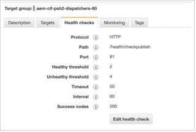
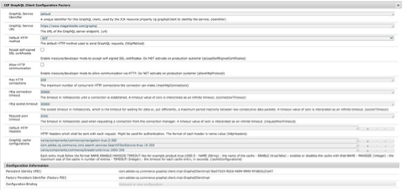

# 인프라 할당(시간 초과 및 연결 제한)

AEM 및 Adobe Commerce과 주변 인프라(예: 정렬이 필요한 로드 밸런서)에 대한 설정이 있으며, 이러한 설정은 연결 제한 및 시간 초과 설정과 관련이 있습니다.

이러한 제한 간의 맞춤이 잘못되면 AEM 측에서 연결이 제한될 수 있지만 Adobe Commerce에서는 더 많은 연결을 처리할 수 있습니다. 마찬가지로, 시간 제한 설정의 경우 Adobe Commerce이 요청을 처리하고 있는 동안 시간 초과 오류가 AEM 측에서 발생했음을 의미할 수 있습니다.

시간 초과 설정의 경우 로드 시 503 시간 초과 오류가 발생하지 않도록 설정을 검토하고 정렬해야 합니다. 검토할 인프라 및 애플리케이션 시간 초과 설정이 몇 가지 있습니다.

## AEM 로드 밸런서

인프라에 AWS 애플리케이션 로드 밸런서와 여러 Dispatcher/게시자가 있다고 가정할 경우 로드 밸런서에 대해 다음 설정을 고려해야 합니다.

1. 디스패처 상태 검사는 디스패처가 로드 서지 지연에서 불필요하게 일찍 서비스를 이탈하지 않도록 검토해야 합니다. 부하 분산 장치 상태 확인의 시간 제한 설정은 게시자 시간 제한 설정과 정렬되어야 합니다.

   

1. Dispatcher 대상 그룹 고착성을 비활성화하고 라운드 로빈 로드 밸런싱 알고리즘을 사용할 수 있습니다. 세션 고착성을 설정해야 하는 AEM 특정 기능이나 AEM 사용자 세션이 없다고 가정합니다. 이 섹션에서는 사용자 로그인 및 세션 관리가 GraphQL을 통해 Adobe Commerce에서만 사용된다고 가정합니다.

   

1. 세션 고착성을 활성화하는 경우, 기본적으로 Apple은 Set-Cookies 헤더로 페이지를 캐시하지 않으므로 명시적으로 캐시하지 않을 수 있습니다. Adobe Commerce은 캐시 가능 페이지에서도 쿠키를 설정하지만(TTL > 0) 기본 Apple VCL은 캐시 캐싱이 제대로 작동하도록 캐시 가능 페이지에서 해당 쿠키를 제거합니다. 페이지가 캐싱되지 않는 경우 사용 중인 사용자 지정 쿠키를 확인하고 기본 VCL도 업로드한 다음 사이트를 다시 확인합니다.

## Dispatcher 시간 초과 설정

디스패처 &quot;renders&quot; 옵션의 /timeout 은 AEM 게시 인스턴스에 액세스하는 연결 시간 제한을 밀리초 단위로 지정합니다. 시간 제한 설정을 처리하기 위해 별도의 로드 밸런서가 있는 경우 이 설정을 검토하고 기본 설정 &quot;0&quot;(무제한 시간 제한)을 사용해야 합니다.

인프라에 로드 밸런서가 없는 경우 시간 초과 설정을 디스패처 /timeout 설정에 지정해야 합니다. 이 값은 게시자의 GraphQL 시간 초과 설정과 일치합니다.

## 게시자

Publisher GraphQL 연결 제한 및 시간 초과: 처음에는 Adobe Commerce CIF GraphQL 클라이언트 구성 팩토리 OSGI 설정의 최대 HTTP 연결을 기본 최대 연결 제한(현재 200으로 설정됨)으로 설정해야 합니다. AEM 팜에 게시자가 여러 개 있는 경우에도 각 게시자에서 제한을 동일하게 설정하여 기본 설정과 일치시켜야 합니다. 이러한 이유는 연결된 디스패처가 예를 들어 팜에서 반출되는 경우 어떤 경우 한 게시자가 다른 게시자보다 더 많은 트래픽을 처리할 수 있기 때문입니다. 즉, 나머지 단일 디스패처 및 게시자를 통해 모든 트래픽이 라우팅됩니다. 이 경우 단일 게시자에게 모든 HTTP 연결이 필요할 수 있습니다.

&quot;기본 HTTP 메서드&quot;는 POST에서 GET으로 설정해야 합니다. Adobe Commerce GraphQL 캐시에서 GET 요청만 캐시되므로 기본 방법은 항상 GET으로 설정되어야 합니다.

http 연결 시간 제한 및 http 소켓 시간 초과는 실제 시간 초과와 일치하는 값으로 설정해야 합니다.

다음 이미지는 Magento CIF GraphQL 클라이언트 구성 팩토리를 보여줍니다. 여기에 표시된 설정은 예시에만 해당되며 사례에 따라 조정되어야 합니다.

다음 이미지는 백엔드 구성을 보여줍니다. 여기에 표시된 설정은 예시에만 해당되며 사례에 따라 조정되어야 합니다.

