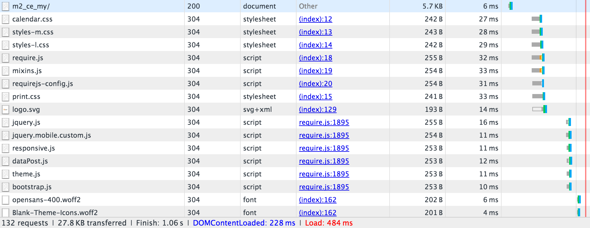

# 바니시 구성

[Varnish Cache]은(는) 오픈 소스 웹 응용 프로그램 가속기(_HTTP 가속기_ 또는 _HTTP 역방향 프록시 캐싱_)입니다. Vannish는 파일 또는 파일 조각을 메모리에 저장(또는 캐시)하여 향후 동등한 요청에 대한 응답 시간 및 네트워크 대역폭 사용을 줄일 수 있습니다. Apache 및 nginx와 같은 웹 서버와 달리 Varnish는 HTTP 프로토콜에서만 사용하도록 설계되었습니다.

[시스템 요구 사항](../../installation/system-requirements.md)은(는) 지원되는 버전의 바니시를 나열합니다.

>[!WARNING]
>
>프로덕션에서 바니시를 사용하는 것이 _좋습니다_. 파일 시스템 또는 [데이터베이스](https://developer.adobe.com/commerce/php/development/cache/partial/database-caching/)에 대한 기본 제공 전체 페이지 캐싱은 Vannish보다 훨씬 느리며 Vannish는 HTTP 트래픽을 가속화하도록 설계되었습니다.

Varnish에 대한 자세한 내용은 다음을 참조하십시오.

- [큰 바니시 그림]
- [니스장 시작 옵션]
- [바니시 및 웹 사이트 성능]

## 바니시 토폴로지 다이어그램

다음 그림은 Commerce 토폴로지의 Varnish에 대한 기본 보기를 보여 줍니다.


앞의 그림에서는 인터넷을 통한 사용자의 HTTP 요청으로 인해 CSS, HTML, JavaScript 및 이미지(_assets_)에 대한 요청이 많이 발생했습니다. Vannish는 웹 서버 앞에 있으며 이러한 요청을 웹 서버로 프록시합니다.

웹 서버가 자산을 반환하면 캐시 가능한 자산이 Varnish에 저장됩니다. 이러한 에셋에 대한 후속 요청은 Varnish에 의해 이행됩니다(즉, 요청이 웹 서버에 도달하지 않음). Varnish는 캐시된 콘텐츠를 매우 빠르게 반환합니다. 그 결과 사용자에게 콘텐츠를 반환하기 위한 응답 시간이 빨라지고 Commerce에서 이행해야 하는 요청 수가 줄어듭니다.

Varnish에 의해 캐시된 Assets은 구성 가능한 간격으로 만료되거나 동일한 에셋의 최신 버전으로 대체됩니다. Admin 또는 [`magento cache:clean`](../cli/manage-cache.md#clean-and-flush-cache-types) 명령을 사용하여 캐시를 수동으로 지울 수도 있습니다.

## 프로세스 개요

이 항목에서는 최소 매개변수 세트를 사용하여 Varnish를 처음 설치하고 작동하는지 테스트하는 방법에 대해 설명합니다. 그런 다음 Commerce 관리에서 니스 구성을 내보내고 다시 테스트합니다.

프로세스는 다음과 같이 요약할 수 있습니다.

1. Varnish를 설치하고 Commerce 페이지에 액세스하여 Varnish가 작동함을 나타내는 HTTP 응답 헤더를 가져오는지 테스트합니다.
1. Commerce 소프트웨어를 설치하고 관리자를 사용하여 Varnish 구성 파일을 만듭니다.
1. 기존 Vannish 구성 파일을 관리자가 생성한 구성 파일로 바꿉니다.
1. 모두 다시 테스트해 보십시오.

   `<magento_root>/var/page_cache` 디렉터리에 아무 것도 없는 경우 Commerce으로 Vannish를 구성했습니다!

>[!NOTE]
>
>- 언급된 경우를 제외하고 이 항목에서 `root` 권한이 있는 사용자로 설명한 모든 명령을 입력해야 합니다.
>
>- 이 항목은 CentOS 및 Apache 2.4의 Varnish용으로 작성되었습니다. 다른 환경에서 바니시를 설정하는 경우 일부 명령이 다를 수 있습니다. 자세한 내용은 Vanish 설명서 를 참조하십시오.

## 알려진 문제

우리는 Varnish와 관련된 다음 문제를 알고 있습니다.

- [바니시가 SSL을 지원하지 않습니다]

  또는 SSL 종료 또는 SSL 종료 프록시를 사용합니다.

- `<magento_root>/var/cache` 디렉터리의 내용을 수동으로 삭제하는 경우 Vanish를 다시 시작해야 합니다.

- Commerce 설치 시 발생할 수 있는 오류:

  ```
  Error 503 Service Unavailable
  Service Unavailable
  XID: 303394517
  Varnish cache server
  ```

  이 오류가 발생하는 경우 `default.vcl`을(를) 편집하고 다음과 같이 `backend` 스타자에 시간 제한을 추가하십시오.

  ```conf
  backend default {
      .host = "127.0.0.1";
      .port = "8080";
      .first_byte_timeout = 600s;
  }
  ```

## 니스 캐싱 개요

니스 캐싱은 다음을 사용하여 Commerce에서 작동합니다.

- Magento 2 GitHub 저장소의 [`nginx.conf.sample`](https://github.com/magento/magento2/blob/2.4/nginx.conf.sample)
- Commerce에서 제공된 Apache용 `.htaccess` 분산 구성 파일
- `default.vcl`관리자[를 사용하여 생성된 Vannish에 대한 ](../cache/configure-varnish-commerce.md) 구성

>[!INFO]
>
>이 항목에서는 이전 목록의 기본 옵션만 다룹니다. 다른 여러 가지 방법으로 복잡한 시나리오(예: 콘텐츠 전달 네트워크 사용)에서 캐싱을 구성할 수 있습니다. 이러한 메서드는 이 안내서의 범위를 벗어납니다.

첫 번째 브라우저 요청에서 캐시 가능한 자산은 Varnish에서 클라이언트 브라우저로 전달되고 브라우저에 캐시됩니다.

또한 Vannish는 정적 에셋에 엔티티 태그(ETag)를 사용합니다. ETag는 서버에서 정적 파일이 변경되는 시기를 확인하는 방법을 제공합니다. 따라서 정적 자산은 브라우저에서 새 요청을 하거나 클라이언트가 브라우저 캐시를 새로 고칠 때(일반적으로 F5 또는 Ctrl+F5 누름) 클라이언트에 전송됩니다.

자세한 내용은 다음 섹션에서 확인할 수 있습니다.

## 브라우저 요청별 캐싱

이 섹션에서는 브라우저 검사기를 사용하여 자산이 첫 번째 요청에서 브라우저에 전달된 후 로컬 브라우저 캐시에서 로드되는 방법을 보여줍니다.

### 첫 번째 브라우저 요청

`nginx.conf.sample` 및 `.htaccess`은(는) 클라이언트 캐싱 옵션을 제공합니다. 캐싱이 가능한 오브젝트에 대한 브라우저에서 첫 번째 요청이 이루어지면 Vannish는 이를 클라이언트에게 전달합니다.

다음 그림은 브라우저 관리자를 사용하는 예를 보여 줍니다.


앞의 예제에서는 Storefront 기본 페이지(`m2_ce_my`)에 대한 요청을 보여 줍니다. CSS 및 JavaScript 자산은 클라이언트 브라우저에 캐시됩니다.

>[!NOTE]
>
>대부분의 정적 에셋에는 서버에서 에셋을 검색했음을 나타내는 HTTP 200(OK) 상태 코드가 있습니다.

### 두 번째 브라우저 요청

동일한 브라우저가 동일한 페이지를 다시 요청하면 다음 그림과 같이 이러한 에셋이 로컬 브라우저 캐시에서 전달됩니다.


첫 번째 요청과 두 번째 요청 사이의 응답 시간 차이를 확인합니다. 다시 말하지만, 정적 자산은 처음으로 로컬 캐시에서 전달되므로 200(OK) 응답 코드가 있습니다.

## Commerce에서 Etag를 사용하는 방법

다음 예제는 특정 정적 자산에 대한 응답 헤더를 보여 줍니다.


`calendar.css`에 ETag 응답 헤더가 있습니다. 즉, 클라이언트 브라우저의 CSS 파일을 서버의 CSS 파일과 비교할 수 있습니다.

또한 다음 그림과 같이 정적 자산이 304(수정되지 않음) HTTP 상태 코드와 함께 반환됩니다.



사용자가 로컬 캐시를 무효화하고 서버의 콘텐츠가 변경되지 않았기 때문에 304 상태 코드가 발생합니다. 304 상태 코드로 인해 정적 자산 _content_&#x200B;이(가) 전송되지 않고 HTTP 헤더만 브라우저로 다운로드됩니다.

서버에서 콘텐츠가 변경되면 클라이언트는 HTTP 200(OK) 상태 코드와 새 ETag와 함께 정적 에셋을 다운로드합니다.

<!-- Link Definitions -->

[큰 바니시 그림]: https://www.varnish-cache.org/docs/trunk/users-guide/intro.html
[바니시 캐시]: https://varnish-cache.org
[니스 시작 옵션]: https://www.varnish-cache.org/docs/trunk/reference/varnishd.html#ref-varnishd-options
[니스 및 웹 사이트 성능]: https://www.varnish-cache.org/docs/trunk/users-guide/performance.html#users-performance
[바니시가 SSL을 지원하지 않음]: https://www.varnish-cache.org/docs/3.0/phk/ssl.html
