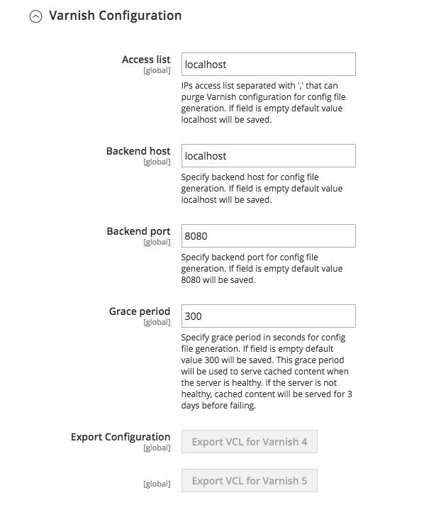

# 바니시를 사용하도록 Commerce 응용 프로그램 구성

바니시를 사용하도록 Commerce를 구성하려면 다음을 수행합니다.

1. 관리자로 관리자에 로그인합니다.
1. 클릭 **[!UICONTROL Stores]** > 설정 > **구성** > **고급** > **시스템** > **전체 페이지 캐시**.
1. 다음에서 **[!UICONTROL Caching Application]** 목록, 클릭 **니스 캐싱**.
1. 에 값 입력 **[!UICONTROL TTL for public content]** 필드.
1. 확장 **[!UICONTROL Varnish Configuration]** 다음 정보를 입력합니다.

   | 필드 | 설명 |
   | ----- | ----------- |
   | 액세스 목록 | 정규화된 호스트 이름, IP 주소 또는 [CIDR(Classless Inter-Domain Routing)](https://www.digitalocean.com/community/tutorials/understanding-ip-addresses-subnets-and-cidr-notation-for-networking) 표기법 컨텐츠를 무효화할 IP 주소 범위입니다. 다음을 참조하십시오 [니스 캐시 삭제](https://varnish-cache.org/docs/3.0/tutorial/purging.html). |
   | 백엔드 호스트 | Varnish의 정규화된 호스트 이름 또는 IP 주소 및 수신 포트를 입력하십시오. _백엔드_ 또는 _원본 서버_&#x200B;즉, Varnish 컨텐츠를 제공하는 서버가 가속화됩니다. 일반적으로 웹 서버입니다. 다음을 참조하십시오 [Vannish 캐시 백엔드 서버](https://www.varnish-cache.org/docs/trunk/users-guide/vcl-backends.html). |
   | 백엔드 포트 | 원본 서버의 수신 포트입니다. |
   | 유예 기간 | 백엔드가 응답하지 않는 경우 Vannish가 오래된 콘텐츠를 제공하는 기간을 결정합니다. 기본값은 300초입니다. |
   | 매개변수 크기 처리 | 의 최대 수를 지정합니다. [레이아웃 핸들](https://developer.adobe.com/commerce/frontend-core/guide/layouts/#layout-handles) 을(를) 처리하려면 [`{BASE-URL}/page_cache/block/esi`](use-varnish-esi.md) 전체 페이지 캐싱을 위한 HTTP 엔드포인트. 크기를 제한하면 보안과 성능을 향상시킬 수 있습니다. 기본값은 100입니다. |

1. 클릭 **구성 저장**.

C 명령줄 인터페이스 도구를 사용하여 Admin에 로그인하지 않고 명령줄에서 Varnish를 활성화할 수도 있습니다.

```bash
bin/magento config:set --scope=default --scope-code=0 system/full_page_cache/caching_application 2
```

## Vannish 구성 파일 내보내기

관리자에서 Vannish 구성 파일을 내보내려면 다음을 수행합니다.

1. 내보내기 단추 중 하나를 클릭하여 `varnish.vcl` 바니쉬와 함께 쓰세요

   예를 들어, Varnish 4가 있는 경우 **VCL을 바니시 4로 내보내기**

   다음 그림은 예를 보여 줍니다.

   

1. 기존 백업 `default.vcl`. 그런 다음 이름 바꾸기 `varnish.vcl` 방금 내보낸 파일 `default.vcl`. 그런 다음 파일을 `/etc/varnish/` 디렉토리.

   ```bash
   cp /etc/varnish/default.vcl /etc/varnish/default.vcl.bak2
   ```

   ```bash
   mv <download_directory>/varnish.vcl default.vcl
   ```

   ```bash
   cp <download_directory>/default.vcl /etc/varnish/default.vcl
   ```

1. Adobe 열기 추천 `default.vcl` 및 값 변경 `acl purge` - Varnish 호스트의 IP 주소입니다. (여러 호스트를 별도의 줄에 지정하거나 CIDR 표기법을 사용할 수도 있습니다.)

   For example,

   ```conf
    acl purge {
       "localhost";
    }
   ```

1. Vagrant 상태 검사 또는 유예 모드 또는 saint 모드 구성을 사용자 지정하려면 을 참조하십시오. [고급 바니시 구성](config-varnish-advanced.md).

1. Vannish와 웹 서버를 다시 시작합니다.

   ```bash
   service varnish restart
   ```

   ```bash
   service httpd restart
   ```

## 정적 파일 캐시

정적 파일은 기본적으로 캐시되지 않아야 하지만 캐시하려면 섹션을 편집할 수 있습니다 `Static files caching` VCL에서 다음 내용을 포함하십시오.

```conf
# Static files should not be cached by default
  return (pass);

# But if you use a few locales and do not use CDN you can enable caching static files by commenting previous line (#return (pass);) and uncommenting next 3 lines
  #unset req.http.Https;
  #unset req.http./* {{ ssl_offloaded_header }} */;
  #unset req.http.Cookie;
```

Commerce에서 Vanish를 사용하도록 구성하기 전에 이러한 변경 작업을 수행해야 합니다.
