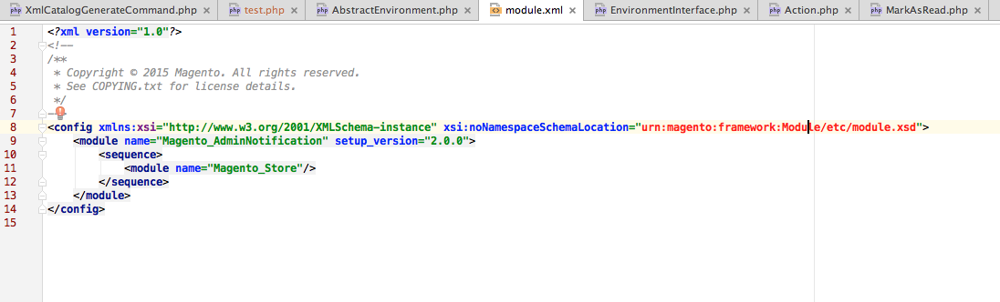

# URN 형광펜 개요

{{file-system-owner}}

Commerce 코드는 모든 XSD 스키마를 [URN(Uniform Resource Names)](https://www.ietf.org/rfc/rfc2141.txt)(으)로 참조합니다. 코드를 개발 중이며 XSD를 참조해야 하는 경우 이 명령은 URN을 인식하고 강조 표시하도록 통합 개발자 환경(IDE)을 구성합니다. 이렇게 하면 개발이 더 쉬워집니다.

기본적으로 PhpStorm과 같은 IDE는 URN을 인식하도록 구성되어 있지 않으며 그 결과 다음과 같이 빨간색 텍스트로 표시됩니다.



`bin/magento dev:urn-catalog:generate` 명령을 사용하면 IDE(현재 PhpStorm 및 Visual Studio 코드만)에서 다음과 같이 URN을 인식하고 강조 표시할 수 있습니다.


특히 이 명령은 다음과 같은 PhpStorm 구성을 만듭니다.


## IDE 구성

현재 PhpStorm 및 Visual Studio 코드만 지원됩니다.

명령 구문:

```bash
bin/magento dev:urn-catalog:generate <path>
```

여기서 `<path>`은(는) 프로젝트 루트에 상대적인 PhpStorm `misc.xml` 파일의 경로입니다. 일반적으로 `<path>`은(는) `.idea/misc.xml`입니다.

>[!INFO]
>
>&quot;스키마 및 DTD&quot;를 최신 상태로 유지하려면 `*.xsd` 파일이 포함된 Commerce 2 모듈을 추가, 수정 또는 제거할 때마다 `dev:urn-catalog:generate` 명령을 실행합니다.
