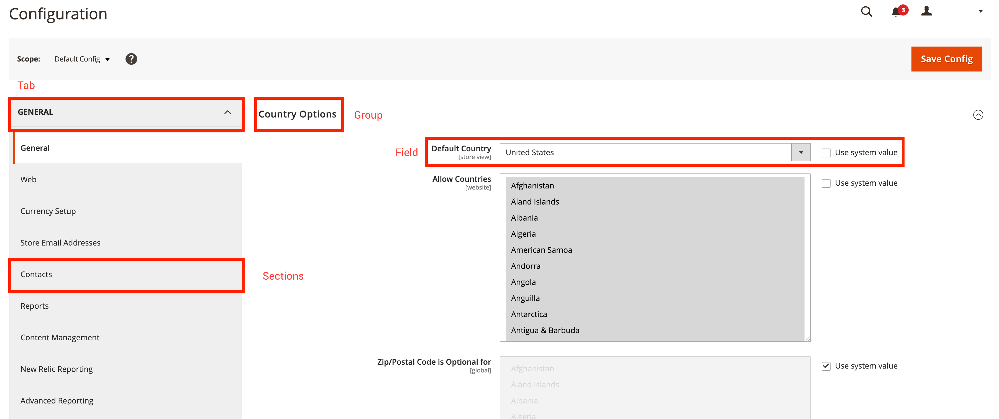

# system.xml 참조

다음 `system.xml` 파일을 사용하면 상거래 시스템 구성을 관리할 수 있습니다. 이 항목을 의 일반 참조로 사용 `system.xml` 파일. 다음 `system.xml` 파일은 아래에 있습니다. `etc/adminhtml/system.xml` 지정된 상거래 2 확장에서.

다음 코드 스니펫은 파일의 기본 골격을 보여 줍니다.

```xml
<?xml version="1.0" ?>
<config xmlns:xsi="http://www.w3.org/2001/XMLSchema-instance" xsi:noNamespaceSchemaLocation="urn:magento:module:Magento_Config:etc/system_file.xsd">
    <system>
        <!-- PLACE YOUR MODULE SPECIFIC CONFIGURATION HERE -->
    </system>
</config>
```

>[!TIP]
>
>IDE에서 즉시 *XSD 유효성 검사를 원하는 경우 다음을 실행할 수 있습니다. `bin/magento dev:urn-catalog:generate [--ide IDE] [--] <path>`.

## 탭 // 섹션 // 그룹/ 필드

다음에서 `system.xml` 파일을 사용하면 서로 관련된 네 가지 서로 다른 엔티티 유형을 정의할 수 있습니다. 다음 섹션에서는 탭, 섹션, 그룹 및 필드 간의 관계를 설명합니다. 다음 스크린샷에는 관리 백엔드의 Commerce 2 시스템 구성이 표시됩니다.
빨간색 사각형은 `system.xml` 파일:



탭은 다른 구성 영역을 의미론적으로 분할하는 데 사용됩니다. 각 탭에는 하위 메뉴로도 참조할 수 있는 섹션이 하나 이상 포함될 수 있습니다. 섹션에는 하나 이상의 그룹이 포함됩니다.
각 그룹에는 하나 이상의 필드가 나열됩니다. 그룹을 사용하여 다음 필드에 대한 일반 설명을 추가할 수도 있습니다. 언급된 바와 같이, 각 그룹은 하나 이상의 필드를 가질 수 있다. 필드는 시스템 구성 컨텍스트에서 가장 작은 엔티티입니다.

## 탭

A `<tab>`- 시스템 구성의 기존 또는 새 탭에 대한 참조에 태그를 지정합니다.

### 탭 속성 참조

A `<tab>`-Tag에는 다음 속성이 있을 수 있습니다.

| 속성 | 설명 | 유형 | 필수 |
|-------------|------------------------------------------------------------------------------------------------------------------------------------------|----------|----------|
| `id` | 섹션을 참조하는 데 사용되는 식별자를 정의합니다. | `typeId` | 필수 |
| `translate` | 번역할 수 있는 필드를 정의합니다. 제공 `label` 레이블을 번역할 수 있도록 만들기 위해 | `string` | 선택 사항 |
| `sortOrder` | 섹션의 정렬 순서를 정의합니다. 숫자가 높으면 섹션이 페이지 맨 아래로 밀리고, 숫자가 낮으면 섹션이 맨 위로 밀립니다. | `float` | 선택 사항 |
| `class` | 정의된 CSS 클래스를 렌더링된 탭 HTML 요소에 추가합니다. | `string` | 선택 사항 |

### 탭 노드 참조

A `<tab>`-태그에 다음 하위 항목이 있을 수 있습니다.

| 노드 | 설명 | 유형 |
|---------|------------------------------------------------------|----------|
| `label` | 앞줄에 표시되는 레이블을 정의합니다. | `string` |

### 예: 탭 만들기

다음 코드 조각은 예제 데이터가 있는 새 탭을 만드는 방법을 보여 줍니다.

```xml
<?xml version="1.0" ?>
<config xmlns:xsi="http://www.w3.org/2001/XMLSchema-instance" xsi:noNamespaceSchemaLocation="urn:magento:module:Magento_Config:etc/system_file.xsd">
    <system>
        <tab id="A_UNIQUE_ID" translate="label" class="a-custom-css-class-to-style-this-tab" sortOrder="10">
            <label>A meaningful label</label>
        </tab>
    </system>
</config>
```

위의 스니펫은 식별자로 새 탭을 만듭니다 `A_UNIQUE_ID`. 다음으로: `translate`-attribute가 정의되고 레이블, `label`-node는 변환 가능합니다. 렌더링 프로세스 동안 CSS 클래스 `a-custom-css-class-to-style-this-tab` 이 탭에 대해 생성된 HTML 요소에 적용됩니다.
다음 `sortOrder`-속성(값 포함) `10` 렌더링할 때 모든 탭 목록에서 탭의 위치를 정의합니다.

## 섹션

A `<section>`- 시스템 구성의 기존 섹션 또는 새 섹션에 대한 참조에 태그를 지정합니다.

### 섹션 속성 참조

A `<section>`-Tag에는 다음 속성이 있을 수 있습니다.

| 속성 | 설명 | 유형 | 필수 |
|:----------------|:---------------------------------------------------------------------------------------------------------------------------------------------------|:---------|:---------|
| `id` | 섹션을 참조하는 데 사용되는 식별자를 정의합니다. | `typeId` | 필수 |
| `translate` | 번역할 수 있는 필드를 정의합니다. 제공 `label` 레이블을 번역할 수 있도록 만들기 위해 | `string` | 선택 사항 |
| `type` | 렌더링된 HTML 요소의 입력 유형을 정의합니다. 기본값은 입니다. `text`. | `string` | 선택 사항 |
| `sortOrder` | 섹션의 정렬 순서를 정의합니다. 숫자가 높으면 섹션이 페이지 맨 아래로 푸시되고 숫자가 낮으면 섹션이 맨 위로 푸시됩니다. | `float` | 선택 사항 |
| `showInDefault` | 섹션이 기본 구성 범위에 표시되는지 여부를 정의합니다. 지정 `1` 섹션 표시 및 `0` 섹션을 숨깁니다. | `int` | 선택 사항 |
| `showInStore` | 섹션을 저장소 수준에 표시할지 여부를 정의합니다. 지정 `1` 섹션 표시 및 `0` 섹션을 숨깁니다. | `int` | 선택 사항 |
| `showInWebsite` | 섹션을 웹 사이트 수준에 표시할지 여부를 정의합니다. 지정 `1` 섹션 표시 및 `0` 섹션을 숨깁니다. | `int` | 선택 사항 |
| `canRestore` | 섹션을 기본값으로 복원할 수 있는지 여부를 정의합니다. | `int` | 선택 사항 |
| `advanced` | 100.0.2 이후 더 이상 사용되지 않습니다. | `bool` | 선택 사항 |
| `extends` | 다른 섹션의 식별자를 제공하면 이 노드의 콘텐츠가 참조한 섹션을 확장합니다. | `string` | 선택 사항 |

### 섹션 노드 참조

A `<section>`-태그에 다음과 같은 하위 항목이 있을 수 있습니다.

| 노드 | 설명 | 유형 |
|------------------|-----------------------------------------------------------------------------------------------------------------------|---------------------|
| `label` | 앞줄에 표시되는 레이블을 정의합니다. | `string` |
| `class` | 정의된 CSS 클래스를 렌더링된 섹션 HTML 요소에 추가합니다. | `string` |
| `tab` | 관련 탭을 참조합니다. 탭의 ID가 필요합니다. | `typeTabId` |
| `header_css` | 이 글을 쓸 당시에는 사용도 평가도 하지 않았다. | `string` |
| `resource` | 이 섹션에 대한 권한 설정을 제공하기 위해 ACL 리소스를 참조합니다. | `typeAclResourceId` |
| `group` | 하나 이상의 하위 그룹을 정의합니다. | `typeGroup` |
| `frontend_model` | 렌더링을 변경하고 출력을 수정할 다른 프론트엔드 모델을 지정합니다. | `typeModel` |
| `include` | 추가 항목을 포함하는 데 사용됨 `system_include.xsd` 호환 파일. 보통 구조를 크게 하는데 사용된다. `system.xml` 파일. | `includeType` |

### 예: 섹션을 만들고 탭에 할당

다음 코드 조각은 새 섹션 만들기의 기본 사용을 보여 줍니다.

```xml
<?xml version="1.0" ?>
<config xmlns:xsi="http://www.w3.org/2001/XMLSchema-instance" xsi:noNamespaceSchemaLocation="urn:magento:module:Magento_Config:etc/system_file.xsd">
    <system>
        <tab id="A_UNIQUE_ID" translate="label" class="a-custom-css-class-to-style-this-tab" sortOrder="10">
            <label>A meaningful label</label>
        </tab>

        <section id="A_UNIQUE_SECTION_ID" showInDefault="1" showInWebsite="0" showInStore="1" sortOrder="10" translate="label">
            <label>A meaningful section label</label>
            <tab>A_UNIQUE_ID</tab>
            <resource>VENDOR_MODULE::path_to_the_acl_resource</resource>
        </section>
    </system>
</config>
```

위에 설명된 섹션은 ID를 정의합니다 `A_UNIQUE_SECTION_ID`는 기본 구성 보기 및 스토어 컨텍스트에 표시됩니다. 다음 `label`-node는 변환 가능합니다. 섹션은 ID가 있는 탭에 연결됩니다 `A_UNIQUE_ID`. 섹션은 ACL에 정의된 권한이 있는 사용자만 액세스할 수 있습니다. `VENDOR_MODULE::path_to_the_acl_resource`.

## 그룹

다음 `<group>`-태그는 필드를 함께 그룹화하는 데 사용됩니다.

### 그룹 속성 참조

A `<group>`-Tag에는 다음 속성이 있을 수 있습니다.

| 속성 | 설명 | 유형 | 필수 |
|:----------------|:---------------------------------------------------------------------------------------------------------------------------------------------------|:---------|:---------|
| `id` | 그룹을 참조하는 데 사용되는 식별자를 정의합니다. | `typeId` | 필수 |
| `translate` | 번역할 수 있는 필드를 정의합니다. 제공 `label` 레이블을 번역할 수 있도록 만들기 위해 여러 필드는 공백으로 구분해야 합니다. | `string` | 선택 사항 |
| `type` | 렌더링된 HTML 요소의 입력 유형을 정의합니다. 기본값은 입니다. `text`. | `string` | 선택 사항 |
| `sortOrder` | 섹션의 정렬 순서를 정의합니다. 숫자가 높으면 섹션이 페이지 맨 아래로 푸시되고 숫자가 낮으면 섹션이 맨 위로 푸시됩니다. | `float` | 선택 사항 |
| `showInDefault` | 그룹이 기본 구성 범위에 표시되는지 여부를 정의합니다. 지정 `1` 그룹 및 `0` 그룹을 숨깁니다. | `int` | 선택 사항 |
| `showInStore` | 그룹이 저장소 수준에 표시되는지 여부를 정의합니다. 지정 `1` 그룹 및 `0` 그룹을 숨깁니다. | `int` | 선택 사항 |
| `showInWebsite` | 그룹이 웹 사이트 수준에 표시되는지 여부를 정의합니다. 지정 `1` 그룹 및 `0` 그룹을 숨깁니다. | `int` | 선택 사항 |
| `canRestore` | 그룹을 기본값으로 복원할 수 있는지 여부를 정의합니다. | `int` | 선택 사항 |
| `advanced` | 100.0.2 이후 더 이상 사용되지 않습니다. | `bool` | 선택 사항 |
| `extends` | 다른 그룹의 식별자를 제공하면 이 노드의 콘텐츠가 참조한 섹션을 확장합니다. | `string` | 선택 사항 |

### 그룹 노드 참조

A `<group>`-태그에 다음과 같은 하위 항목이 있을 수 있습니다.

| 노드 | 설명 | 유형 |
|-----------------------------|-------------------------------------------------------------------------------------------------------------------------------------------------------------------------------------------|---------------|
| `label` | 앞줄에 표시되는 레이블을 정의합니다. | `string` |
| `fieldset_css` | 그룹 필드 집합에 하나 이상의 CSS 클래스를 추가합니다. | `string` |
| `frontend_model` | 렌더링을 변경하고 출력을 수정할 다른 프론트엔드 모델을 지정합니다. | `typeModel` |
| `clone_model` | 필드를 복제할 특정 모델을 지정합니다. | `typeModel` |
| `clone_fields` | 필드의 복제가 활성화되었거나 비활성화되었습니다. | `int` |
| `help_url` | 확장할 수 없습니다. 아래를 참조하십시오. | `typeUrl` |
| `more_url` | 확장할 수 없습니다. 아래를 참조하십시오. | `typeUrl` |
| `demo_link` | 확장할 수 없습니다. 아래를 참조하십시오. | `typeUrl` |
| `comment` | 그룹 레이블 아래에 주석을 추가합니다. 사용 `<![CDATA[//]]>` HTML을 적용할 수 있습니다. | `string` |
| `hide_in_single_store_mode` | 그룹이 단일 저장소 모드로 표시되어야 하는지 여부입니다. `1` 그룹을 숨깁니다. `0` 그룹을 표시합니다. | `int` |
| `field` | 이 그룹에서 사용할 수 있는 필드를 한 개 이상 정의합니다. | `field` |
| `group` | 하나 이상의 하위 그룹을 정의합니다. | `unbounded` |
| `depends` | 를 사용하여 다른 필드에 대한 종속성을 선언할 수 있습니다. 지정된 필드에 값이 인 경우에만 특정 필드/그룹을 표시하는 데 사용됩니다. `1`. 이 노드에는 `section/group/field`-string. | `depends` |
| `attribute` | 사용자 지정 특성은 프론트엔드 모델에서 사용할 수 있습니다. 일반적으로 는 주어진 프론트엔드 모델을 더 역동적으로 만드는 데 사용됩니다. | `attribute` |
| `include` | 추가 항목을 포함하는 데 사용됨 `system_include.xsd` 호환 파일. 보통 구조를 크게 하는데 사용된다. `system.xml` 파일. | `includeType` |

>[!WARNING]
>
>노드 `more_url`, `demo_url` 및 `help_url` 는 한 번만 사용되는 PayPal 프론트엔드 모델로 정의됩니다. 이러한 노드는 재사용할 수 없습니다.

### 예: 주어진 섹션에 대한 그룹 만들기

다음 코드 조각은 새 그룹을 만드는 기본 사용 방법을 보여 줍니다.

```xml
<config xmlns:xsi="http://www.w3.org/2001/XMLSchema-instance" xsi:noNamespaceSchemaLocation="urn:magento:module:Magento_Config:etc/system_file.xsd">
    <system>
        <tab id="A_UNIQUE_ID" translate="label" class="a-custom-css-class-to-style-this-tab" sortOrder="10">
            <label>A meaningful label</label>
        </tab>

        <section id="A_UNIQUE_SECTION_ID" showInDefault="1" showInWebsite="0" showInStore="1" sortOrder="10" translate="label">
            <label>A meaningful section label</label>
            <tab>A_UNIQUE_ID</tab>
            <resource>VENDOR_MODULE::path_to_the_acl_resource</resource>

            <group id="A_UNIQUE_GROUP_ID" translate="label comment" sortOrder="10" showInDefault="1" showInWebsite="0" showInStore="1">
                <label>A meaningful group label</label>
                <comment>An additional comment helping users to understand the effect when configuring the fields defined in this group.</comment>
                <!-- Add your fields here. -->
            </group>
        </section>
    </system>
</config>
```

위에서 설명한 그룹은 ID를 정의합니다 `A_UNIQUE_GROUP_ID`는 기본 구성 보기 및 스토어 컨텍스트에 표시됩니다. 둘 다, `label` 및 `comment` 번역 가능으로 표시됩니다.

## 필드

다음 `<field>`-Tag는에서 사용됩니다. `<group>`- 특정 구성 값을 정의하는 태그입니다.

### 필드 속성 참조

A `<field>`-Tag에는 다음 속성이 있을 수 있습니다.

| 속성 | 설명 | 유형 | 필수 |
|:----------------|:---------------------------------------------------------------------------------------------------------------------------------------------------|:---------|:---------|
| `id` | 필드를 참조하는 데 사용되는 식별자를 정의합니다. | `typeId` | 필수 |
| `translate` | 번역할 수 있는 필드를 정의합니다. 제공 `label` 레이블을 번역할 수 있도록 만들기 위해 여러 필드는 공백으로 구분해야 합니다. | `string` | 선택 사항 |
| `type` | 렌더링된 HTML 요소의 입력 유형을 정의합니다. 기본값은 입니다. `text`. | `string` | 선택 사항 |
| `sortOrder` | 섹션의 정렬 순서를 정의합니다. 숫자가 높으면 섹션이 페이지 맨 아래로 밀리고, 숫자가 낮으면 섹션이 맨 위로 밀립니다. | `float` | 선택 사항 |
| `showInDefault` | 필드가 기본 구성 범위에 표시되는지 여부를 정의합니다. 지정 `1` 필드 표시 및 `0` 필드를 숨깁니다. | `int` | 선택 사항 |
| `showInStore` | 필드가 저장소 수준에 표시되는지 여부를 정의합니다. 지정 `1` 필드 표시 및 `0` 필드를 숨깁니다. | `int` | 선택 사항 |
| `showInWebsite` | 필드가 웹 사이트 수준에 표시되는지 여부를 정의합니다. 지정 `1` 필드 표시 및 `0` 필드를 숨깁니다. | `int` | 선택 사항 |
| `canRestore` | 필드를 기본값으로 복원할 수 있는지 여부를 정의합니다. | `int` | 선택 사항 |
| `advanced` | 100.0.2 이후 더 이상 사용되지 않습니다. | `bool` | 선택 사항 |
| `extends` | 다른 필드의 식별자를 제공하면 이 노드의 콘텐츠가 참조한 섹션을 확장합니다. | `string` | 선택 사항 |

### 필드 유형 참조

A `<field>`-Tag에는 다음 값이 있을 수 있습니다. `type=""` 특성:

| 유형 | 설명 |
|-----------------|-------------------------------------------------------------------------------------------------------------------------------------------------------------------------------------------------------------------------------|
| `text` | 표준, 단일 행 텍스트 필드 |
| `textarea` | 텍스트 블록 |
| `select` | 일반 드롭다운, 사용자 지정 항목이 필요할 수 있음 `source_model`. 다음에 사용됨: `Yes/No` 선택 항목. 다음을 참조하십시오 `Magento\Search\Model\Adminhtml\System\Config\Source\Engine` 예를 들어, |
| `multiselect` | 좋아요 `select` 그러나 여러 옵션이 유효합니다. |
| `button` | 즉각적인 이벤트를 트리거하는 단추입니다. 버튼 텍스트 및 작업을 정의하려면 사용자 정의 프론트엔드 모델이 필요합니다. 다음을 참조하십시오 `Magento\ScheduledImportExport\Block\Adminhtml\System\Config\Clean` 예를 들어, |
| `obscure` | 값이 암호화되고 다음으로 표시되는 텍스트 필드 `****`. 브라우저에서 &quot;Inspect 요소&quot;를 사용하여 유형을 변경해도 값이 표시되지 않습니다. |
| `password` | 좋아요 `obscure` 숨겨진 값이 암호화되지 않고 브라우저에서 &quot;Inspect 요소&quot;를 사용하여 강제로 유형을 변경하면 값이 표시됩니다. |
| `file` | 처리를 위해 파일을 업로드할 수 있습니다. |
| `label` | 편집 가능한 필드 대신 레이블을 표시합니다. 특정 범위(예: 보기 수준만 저장)에서만 필드를 편집할 수 있는 경우 이 유형을 사용합니다. |
| `time` | 세 개의 드롭다운-시간, 분, 초를 사용하여 시간을 설정하도록 제어합니다. |
| `allowspecific` | 특정 국가의 다중 선택 목록. 다음 요구 사항: `source_model` 과 같은 `Magento\Shipping\Model\Config\Source\Allspecificcountries` |
| `image` | 이미지를 업로드할 수 있습니다. |
| `note` | 정보 메모를 페이지에 추가할 수 있습니다. 이 유형에는 다음이 필요합니다. `frontend_model` 메모를 렌더링합니다. |

사용자 지정 필드 유형을 만들 수도 있습니다. 이 작업은 작업이 있는 특수 버튼이 필요할 때 수행됩니다. 이렇게 하려면 두 가지 기본 요소가 필요합니다.

- 에서 블록 만들기 `adminhtml` 영역
- 설정 `type=""` 이 블록의 경로로

블록 자체에는 최소한 `__construct` 방법 및 `getElementHtml()` 메서드를 사용합니다. 다음 [Magento_OfflineShipping](https://github.com/magento/magento2/blob/2.4/app/code/Magento/OfflineShipping) 는 사용자 정의 유형의 간단한 예입니다.

예를 들어 OfflineShipping 모듈에서는 내보내기 단추가에 정의되어 있습니다. `Magento\OfflineShipping\Block\Adminhtml\Form\Field\Export` 그리고 필드 정의는 다음과 같습니다.

```xml
<field id="export" translate="label" type="Magento\OfflineShipping\Block\Adminhtml\Form\Field\Export" sortOrder="5" showInDefault="0" showInWebsite="1" showInStore="0">
    <label>Export</label>
</field>
```

### 필드 노드 참조

A `<field>`-태그에 다음과 같은 하위 항목이 있을 수 있습니다.

| 노드 | 설명 | 유형 |
|-----------------------------|-------------------------------------------------------------------------------------------------------------------------------------------------------------------------------------------|------------------|
| `label` | 앞줄에 표시되는 레이블을 정의합니다. | `string` |
| `comment` | 필드 레이블 아래에 주석을 추가합니다. 사용 `<![CDATA[//]]>` HTML을 적용할 수 있습니다. | `string` |
| `tooltip` | 이 필드의 의미를 설명하는 데 사용할 수 있는 또 다른 가능한 프론트엔드 요소입니다. 필드 옆에 작은 아이콘으로 표시됩니다. | `string` |
| `hint` | 추가 정보를 표시합니다. 특정 항목에서만 사용 가능 `frontend_model`. | `string` |
| `frontend_class` | 정의된 CSS 클래스를 렌더링된 섹션 HTML 요소에 추가합니다. | `string` |
| `frontend_model` | 렌더링을 변경하고 출력을 수정할 다른 프론트엔드 모델을 지정합니다. | `typeModel` |
| `backend_model` | 구성된 값을 수정할 다른 백엔드 모델을 지정합니다. | `typeModel` |
| `source_model` | 특정 값 집합을 제공하는 다른 원본 모델을 지정합니다. | `typeModel` |
| `config_path` | 필드의 일반 구성 경로를 덮어쓰는 데 사용할 수 있습니다. | `typeConfigPath` |
| `validate` | 다른 유효성 검사 규칙(공백으로 구분)을 정의합니다. 사용 가능한 유효성 검사 규칙의 전체 참조 목록이 아래에 나와 있습니다. | `string` |
| `can_be_empty` | 다음과 같은 경우에 사용됩니다. `type` 은(는) `multiselect` 필드를 비워둘 수 있도록 지정합니다. | `int` |
| `if_module_enabled` | 특정 모듈이 활성화된 경우에만 필드를 표시하는 데 사용됩니다. | `typeModule` |
| `base_url` | 과 함께 사용됩니다. `upload_dir` 파일 업로드용. | `typeUrl` |
| `upload_dir` | 업로드할 대상 디렉터리를 지정합니다. 이 노드에는 추가 속성과 노드가 있습니다. 이걸 사용하기 전에 그들을 살펴보세요. | `typeUploadDir` |
| `button_url` | 다음과 같은 경우 단추를 표시합니다. `button_url` 및 `button_label` 을(를) 지정합니다. 일반적으로 사용자 지정 프론트엔드 모델과 함께 사용됩니다. | `typeUrl` |
| `button_label` | 다음과 같은 경우 단추를 표시합니다. `button_label` 및 `button_url` 을(를) 지정합니다. 일반적으로 사용자 지정 프론트엔드 모델과 함께 사용됩니다. | `string` |
| `more_url` | 확장할 수 없습니다. 아래를 참조하십시오. | `typeUrl` |
| `demo_url` | 확장할 수 없습니다. 아래를 참조하십시오. | `typeUrl` |
| `hide_in_single_store_mode` | 그룹이 단일 저장소 모드로 표시되어야 하는지 여부입니다. `1` 그룹을 숨깁니다. `0` 그룹을 표시합니다. | `int` |
| `options` | 사용되지 않습니다. 더 이상 사용되지 않을 수 있습니다. | `complexType` |
| `depends` | 를 사용하여 다른 필드에 종속성을 선언할 수 있습니다. 지정된 필드에 값이 인 경우 특정 필드/그룹만 표시하는 데 사용됩니다. `1`. 이 노드에는 `section/group/field`-string. | `complexType` |
| `attribute` | 사용자 지정 특성은 프론트엔드 모델에서 사용할 수 있습니다. 일반적으로 는 주어진 프론트엔드 모델을 더 역동적으로 만드는 데 사용됩니다. | `complexType` |
| `requires` | 확장할 수 없습니다. 아래를 참조하십시오. | `complexType` |

>[!WARNING]
>
>노드 `more_url`, `demo_url`, `requires` 및 `options` 는 다른 핵심 결제 모델에 의해 정의되며 한 번만 사용됩니다. 이러한 노드는 재사용할 수 없습니다.

### 예: 주어진 그룹에 두 개의 필드 만들기

```xml
<config xmlns:xsi="http://www.w3.org/2001/XMLSchema-instance" xsi:noNamespaceSchemaLocation="urn:magento:module:Magento_Config:etc/system_file.xsd">
    <system>
        <tab id="A_UNIQUE_ID" translate="label" class="a-custom-css-class-to-style-this-tab" sortOrder="10">
            <label>A meaningful label</label>
        </tab>

        <section id="A_UNIQUE_SECTION_ID" showInDefault="1" showInWebsite="0" showInStore="1" sortOrder="10" translate="label">
            <label>A meaningful section label</label>
            <tab>A_UNIQUE_ID</tab>
            <resource>VENDOR_MODULE::path_to_the_acl_resource</resource>

            <group id="A_UNIQUE_GROUP_ID" translate="label" sortOrder="10" showInDefault="1" showInWebsite="0" showInStore="1">
                <label>A meaningful group label</label>
                <comment>An additional comment helping users to understand the effect when configuring the fields defined in this group.</comment>

                <field id="A_UNIQUE_FIELD_ID" translate="label" sortOrder="10" showInDefault="0" showInWebsite="0" showInStore="1" type="select">
                    <label>Feature Flag Example</label>
                    <comment>This field is an example for a basic yes or no select.</comment>
                    <tooltip>Usually these kinds of fields are used to enable or disable a given feature. Other fields might be dependent to this and will only appear if this field is set to yes.</tooltip>
                    <source_model>Magento\Config\Model\Config\Source\Yesno</source_model>
                </field>

                <field id="ANOTHER_UNIQUE_FIELD_ID" translate="label" sortOrder="10" showInDefault="0" showInWebsite="0" showInStore="1" type="text">
                    <label>A meaningful field label</label>
                    <comment>A descriptive text explaining this configuration field.</comment>
                    <tooltip>Another possible frontend element that also can be used to describe the meaning of this field. Will be displayed as a small icon beside the field.</tooltip>
                    <validate>required-entry no-whitespace</validate> <!-- Field is required and must not contain any whitespace. -->
                    <if_module_enabled>VENDOR_MODULE</if_module_enabled>
                    <depends> <!-- This field will only be visible if the field with the id A_UNIQUE_FIELD_ID is set to value 1 -->
                        <field id="A_UNIQUE_FIELD_ID">1</field>
                    </depends>
                </field>
            </group>
        </section>
    </system>
</config>
```

위의 예에서는 기본적으로 및 스토어 보기에서 표시/구성 가능한 두 개의 필드를 만듭니다. 두 필드에는 사용자에게 용도를 설명하는 댓글과 도구 설명이 있습니다. 다음 `label`-node는 변환 가능합니다.
식별자가 있는 필드 `ANOTHER_UNIQUE_FIELD_ID` 의 해당 모듈이 `if_module_enabled` 는 전체적으로 활성화됩니다. 또한 필드는 규칙에 대해 해당 값의 유효성을 검사합니다 `required-entry` 및 `no-whitespace`.
식별자가 있는 필드 `A_UNIQUE_FIELD_ID` 는 해당 값을 제공하는 다른 소스 모델을 정의합니다 `Yes` 및 `No`.

### 공통 소스 모델

다음 소스 모델은 Commerce 2 Core에서 제공합니다. 일반적으로 소스 모델이 더 많습니다. 다음 목록은 가장 일반적인 소스 모델을 설명합니다. 이러한 소스 모델에는 필드 속성이 필요합니다 `type` 로 설정 `select` 제대로 일하려면.

| 소스 모델 | 설명 |
|-----------------------------------------------------------|------------------------------------------------------------------------------------------------------------|
| `Magento\Config\Model\Config\Source\Yesnocustom` | 값을 제공합니다. `Yes`, `No` 및 `Specified`. |
| `Magento\Config\Model\Config\Source\Enabledisable` | 값을 제공합니다. `Enable`, `Disable`. 값을 다음으로 저장 `0` 및 `1` 데이터베이스. |
| `Magento\AdminNotification\Model\Config\Source\Frequency` | 값을 제공합니다. `1 Hour`,`2 Hours`,`6 Hours`,`12 Hours` 및 `24 Hours`. 값은 정수로 저장됩니다. |
| `Magento\Catalog\Model\Config\Source\TimeFormat` | 시간 형식(12시간/24시간)의 값을 제공합니다. |
| `Magento\Cron\Model\Config\Source\Frequency` | 값을 제공합니다. `Daily`, `Weekly` 및 `Monthly`. 값은 데이터베이스로 저장됩니다. `D`, `W` 및 `M`. |
| `Magento\GoogleAdwords\Model\Config\Source\Language` | 특정 언어의 2자리 코드 값을 ISO 639-1 형식(예: en)으로 제공합니다. |
| `Magento\Config\Model\Config\Source\Locale` | 위의 값과 비슷하지만 로케일 코드(예: en_US)와 관련되어 있습니다. |

### 필드 유효성 검사

필드에는 하나 이상의 유효성 검사기 클래스가 할당되어 사용자의 입력이 확장의 요구 사항을 충족하는지 확인할 수 있습니다. 유효성 검사 규칙은 `<validate>`-태그.
다음 예제에서는 필드의 유효성을 검사하고 몇 가지 다른 유효성 검사 규칙을 추가합니다.

```xml
<field id="A_CUSTOM_IDENTIFIER" showInDefault="1" showInWebsite="0" showInStore="1">
    <validate>required-entry validate-clean-url no-whitespace</validate>
</field>
```

다음 유효성 검사 규칙을 사용할 수 있습니다.

| 규칙 | 설명 |
|---------------------------------|-------------------------------------------------------------------------------------------------------------------------|
| `alphanumeric` | 문자, 숫자, 공백 또는 밑줄만 허용합니다. |
| `integer` | 소수가 아닌 양수 또는 음수를 허용합니다. |
| `ipv4` | 유효한 IP v4 주소를 허용합니다. |
| `ipv6` | 유효한 IP v6 주소를 허용합니다. |
| `letters-only` | 문자만 허용합니다. For example, `abcABC`. |
| `letters-with-basic-punc` | 문자 또는 구두점만 허용합니다.<br>다음 표현식을 전달해야 합니다. `/^[a-z\-.,()\u0027\u0022\s]+$/i`. |
| `mobileUK` | (영국) 휴대폰 번호를 허용합니다. |
| `no-marginal-whitespace` | 값의 시작 또는 끝에 공백을 사용할 수 없습니다. |
| `no-whitespace` | 공백을 사용할 수 없습니다. |
| `phoneUK` | (영국) 전화 번호를 허용합니다. |
| `phoneUS` | 미국 전화 번호를 허용합니다. |
| `required-entry` | 빈 값 허용 안 함(동등한 유효성 검사 `validate-no-empty`).<br>유효성 검사 실패 메시지: &quot;필수 필드입니다.&quot; |
| `time` | 00:00에서 23:59 사이의 24시간 형식으로 유효한 시간을 허용합니다. 예 `15`, `15:05` 또는 `15:05:48`. |
| `time12h` | 오전 12:00에서 11 사이의 12시간 형식으로 유효한 시간을 허용합니다.:59:오후 59시 For example `3 am`, `11:30 pm`, `02:15:00 pm`. |
| `validate-admin-password` | 숫자와 영문자를 모두 사용하여 7자 이상을 허용합니다. |
| `validate-alphanum-with-spaces` | 문자(a-z 또는 A-Z), 숫자(0-9) 또는 공백만 사용할 수 있습니다. |
| `validate-clean-url` | 유효한 URL을 허용합니다. 예를 들어, `https://www.example.com` 또는 `www.example.com`. |
| `validate-currency-dollar` | 유효한(달러) 금액을 허용합니다. 예를 들어 $100.00입니다. |
| `validate-data` | 문자(a-z 또는 A-Z), 숫자(0-9) 또는 밑줄(\_)만 사용할 수 있습니다.<br>첫 번째 문자는 문자여야 합니다.<br>(표현식과 일치해야 함: `/^[A-Za-z]+[A-Za-z0-9_]+$/`)<br>유효성 검사 실패 메시지: &quot;이 필드에는 문자(a-z 또는 A-Z), 숫자(0-9) 또는 밑줄(\_)만 사용하십시오. 첫 번째 문자는 문자여야 합니다.&quot; |
| `validate-date-au` | dd/mm/yyyy 날짜 형식을 적용합니다. 예: 2006년 3월 17일의 경우 2006년 3월 17일 |
| `validate-email` | 유효한 이메일 주소를 허용합니다. 예: johndoe@domain.com. |
| `validate-emailSender` | 유효한 이메일 주소를 허용합니다. 예: johndoe@domain.com. |
| `validate-fax` | 유효한 팩스 번호를 허용합니다. 예: 123-456-7890. |
| `validate-no-empty` | 빈 값 허용 안 함(동등한 유효성 검사 `requried-entry`).<br>유효성 검사 실패 메시지: &quot;빈 값&quot; |
| `validate-no-html-tags` | HTML 태그를 사용할 수 없습니다. |
| `validate-password` | 6자 이상을 허용합니다. 선행 및 후행 공백은 무시됩니다. |
| `validate-phoneLax` | 유효한 전화 번호를 허용합니다. 예: (123) 456-7890 또는 123-456-7890. |
| `validate-phoneStrict` | 유효한 전화 번호를 허용합니다. 예: (123) 456-7890 또는 123-456-7890. |
| `validate-select` | 선택한 선택 옵션에 `null` value, 문자열 값 `none` 또는 문자열 길이가 0입니다. |
| `validate-ssn` | 유효한 미국 사회 보장 번호를 허용합니다. 예: 123-45-6789. |
| `validate-street` | 문자(a-z 또는 A-Z), 숫자(0-9), 공백 및 &quot;#&quot;만 사용할 수 있습니다. |
| `validate-url` | 유효한 URL을 허용합니다. 프로토콜이 필요합니다(http://, https:// 또는 ftp://). |
| `validate-xml-identifier` | 유효한 XML 식별자를 허용합니다. 예: something_1, block5, id-4. |
| `validate-zip-us` | 유효한 (미국) 우편 번호를 허용합니다. 예: 90602 또는 90602-1234. |
| `vinUS` | (미국) 차량 식별 번호(VIN) 값을 허용합니다. |

### 기본값

필드의 기본값은 모듈의 `etc/config.xml` 에서 기본값을 지정하여 파일 `section/group/field_ID` 노드.

#### 예: 기본값 설정 `ANOTHER_UNIQUE_FIELD_ID` (기본 범위)

```xml
<config xmlns:xsi="http://www.w3.org/2001/XMLSchema-instance" xsi:noNamespaceSchemaLocation="urn:magento:module:Magento_Store:etc/config.xsd">
    <default>
        <A_UNIQUE_SECTION_ID>
            <A_UNIQUE_GROUP_ID>
                <ANOTHER_UNIQUE_FIELD_ID>This is the default value</ANOTHER_UNIQUE_FIELD_ID>
            </A_UNIQUE_GROUP_ID>
        </A_UNIQUE_SECTION_ID>
    </default>
</config>
```

#### 예: 기본값 설정 `ANOTHER_UNIQUE_FIELD_ID` (웹 사이트 범위)

사용 `websites` 태그, 특정 웹 사이트에 대한 기본값을 지정합니다.

```xml
<config xmlns:xsi="http://www.w3.org/2001/XMLSchema-instance" xsi:noNamespaceSchemaLocation="urn:magento:module:Magento_Store:etc/config.xsd">
    <websites>
        <WEBSITE_CODE>
            <A_UNIQUE_SECTION_ID>
                <A_UNIQUE_GROUP_ID>
                    <ANOTHER_UNIQUE_FIELD_ID>This is the default value</ANOTHER_UNIQUE_FIELD_ID>
                </A_UNIQUE_GROUP_ID>
            </A_UNIQUE_SECTION_ID>
        </WEBSITE_CODE>
    </websites>
</config>
```
