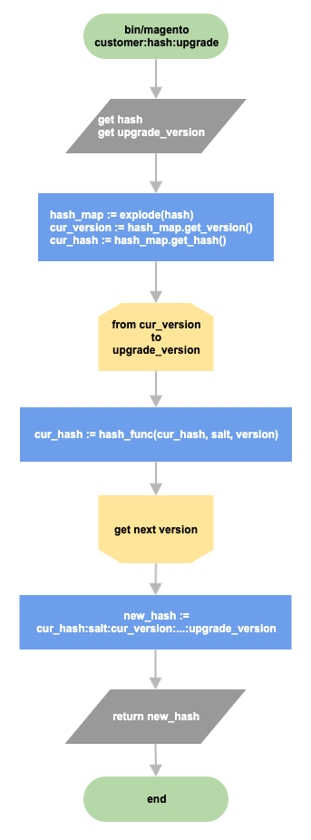
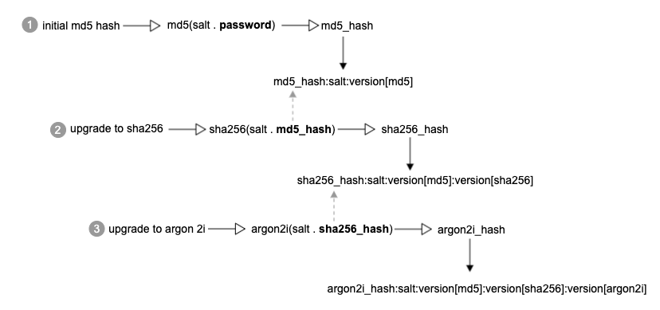

# 암호 해싱

현재 Commerce는 다른 기본 PHP 해시 알고리즘을 기반으로 암호 해시에 자체 전략을 사용합니다. Commerce는 다음과 같은 여러 알고리즘을 지원합니다. `MD5`, `SHA256`, 또는 `Argon 2ID13`. Sodium 확장이 설치되어 있으면(PHP 7.3에서 기본적으로 설치) `Argon 2ID13` 는 기본 해시 알고리즘으로 선택됩니다. 그렇지 않으면, `SHA256` 는 기본값입니다. 상업은 기본 PHP를 사용할 수 있습니다 `password_hash` 아르곤 2i 알고리즘 지원을 통한 기능.

다음과 같은 오래된 알고리즘으로 해시된 이전 암호를 사용하지 않으려면 `MD5`, 현재 구현에서는 원래 암호를 변경하지 않고 해시를 업그레이드하는 방법을 제공합니다. 일반적으로 암호 해시는 다음과 같은 형식을 갖습니다.

```text
password_hash:salt:version<n>:version<n>
```

위치 `version<n>`...`version<n>` 암호에 사용된 모든 해시 알고리즘 버전을 나타냅니다. 또한 솔트는 항상 암호 해시와 함께 저장되므로 알고리즘 전체 체인을 복원할 수 있습니다. 예제는 다음과 같습니다.

```text
a853b06f077b686f8a3af80c98acfca763cf10c0e03597c67e756f1c782d1ab0:8qnyO4H1OYIfGCUb:1:2
```

첫 번째 부분은 암호 해시를 나타냅니다. 두 번째, `8qnyO4H1OYIfGCUb` 소금이야. 마지막 두 가지는 서로 다른 해시 알고리즘입니다. 1은 `SHA256` 및 2는 `Argon 2ID13`. 이는 고객의 비밀번호가 원래 다음으로 해시되었음을 의미합니다 `SHA256` 그리고 그 후 알고리즘이 `Argon 2ID13` 그리고 해시는 아르곤으로 재해시되었습니다.

## 해시 전략 업그레이드

해시 업그레이드 메커니즘의 모양을 고려합니다. 원래 암호는 다음으로 해시되었다고 가정해 보십시오. `MD5` 그런 다음 Argon 2ID13으로 알고리즘을 여러 번 업데이트하였다. 다음 다이어그램은 해시 업그레이드 플로우를 보여 줍니다.



각 해시 알고리즘은 이전 암호 해시를 사용하여 새 해시를 생성합니다. Commerce는 원래 원시 암호를 저장하지 않습니다.



위에서 논의한 바와 같이, 암호 해시는 원래 암호에 적용된 여러 해시 버전을 가질 수 있다.
다음은 고객 인증 중에 암호 인증 메커니즘이 작동하는 방식입니다.

```php
def verify(password, hash):
    restored = password

    hash_map = extract(hash)
    # iterate through all versions specified in the received hash [md5, sha256, argon2id13]
    for version in hash_map.get_versions():
        # generate new hash based on password/previous hash, salt and version
        restored = hash_func(salt . restored, version)

    # extract only password hash from the hash:salt:version chain
    hash = hash_map.get_hash()

    return compare(restored, hash)
```

Commerce는 사용된 모든 암호 해시 버전을 암호 해시와 함께 저장하기 때문에 암호 인증 중에 전체 해시 체인을 복원할 수 있습니다. 해시 인증 메커니즘은 해시 업그레이드 전략과 유사합니다. 암호 해시와 함께 저장된 버전에 따라 알고리즘은 제공된 암호로부터 해시를 생성하고 해시된 암호와 데이터베이스에 저장된 해시 간의 비교 결과를 반환합니다.

## 구현

다음 `\Magento\Framework\Encryption\Encryptor` 클래스는 암호 해시 생성 및 확인을 담당합니다. 다음 [`bin/magento customer:hash:upgrade`](https://devdocs.magento.com/guides/v2.4/reference/cli/magento.html#customerhashupgrade) command가 고객 암호 해시를 최신 해시 알고리즘으로 업그레이드합니다.
