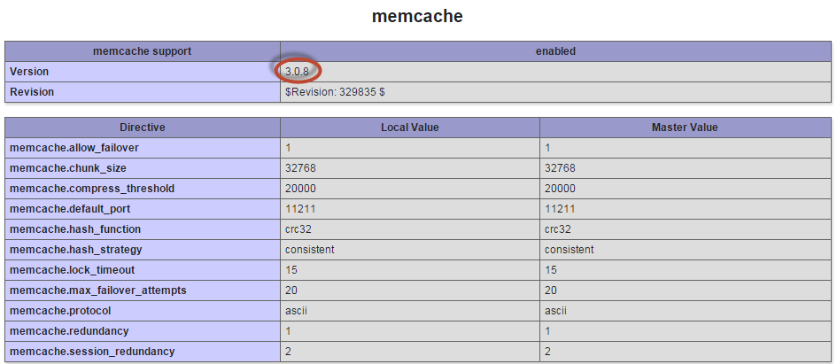

# CentOS에서 memcached 설정

이 섹션에서는 CentOS에 memcached를 설치하는 방법에 대해 설명합니다. 자세한 내용은 [memcached wiki](https://github.com/memcached/old-wiki)를 참조하십시오.

>[!INFO]
>
>Adobe은 안정적인 최신 memcached 버전(현재 memcached의 경우 3.1.3)을 사용할 것을 권장합니다.

PHP에는 memcache에 대한 기본 지원이 없으므로 이를 사용하려면 PHP용 확장을 설치해야 합니다. 사용 가능한 두 개의 PHP 확장명이 있으며, 어떤 것을 사용할지 디코딩하는 것이 중요합니다.

- `memcache`(_no d_)—정기적으로 유지되지 않는 오래되었지만 인기 있는 확장입니다.
`memcache` 확장 프로그램은 현재 _PHP 7에서 작동하지 않습니다_. memcache에 대한 [PHP 설명서](https://www.php.net/manual/en/book.memcache.php)를 참조하십시오.

  정확한 이름은 CentOS의 `php-pecl-memcache`입니다.

- `memcached`(_(`d`_&#x200B;을(를) 사용하는 경우)—PHP 7과 호환되는 최신 버전 및 유지 관리된 확장입니다. memcached에 대한 [PHP 설명서](https://www.php.net/manual/en/book.memcached.php)를 참조하세요.

  정확한 이름은 CentOS의 `php-pecl-memcached`입니다.

## CentOS에서 memcached 설치 및 구성

CentOS에 memcached를 설치하려면 `root` 권한을 가진 사용자로 다음 작업을 수행하십시오.

1. memcached 및 해당 종속성 설치:

   ```bash
   yum -y update
   ```

   ```bash
   yum install -y libevent libevent-devel
   ```

   ```bash
   yum install -y memcached
   ```

   ```bash
   yum install -y php-pecl-memcache
   ```

   >[!INFO]
   >
   >이전 명령의 구문은 사용하는 패키지 저장소에 따라 다를 수 있습니다. 예를들어, webtatic과 PHP 5.6을 사용하는 경우 `yum install -y php56w-pecl-memcache`을 입력합니다. `yum search memcache|grep php`을(를) 사용하여 적절한 패키지 이름을 찾으십시오.


1. `CACHESIZE` 및 `OPTIONS`에 대한 memcached 구성 설정 변경:

   1. 텍스트 편집기에서 `/etc/sysconfig/memcached` 열기
   1. `CACHESIZE`의 값을 찾아 1GB 이상으로 변경합니다. For example:

      ```config
      CACHESIZE="1GB"
      ```

   1. `OPTIONS`의 값을 찾아 `localhost` 또는 `127.0.0.1`(으)로 변경합니다.

1. 변경 내용을 `memcached`에 저장하고 텍스트 편집기를 종료합니다.
1. memcached를 다시 시작합니다.

   ```bash
   service memcached restart
   ```

1. 웹 서버를 다시 시작합니다.

   Apache의 경우:

   ```bash
   service httpd restart
   ```

1. 다음 섹션을 계속합니다.

## Commerce을 설치하기 전에 memcached 작업 확인

Adobe은 Commerce을 설치하기 전에 memcached를 테스트하여 작동하는지 확인할 것을 권장합니다. 이렇게 하면 몇 분 밖에 걸리지 않으며 나중에 문제 해결을 단순화할 수 있습니다.

### 웹 서버에서 memcached를 인식하는지 확인

웹 서버에서 memcached를 인식하는지 확인하려면:

1. 웹 서버의 docroot에 `phpinfo.php` 파일을 만듭니다.

   ```php
   <?php
   // Show all information, defaults to INFO_ALL
   phpinfo();
   ```

1. 웹 브라우저의 해당 페이지로 이동합니다.

   For example, `http://192.0.2.1/phpinfo.php`

1. memcache가 다음과 같이 표시되는지 확인합니다.



memcached 버전 3.0.5 이상을 사용 중인지 확인하십시오.

memcache가 표시되지 않으면 웹 서버를 다시 시작하고 브라우저 페이지를 새로 고칩니다. 그래도 표시되지 않으면 `php-pecl-memcache` 확장을 설치했는지 확인하십시오.

### MySQL 데이터베이스와 PHP 스크립트로 구성된 memcache 테스트 만들기

테스트에서는 MySQL 데이터베이스, 테이블 및 데이터를 사용하여 데이터베이스 데이터를 검색하고 이를 memcache에 저장할 수 있는지 확인합니다. PHP 스크립트는 먼저 캐시를 검색합니다. 결과가 없으면 스크립트는 데이터베이스를 쿼리합니다. 원본 데이터베이스에서 쿼리가 이행되면 스크립트는 `set` 명령을 사용하여 결과를 memcache에 저장합니다.

[이 테스트에 대한 추가 정보](https://www.digitalocean.com/community/tutorials/how-to-install-and-use-memcache-on-ubuntu-12-04)

MySQL 데이터베이스를 만듭니다.

```bash
mysql -u root -p
```

`mysql` 프롬프트에서 다음 명령을 입력합니다.

```sql
create database memcache_test;
GRANT ALL ON memcache_test.* TO memcache_test@localhost IDENTIFIED BY 'memcache_test';
use memcache_test;
create table example (id int, name varchar(30));
insert into example values (1, "new_data");
exit
```

웹 서버의 docroot에 `cache-test.php`을(를) 만듭니다.

```php
$meminstance = new Memcached();

$meminstance->addServer('<memcached hostname or ip>', <memcached port>);

$query = "select id from example where name = 'new_data'";
$querykey = "KEY" . md5($query);

$result = $meminstance->get($querykey);

if (!$result) {
   try {
        $dbh = new PDO('mysql:host=localhost;dbname=memcache_test','memcache_test','memcache_test');
        $dbh->setAttribute(PDO::ATTR_ERRMODE, PDO::ERRMODE_EXCEPTION);
        $result = $dbh->query("select id from example where name = 'new_data'")->fetch();
        $meminstance->set($querykey, $result, 0, 600);
        print "got result from mysql\n";
        return 0;
    } catch (PDOException $e) {
        die($e->getMessage());
    }
}
print "got result from memcached\n";
return 0;
```

여기서 `<memcached hostname or ip>`은(는) `localhost`, `127.0.0.1`이거나 memcache 호스트 이름 또는 IP 주소입니다. `<memcached port>`은(는) 수신 포트입니다. 기본적으로 `11211`입니다.

명령줄에서 스크립트를 실행합니다.

```bash
cd <web server docroot>
```

```bash
php cache-test.php
```

첫 번째 결과는 `got result from mysql`입니다. 즉, memcached에 키가 없었지만 MySQL에서 검색되었습니다.

두 번째 결과는 값이 memcached에 성공적으로 저장되었는지 확인하는 `got result from memcached`입니다.

마지막으로 텔넷을 사용하여 memcache 키를 볼 수 있습니다.

```bash
telnet localhost <memcache port>
```

프롬프트에서 다음을 입력합니다.

```bash
stats items
```

그 결과는 다음과 비슷합니다.

```
STAT items:3:number 1
STAT items:3:age 1075
STAT items:3:evicted 0
STAT items:3:evicted_nonzero 0
STAT items:3:evicted_time 0
STAT items:3:outofmemory 0
STAT items:3:tailrepairs 0
```

memcache 저장소를 플러시하고 텔넷을 종료합니다.

```bash
flush_all
```

```bash
quit
```

[Telnet 테스트에 대한 추가 정보](https://darkcoding.net/software/memcached-list-all-keys/)
