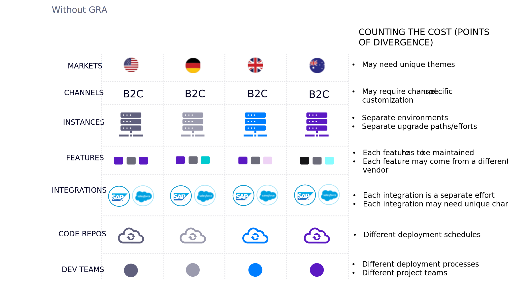

# GRA(글로벌 참조 아키텍처)

여러 현지 시장(현지화된 통화, 언어, 미디어, 공유 카탈로그 및 고유한 카트가 있는 경우)에서 여러 브랜드에 대한 사이트가 여러 개인 기업을 운영하고 있고 동일한 기능 및 통합을 구현하는 데 필요한 불필요한 비용을 방지하려는 경우(GRA) 글로벌 참조 아키텍처(GRA)는 항상 좋은 옵션입니다.

GRA는

- 구현 방법
- 배포 전략
- 프로세스 거버넌스 모델

GRA는 다음 내용이 아닙니다.

- 제품 &quot;기능&quot;
- 모든 상거래 플랫폼에 대한 고유
- 글로벌 비즈니스 사용 사례에 대해서만

GRA가 미치는 영향:

- 코드가 전달되는 방법

   - 다양한 경험을 제공하는 특정 코드 리포지토리를 기반으로 구축되었습니다.

- 비즈니스 시스템 통합 방법

   - 브랜드 및/또는 지역별 비즈니스 시스템과의 연결을 통합합니다.

- 사용자 정의 개발 및 유지 관리 방법

   - 모든 사용자 지정 작업이 비즈니스에 대한 포괄적인 관점에서 수행될 수 있도록 중앙 집중식 및 도메인별 사용자 지정 작업을 보장합니다.

- 새로운 시장 활성화 방법

   - 많은 시간과 비용이 소요되는 여러 채널과 시장을 간편하게 출시할 수 있습니다.
