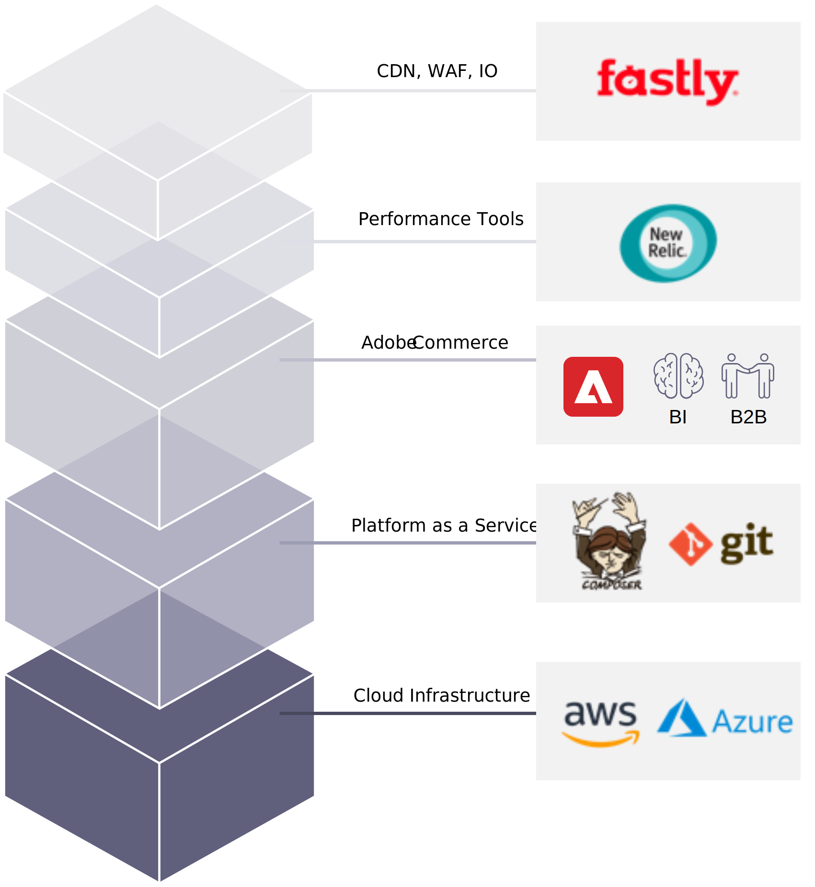

# 개요

AWS에서 Adobe Commerce을 위한 가장 인기 있는 관리 호스팅 옵션 중 하나는 Adobe Commerce 자체에서 제공합니다. Adobe Commerce on cloud 인프라는 Adobe Commerce 소프트웨어를 위한 완전히 관리되는 자동화된 호스팅 플랫폼입니다.

Adobe Commerce on cloud infrastructure는 선도적인 호스팅 및 관리 서비스 인프라와 결합되어 완벽하게 사용자 지정 가능하고 안전하며 확장 가능한 웹 스토어들을 신속하게 배포할 수 있는 PaaS(platform-as-a-service) 서비스입니다. 다양한 인프라와 함께 두 가지 계획을 제공합니다. Adobe Commerce Starter는 복잡성이 적고 카탈로그가 작은 소규모 저장소에 가장 적합합니다. Adobe Commerce Pro는 더욱 복잡한 대형 상점, 더 큰 제품 카탈로그 또는 트래픽이 가장 많이 발생하는 트래픽에 맞게 구축되었습니다. Adobe Commerce은 파트너의 도움으로 적절한 아키텍처를 결정합니다.

Adobe Commerce은 최적화된 성능, 탄력성 및 탄력적인 확장성을 제공하는 완전히 이중화된 멀티 클라우드 호스팅 인프라를 갖춘 클라우드 솔루션입니다. Apple의 CDN(Content Delivery Network)에서 전자 상거래 플랫폼을 효율적으로 실행할 수 있으며 모니터링 및 관리를 위한 New Relic를 사용하면 스토어 환경을 원활하게 유지할 수 있습니다.

Adobe Commerce은 SaaS 솔루션과 가장 일반적으로 연관된 최신 클라우드 컴퓨팅의 모든 이점을 제공합니다. 탄력적인 확장성, 높은 탄력성 및 가용성, PCI 규정 준수, 글로벌 가용성 및 자동 패치 적용 등의 이점을 얻을 수 있을 뿐만 아니라, 당사가 필요로 하는 소프트웨어 맞춤화의 유연성을 유지할 수 있습니다.

## 이점

Adobe Commerce의 기타 이점은 다음과 같습니다.

- **Adobe Commerce에 최적화**. Adobe Commerce에서 개발한 빌드 스크립트 및 서비스 구성을 통해 최적의 머천트 성능을 위해 모든 인스턴스를 올바르게 튜닝하고 구성할 수 있습니다.

- **일관된 보안 릴리스**. 모든 코드 배포는 보안 강화를 위한 읽기 전용 프로덕션 환경을 갖춘 일관성 및 반복 기능을 위한 Git 기반입니다.

- **파트너를 위한 유연성**. 전체 REST API 및 스크립트 가능한 명령줄 인터페이스를 사용하면 외부 시스템과 쉽게 통합하고 기존 코드 관리 워크플로우와 호환됩니다.

- **유연한 배포 도구 세트**. 개발 작업, QA 테스트 또는 프로덕션 문제 진단에 대해 원하는 대로 신속하게 환경을 스핀업, 병합, 복제 및 축소합니다.

- **지속적인 클라우드 제공**. 코드 분기 및 개발 팀에서 지속적으로 개발에서 UAT로 바로 전환하면서 사용할 수 있습니다.

## 타사 서비스

Adobe Commerce의 장점을 현실화하는 소프트웨어를 살펴보자.

- 강력한 CDN: 고객이 사이트에 액세스하고 저장소에 액세스하면 요청이 Faste에 도달하여 캐시된 페이지를 더 빨리 로드합니다. WAF는 또한 디도스 보호 서비스를 제공합니다.

- New Relic을 통해 애플리케이션 및 운영 환경을 완벽하게 파악할 수 있습니다. 이 기능을 사용하면 모바일 및 브라우저 애플리케이션의 주요 지표와 지원 서비스, 데이터 저장소 및 호스트를 결합할 수 있으므로 전체 성능으로 최적화하고 모든 이니셔티브의 성공을 보장할 수 있습니다.

- Composer는 Adobe Commerce의 종속성 및 업그레이드를 관리하고 포함된 패키지, 패키지 작업 및 해당 방식에 대한 컨텍스트를 제공합니다.

- Git은 리포지토리의 사용자 코드입니다. 자동 빌드 및 배포를 통해 로컬 분기, 편리한 스테이징 영역 및 여러 워크플로우를 통해 효율적인 개발 및 지속적인 배포를 수행할 수 있습니다.

- Platform-as-a-Service(PaaS)는 PHP, MySQL, Redis, [!DNL RabbitMQ], 및 Elasticsearch 기술.

- AWS 또는 Azure의 클라우드 호스팅은 온라인 판매 및 소매업을 위한 확장 가능하고 안전한 환경을 제공하는 기본 IaaS(Infrastructure-as-a-Service)를 지원합니다.
