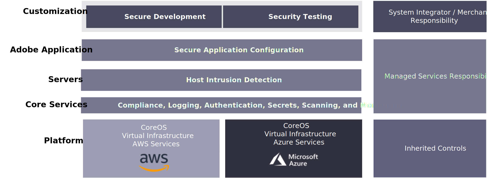

# Adobe Managed Services

Adobe Commerce is a platform for delivering ecommerce capabilities, including out-of-the-box features, an ability to customize, and third-party integrations.

Adobe의 Managed Services은 Cloud Commerce on Cloud Infrastructure Pro Plan을 위한 호스팅 및 관리되는 애플리케이션 및 인프라입니다.

## 이점

## 보안

Managed Services용 Adobe 보안 스택은 자동화 및 일관성을 사용하여 사람의 오류를 줄이기 위해 모든 수준에서 보안을 빌드합니다. 개발 및 운영 팀은 스택의 다양한 수준에서 보안 제어를 자동으로 상속합니다.

Amazon Web Services 및 Microsoft Azure와 같은 플랫폼 파트너는 플랫폼 사용자 지정을 적용할 때 최대 보안 기능을 보장하지만, Adobe의 Managed Services 팀은 규정 준수, 로깅, 인증, 스캔 및 모니터링과 같은 핵심 보안 서비스뿐만 아니라 서버 보안 및 보안 응용 프로그램 구성을 제공합니다. Dsu 상거래는 사용자 지정 개발 및 통합 및 사용자 지정 코드에 대한 관련 보안 프로세스를 담당합니다.

다음 다이어그램은 Adobe 관리 서비스의 보안 기술 스택을 보여줍니다.

