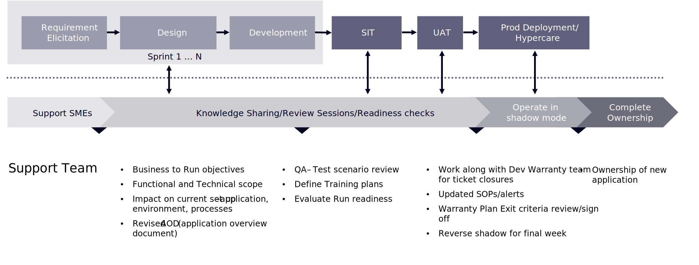

# 유지 관리 및 지원 개요

소비자들은 이미 그 어느 때보다 선택의 폭이 넓어졌다. 브랜드가 관심을 받기 위해 경쟁하는 데 부족함이 없는 상황에서, 당신은 소비자들에게 당신의 경쟁자들을 바라볼 어떠한 이유도 줄 수 없다. 우리가 보았듯이, 소비자에 대한 충성도와 인내는 희박하다. 그들이 당신의 브랜드를 포기하는 데 많은 비용이 들지 않고, 나쁜 전자 상거래 경험을 갖는 것은 그들이 포기하기 쉬운 방법입니다.

이는 두 가지 보완점으로 이어진다. 첫 번째는 새로운 전자 상거래 사이트의 출시가 여러분이 다음으로 넘어가겠다는 것을 의미하지는 않는다는 것입니다. 마케팅과 소비자의 요구에 따른 변화율이 너무 커서 브랜드가 따라잡기 위해 끊임없이 진화해야 한다. 두 번째를 가리키게 되죠. 만약 당신의 전자 상거래 지원이 깨졌을 때 그것을 고치기 위해 그곳에 있다면, 그것은 소비자들의 높아지는 기대를 충족시키는 것이 불가능할 것이다. 즉, 전자 상거래 지원은 사이트를 계속 작동시켜서는 안 되며 브랜드를 발전시켜 나가야 합니다. 이 섹션은 사이트 시작 후 브랜드를 앞으로 이동하는 데 도움이 됩니다.

## 전환 단계

프로젝트의 전환 단계에서 프로덕션 지원을 설정하는 것은 커머스 기업에 가장 중요한 성공 요인 중 하나입니다. 구현이 완료되고 현장이 가동되면 생산 지원팀이 지원 활동을 대신할 준비와 장비를 갖추어야 한다. 일반적인 방법은 전환 단계에서 개발 팀을 단계적으로 축소하고 지원을 위해 적절한 소규모 팀을 구축하는 것입니다.

지식 전달은 전체 프로젝트의 과정을 통해 이루어지며 성공적인 전환 접근은 전달과 병행하여 일어난다. 또한 사용자 가이드 및 기술 위키는 프로젝트 단계 전반에 걸쳐 워크샵을 통해 팀이 사용할 수 있는 중요한 도구입니다.

다음 다이어그램은 성공적인 전환 결과에 포함될 단계 및 활동을 보여 줍니다.

>[!NOTE]
>
> 프로젝트 관리자가 제작 후 지원 팀을 성공적으로 설정하는 데 필요한 작업을 완료할 수 있도록 지원하는 전환 확인 목록을 구성하는 것이 중요합니다. 이 전환은 전체 프로젝트 계획의 일부여야 하며 작업은 일정에 포함되어야 합니다.

플랫폼 및 상거래 관행을 지속적으로 개선하고 최적화하기 위해 비즈니스에 적합한 지원 모델을 파악하는 것은 구현 프로세스 동안 수행한 모든 수고를 유지 관리하는 중요한 단계입니다. 포괄적인 지속적인 지원 계획을 통해 상거래 사이트는 고객의 기대에 부응할 수 있으며 목표를 계속 달성할 수 있습니다.

Adobe Commerce을 배포할 때에는 유지 관리 및 지원 전략에 포함할 내용을 고려하는 것이 중요합니다.
Adobe Commerce 라이선스에는 전문가 지원이 포함되어 있습니다. 전문가 지원 및 Adobe 지원 계획에 대한 자세한 내용은 [Adobe 지원 계획](https://business.adobe.com/kr/customers/consulting-services/premier-support.html)을 참조하세요.
Adobe 지원 플랜 외에도 레거시 Magento 지원 약관이 있습니다. 적용 가능한 지원 서비스를 이해하려면 계약을 참조하여 보유하고 있는 지원 계약을 확인하거나 Adobe 계정 팀에 문의하십시오.
