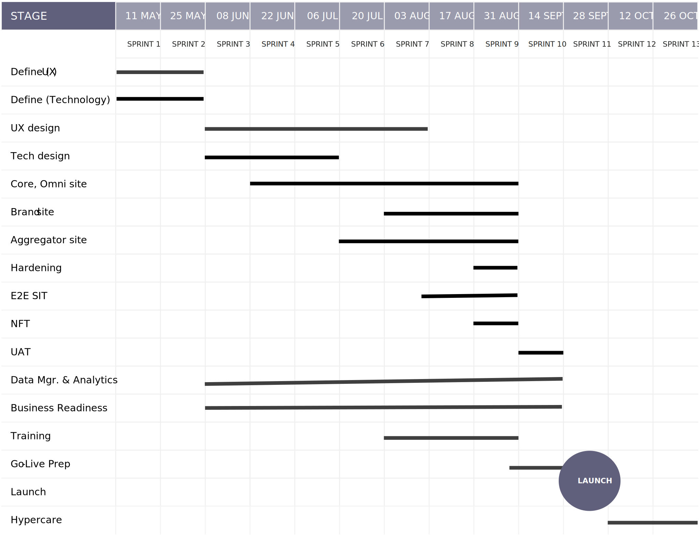

# 전달 및 계획 방식

구현을 시작하기 전에 프로젝트의 전체 범위를 이해하는 것은 시간, 예산 및 요구 사항에 맞는 솔루션을 제공할 계획을 세우는 것과 마찬가지로 매우 중요합니다. 이를 위해서는 솔루션의 디자인과 구현을 위한 완벽한 블루프린트를 식별하고 성공을 측정하는 동안 해당 블루프린트를 실행해야 합니다.

이 작업은 처음 구상부터 시작하여 시작 이후까지 끝나지 않는 전체 팀의 약속입니다. 그리고 이것이 세부적이고 때로는 지루한 과정의 측면인 반면, 여러분이 계획과 지배구조에 투입한 작업은 주변을 탐색하고 극복하기 훨씬 쉽게 장애물을 만듭니다.

전략적 상거래 프로젝트는 다양한 접근 방식과 다양한 프로젝트 관리 방법론을 통해 제공될 수 있습니다. 그러나 성공적인 전달과 최적의 실행을 위해 하이브리드 Agile 접근 방식을 사용하는 것이 좋습니다.

이 방법은 다음 단계로 구성됩니다.

- 계획, 설계 및 전략을 위한 단계 정의

- 솔루션을 구축하고 설계하기 위한 Agile Sprint

- 파일럿에 대한 통합, 성능 및 사용자 수락 테스트

- 브랜드 및 상거래 사이트에 대한 스크럼 팀 역할

하이브리드 모델을 사용하면 Agile 방법론의 힘을 활용하여 타임라인, 비용 및 품질에 대한 목표를 유지할 수 있습니다. 전체 계획은 두 개의 개별 단계로 구분되며, 그 뒤에는 시작, 최적화 및 유지 관리 활동이 실행됩니다.

- **올바른 아이디어 얻기**—요구 사항, 디자인 및 기술 솔루션을 이해 당사자 간에 전략 수립, 문서화 및 공동 작업하도록 하는 사전 구현 단계입니다. 구현에 대한 백로그가 정리되고 빌드되고 개발 인기도 계획되며, 제품 구축에 대한 순차적 전략이 마무리됩니다.

- **아이디어를 정확하게 얻기**- 제품을 반복적으로 빌드하고, 철저하게 테스트하고, 적절하게 릴리스하기 위한 구현 단계입니다. 첫 단계는 여러 스프린트를 통해 코드를 개발하는 것이다. 각 sprint에는 인스프린트 개발 및 테스트, 시스템 통합 테스트, 성능 및 보안 테스트, 사용자 수락 테스트 및 릴리스 활동이 순서대로 포함됩니다.

프로젝트 계획은 중요한 활동입니다. 프로젝트 단계를 모니터링, 관리 및 제어하는 방법에 대해 이해 관계자, 팀, 스폰서 및 프로젝트 관리자에게 안내합니다. 또한 목표를 파악하고, 최종 기한을 놓치지 않고, 중요한 작업을 우선 순위화하고, 위험을 줄이고, 원하는 결과를 제공하는 데 도움이 됩니다.

프로젝트 계획은 일반적으로 네 단계로 구성됩니다.

- 시작 및 계획
- 실행
- Launch
- 출시 후

각 단계는 여러 개의 더 작은 스프린트를 통해 전달될 수 있으므로, 더 작은 증분으로 진행과 결과를 더 높은 민첩성으로 관리할 수 있습니다. 그러나 계획이 일반적으로 다른 세 단계의 일부라는 점에서 독특합니다. Adobe에서는 각 단계에 대한 세부 분류와 성공적인 Adobe Commerce 구현을 위한 프로젝트 계획의 예를 제공했습니다.

정의한 접근 방식은 성공적인 프로젝트 실행을 위해 함께 제공되는 다양한 프로젝트 단계를 보여줍니다. PMO(Project Management Office)는 다양한 수준에서 철저한 감시를 제공하며 최적의 품질과 비용으로 최대 성공적이고 시기 적절한 실행을 구성하는 각 단계(및 스프린트)에서 성공을 보장합니다.

