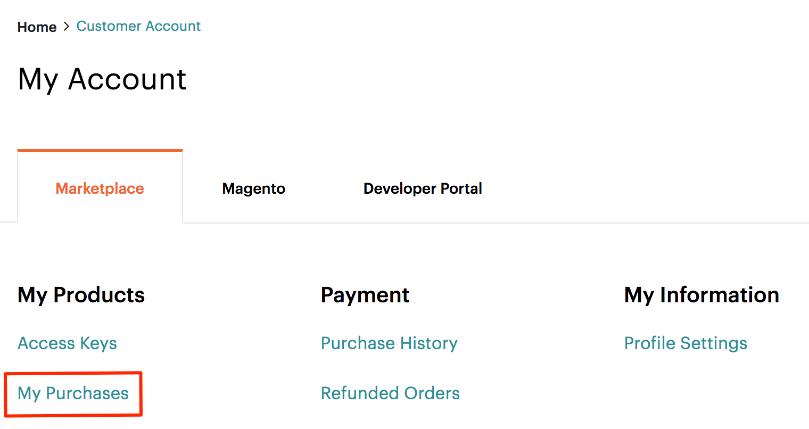

# 확장 설치

Adobe Commerce 및 Magento Open Source 동작을 확장 또는 사용자 지정하는 코드를 확장이라고 합니다. 필요에 따라 확장을 패키징하여 [Commerce Marketplace](https://marketplace.magento.com) 또는 다른 확장 배포 시스템을 참조하십시오.

확장에는 다음이 포함됩니다.

- 모듈(Adobe Commerce 및 Magento Open Source 기능 확장)
- 테마(상점 및 관리자의 모양 및 느낌 변경)
- 언어 패키지(storefront 및 관리자 현지화)

>[!TIP]
>
>이 항목에서는 명령줄을 사용하여 Commerce Marketplace에서 구입한 확장을 설치하는 방법을 설명합니다. 동일한 절차를 사용하여 _임의_ 확장; 확장의 작성기 이름 및 버전만 필요합니다. 이를 찾으려면 확장 프로그램의 `composer.json` 파일에 대한 값을 기록하고 `"name"` 및 `"version"`.

설치 전에 다음을 수행할 수 있습니다.

1. 데이터베이스를 백업합니다.
1. 유지 관리 모드 사용:

   ```bash
   bin/magento maintenance:enable
   ```

확장을 설치하려면 다음을 수행해야 합니다.

1. Commerce Marketplace 또는 다른 확장 개발자로부터 확장을 가져옵니다.
1. Commerce Marketplace에서 확장을 설치하는 경우 `repo.magento.com` 저장소가 `composer.json` 파일:

   ```bash
   "repositories": [
       {
           "type": "composer",
           "url": "https://repo.magento.com/"
       }
   ]
   ```

1. 확장의 작성기 이름 및 버전을 가져옵니다.
1. 업데이트 `composer.json` 확장명의 이름 및 버전을 사용하여 프로젝트에 파일을 포함합니다.
1. 확장이 제대로 설치되었는지 확인합니다.
1. 확장을 활성화하고 구성합니다.

## 확장 작성기 이름 및 버전 가져오기

확장의 작성기 이름 및 버전을 이미 알고 있는 경우 이 단계를 건너뛰고 [업데이트 `composer.json` 파일](#update-your-composer-file).

Commerce Marketplace에서 확장의 작성기 이름 및 버전을 가져오려면 다음을 수행하십시오.

1. 에 로그인합니다. [Commerce Marketplace](https://marketplace.magento.com) 확장을 구입할 때 사용한 사용자 이름과 암호로 사용.

1. 오른쪽 위 모서리에서 을(를) 클릭합니다. **사용자 이름** > **내 프로필**.

   

1. 클릭 **내 구매**.

   

1. 설치할 확장을 찾아 클릭합니다 **기술 세부 정보**.

   

>[!TIP]
>
>또는 의 작성기 이름과 버전을 찾을 수 있습니다 _임의_ 확장 프로그램의 `composer.json` 파일.

## 작성기 파일 업데이트

확장의 이름 및 버전을 `composer.json` 파일:

1. 프로젝트 디렉토리로 이동하여 를 업데이트합니다 `composer.json` 파일.

   ```bash
   composer require <component-name>:<version>
   ```

   예,

   ```bash
   composer require j2t/module-payplug:2.0.2
   ```

1. 을(를) 입력합니다. [인증 키](../prerequisites/authentication-keys.md). 공개 키는 사용자 이름 입니다. 개인 키는 암호입니다.

1. 작성기가 프로젝트 종속성 업데이트를 완료하고 오류가 없는지 확인할 때까지 기다립니다.

   ```terminal
   Updating dependencies (including require-dev)
   Package operations: 1 install, 0 updates, 0 removals
     - Installing j2t/module-payplug (2.0.2): Downloading (100%)
   Writing lock file
   Generating autoload files
   ```

## 확장 확인

확장이 제대로 설치되었는지 확인하려면 다음 명령을 실행하십시오.

```bash
bin/magento module:status J2t_Payplug
```

기본적으로 확장은 비활성화되어 있을 수 있습니다.

```terminal
Module is disabled
```

확장 이름은 형식입니다 `<VendorName>_<ComponentName>`; 작성기 이름과 다른 형식입니다. 이 형식을 사용하여 확장을 활성화합니다. 확장 이름을 잘 모르는 경우 다음을 실행합니다.

```bash
bin/magento module:status
```

그리고 &quot;비활성화된 모듈 목록&quot;에서 확장을 찾습니다.

## 확장 활성화

생성된 정적 보기 파일을 먼저 지우지 않으면 일부 확장이 제대로 작동하지 않습니다. 를 사용하십시오 `--clear-static-content` 확장을 활성화할 때 정적 보기 파일을 삭제하는 옵션.

1. 확장을 활성화하고 정적 보기 파일을 지웁니다.

   ```bash
   bin/magento module:enable J2t_Payplug --clear-static-content
   ```

   다음 출력이 표시됩니다.

   ```terminal
   The following modules have been enabled:
   - J2t_Payplug
   
   To make sure that the enabled modules are properly registered, run 'setup:upgrade'.
   Cache cleared successfully.
   Generated classes cleared successfully. Please run the 'setup:di:compile' command to generate classes.
   Generated static view files cleared successfully.
   ```

1. 확장을 등록합니다.

   ```bash
   bin/magento setup:upgrade
   ```

1. 프로젝트를 다시 컴파일합니다. 프로덕션 모드에서는 &quot;Magento 컴파일 명령을 다시 실행하십시오&quot;라는 메시지가 표시될 수 있습니다. 응용 프로그램에서 개발자 모드에서 컴파일 명령을 실행하라는 메시지가 표시되지 않습니다.

   ```bash
   bin/magento setup:di:compile
   ```

1. 확장이 활성화되어 있는지 확인합니다.

   ```bash
   bin/magento module:status J2t_Payplug
   ```

   확장이 더 이상 비활성화되지 않음을 확인하는 출력이 표시됩니다.

   ```terminal
   Module is enabled
   ```

1. 캐시 정리:

   ```bash
   bin/magento cache:clean
   ```

1. 필요에 따라 Admin에서 확장을 구성합니다.

>[!TIP]
>
>브라우저에서 저장 공간을 로드할 때 오류가 발생하면 다음 명령을 사용하여 캐시를 지웁니다. `bin/magento cache:flush`.

## 확장 업그레이드

모듈 또는 확장을 업데이트하거나 업그레이드하려면 다음을 수행하십시오.

1. 업데이트된 파일을 Marketplace 또는 다른 확장 개발자가 다운로드합니다. 모듈 이름과 버전을 주목하십시오.

1. 컨텐츠를 애플리케이션 루트 디렉토리로 내보냅니다.

1. 모듈에 대한 작성기 패키지가 있으면 다음 중 하나를 실행합니다.

   모듈 이름별 업데이트:

   ```bash
   composer update vendor/module-name
   ```

   버전별 업데이트:

   ```bash
   composer require vendor/module-name ^x.x.x
   ```

1. 다음 명령을 실행하여 캐시를 업그레이드, 배포 및 청소합니다.

   ```bash
   bin/magento setup:upgrade --keep-generated
   ```

   ```bash
   bin/magento setup:static-content:deploy
   ```

   ```bash
   bin/magento cache:clean
   ```
