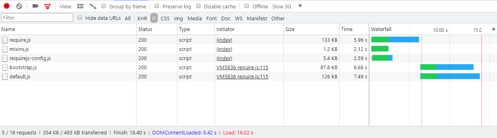

# 고급 [!DNL JavaScript] 번들링

번들링 [!DNL JavaScript] 성능을 향상시키기 위한 모듈은 두 가지 사항을 줄이는 것입니다.

1. 서버 요청 수입니다.
1. 해당 서버 요청의 크기입니다.

모듈식 애플리케이션에서는 서버 요청 수가 수백 개에 도달할 수 있습니다. 예를 들어 다음 스크린샷은 [!DNL JavaScript] 정리 설치의 홈 페이지에 로드되는 모듈입니다.


## 병합 및 번들

즉시 [!DNL Commerce] 에서는 서버 요청 수를 줄이는 두 가지 방법을 제공합니다. 병합 및 번들링. 이러한 설정은 기본적으로 꺼져 있습니다. 의 관리자 UI 내에서 이러한 기능을 설정할 수 있습니다 **[!UICONTROL Stores]** > **설정** > **[!UICONTROL Configuration]** > **[!UICONTROL Advanced]** > **[!UICONTROL Developer]** > **[!UICONTROL [!DNL JavaScript] Settings]**&#x200B;또는 를 포함할 수도 있습니다.


### 기본 번들

명령줄에서 내장 번들링을 활성화하려면

```bash
php -f bin/magento config:set dev/js/enable_js_bundling 1
```

이것은 토착민이다 [!DNL Commerce] 시스템에 있는 모든 자산을 결합하여 동일한 크기의 번들(bundle_0.js, bundle_1.js .. bundle_x.js)에 배포하는 메커니즘입니다.

![[!DNL Commerce] 번들링](../assets/performance/images/magentoBundling.png)

더 낫지만 브라우저가 여전히 모든 [!DNL JavaScript] 번들뿐만 아니라 필요한 번들까지도

[!DNL Commerce] 번들링 은 페이지당 연결 수를 줄이지만, 각 페이지 요청에 대해 요청된 페이지가 하나 또는 두 개의 번들 내의 파일에만 종속될 수 있는 경우에도 모든 번들을 로드합니다. 브라우저가 번들을 캐시한 후 성능이 개선됩니다. 그러나 브라우저가 이러한 번들을 동기식으로 로드하므로 사용자가 처음 [!DNL Commerce] storefront에서 사용자 경험을 렌더링하고 손상시키는 데 시간이 걸릴 수 있습니다.

### 기본 병합

명령줄에서 내장 병합을 활성화하려면

```bash
php -f bin/magento config:set dev/js/merge_files 1
```

이 명령은 모든 동기식을 병합합니다. [!DNL JavaScript] 파일을 하나의 파일에 넣을 수 있습니다. 번들링을 활성화하지 않고 병합을 활성화하는 것은 [!DNL Commerce] requireJS를 사용합니다. 번들링을 활성화하지 않으면, [!DNL Commerce] 는 RequireJS 및 해당 구성만 병합합니다. 번들링과 병합을 모두 활성화하면 [!DNL Commerce] 단일 만들기 [!DNL JavaScript] 파일:


## 실제 렌더링 시간

이전 번들 및 병합된 로드 시간은 개발 환경에서 매우 적합합니다. 그러나 실제 환경에서는 렌더링의 속도를 저하할 수 있는 것이 많습니다. 느린 연결, 큰 연결 임계값, 제한된 네트워크. 또한 모바일 장치는 데스크톱만큼 빠르게 렌더링되지 않습니다.

실제 환경을 위한 스토어 전면 배포를 테스트하고 준비하려면 Chrome의 기본 조절 프로필 &quot;Slow 3G&quot;로 테스트하는 것이 좋습니다. 슬로우 3G를 통해 이전의 번들 출력 시간은 이제 많은 사용자의 연결 현실을 반영합니다.


Slow 3G 연결 기능에서 깨끗한 홈 페이지의 모든 번들을 로드하는 데 약 44초가 걸립니다 [!DNL Commerce] 설치.

번들을 단일 파일에 병합할 때에도 마찬가지입니다. 사용자는 다음과 같이 초기 페이지 로드를 42초 정도 기다릴 수 있습니다.


에 대한 고급 접근 방식 사용 [!DNL JavaScript] 번들링, 이러한 로드 시간을 향상시킬 수 있습니다.

## 고급 번들

기억하십시오. [!DNL JavaScript] 번들링을 사용하면 브라우저에서 로드되는 각 페이지에 대해 요청한 자산의 수와 크기를 줄일 수 있습니다. 이를 위해 Adobe에서는 스토어의 각 페이지가 액세스되는 각 페이지에 대해 공통 번들과 페이지별 번들만 다운로드하도록 번들을 빌드하려고 합니다.

이를 위한 한 가지 방법은 페이지 유형별로 번들을 정의하는 것입니다. 분류할 수 있습니다 [!DNL Commerce]의 페이지를 카테고리, 제품, CMS, 고객, 장바구니 및 체크아웃을 포함하여 여러 페이지 유형으로 분류합니다. 이러한 페이지 유형 중 하나로 분류된 각 페이지에는 다른 RequireJS 모듈 종속성 세트가 있습니다. 페이지 유형별로 RequireJS 모듈을 번들로 묶으면 스토어에 있는 모든 페이지의 종속성을 다루는 몇 개의 번만 표시됩니다.

예를 들어, 모든 페이지에 공통되는 종속성에 대한 번들, CMS 전용 페이지에 대한 번들, 카탈로그 전용 페이지에 대한 번들, 검색 전용 페이지에 대한 다른 번들 및 체크아웃 페이지에 대한 번들이 있을 수 있습니다.

목적별로 번들을 만들 수도 있습니다. 일반적인 기능, 제품 관련 기능, 운송 기능, 체크아웃 기능, 세금 및 양식 검증. 번들 정의 방법은 사용자 및 스토어의 구조에 따라 다릅니다. 여러분은 몇몇 번들링 전략이 다른 방법보다 더 잘 작동할 것이라는 것을 알게 될 것이다.

깨끗한 [!DNL Commerce] 설치를 통해 페이지 유형별로 번들을 분할하여 충분히 좋은 성능을 얻을 수 있지만, 일부 사용자 지정을 사용하려면 심층적인 분석 및 기타 자산 배포가 필요할 수 있습니다.

### 필수 도구

다음 단계를 수행하려면 다음 도구를 설치하고 숙지해야 합니다.

- [nodejs](https://nodejs.org/en/download/)
- [r.js](http://requirejs.org/docs/optimization.html#download)
- [[!DNL PhantomJS]](https://phantomjs.org/) (선택 사항)

### 샘플 코드

이 문서에 사용되는 샘플 코드의 전체 버전은 다음 위치에서 사용할 수 있습니다.

- [build.js](../assets/performance/code-samples/build.js)
- [deps.js](../assets/performance/code-samples/deps.js)
- [deps-map.sh](../assets/performance/code-samples/deps-map.sh.txt)

### 1부: 번들 구성 만들기

#### 1\. build.js 파일 추가

만들기 `build.js` 파일의 [!DNL Commerce] 루트 디렉토리. 이 파일에는 번들에 대한 전체 빌드 구성이 포함됩니다.

```javascript
({
    optimize: 'none',
    inlineText: true
})
```

나중에 변경 `optimize:` 에서 설정 `none` to `uglify2` 번들 출력을 축소하려면 그러나 지금은 개발 중에 `none` 를 사용하여 보다 신속하게 빌드할 수 있습니다.

#### 2\. RequireJS 종속성, shims, 경로 및 맵 추가

다음 RequireJS 빌드 구성 노드를 추가합니다. `deps`, `shim`, `paths`, 및 `map`: 빌드 파일에 추가할 수 있습니다.

```javascript
({
    optimize: 'none',
    inlineText: true,

    deps: [],
    shim: {},
    paths: {},
    map: { "*": {} },
})
```

#### 3\. requirejs-config.js 인스턴스 값을 집계합니다

이 단계에서는 여러 항목을 모두 집계해야 합니다 `deps`, `shim`, `paths`, 및 `map` 저장소의 구성 노드 `requirejs-config.js` 파일에서 `build.js` 파일. 이렇게 하려면 **[!UICONTROL Network]** 브라우저의 개발자 도구 패널에서 탭을 탭하고 홈 페이지와 같은 스토어의 모든 페이지로 이동합니다. 네트워크 탭에 `requirejs-config.js` 파일 옆에 있는 다음 강조 표시됩니다.


이 파일 내에서는 각 구성 노드(`deps`, `shim`, `paths`, `map`). 이러한 여러 노드 값을 build.js 파일의 단일 구성 노드에 집계해야 합니다. 예를 들어 `requirejs-config.js` 인스턴스에 15개의 개별 항목이 있습니다. `map` 노드, 모든 15개 노드의 항목을 단일 노드에 병합해야 합니다 `map` 노드 `build.js` 파일. 동일한 것이 `deps`, `shim`, 및 `paths` 노드 아래에 나열됩니다. 이 프로세스를 자동화하는 스크립트가 없다면 시간이 걸릴 수 있습니다.

경로를 변경해야 합니다 `mage/requirejs/text` to `requirejs/text` in `paths` 구성 노드는 다음과 같습니다.

```javascript
({
    //...
    paths: {
        //...
        "text": "requirejs/text"
    },
})
```

#### 4\. 모듈 노드 추가

의 끝 `build.js` 파일에서 모듈을 추가합니다[] 나중에 storefront에 대해 정의할 번들의 자리 표시자로서 배열을 지정합니다.

```javascript
({
    optimize: 'none',
    inlineText: true,

    deps: [],
    shim: {},
    paths: {},
    map: { "*": {} },

    modules: [],
})
```

#### 5\. RequireJS 종속성 검색

모든 [!DNL RequireJS] 다음을 사용하여 저장소의 페이지 유형에서 모듈 종속성 만들기:

1. [!DNL PhantomJS] 명령줄에서 [!DNL PhantomJS] 설치).
1. 브라우저 콘솔에서 JS 명령 필요.

#### 를 사용하려면 [!DNL PhantomJS]:

에서 [!DNL Commerce] 루트 디렉토리, 라는 새 파일을 만듭니다. `deps.js` 및 를 복사하여 아래 코드에 넣습니다. 이 코드는 [!DNL 을 사용합니다 [!DNL PhantomJS]] 페이지를 열고 브라우저가 모든 페이지 자산을 로드할 때까지 기다립니다. 그런 다음 [!DNL RequireJS] 지정된 페이지에 대한 종속성.

```javascript
"use strict";
var page = require('webpage').create(),
    system = require('system'),
    address;

if (system.args.length === 1) {
    console.log('Usage: $phantomjs deps.js url');
    phantom.exit(1);
} else {
    address = system.args[1];
    page.open(address, function (status) {
        if (status !== 'success') {
            console.log('FAIL to load the address');
        } else {
            setTimeout(function () {
                console.log(page.evaluate(function () {
                    return Object.keys(window.require.s.contexts._.defined);
                }));
                phantom.exit();
            }, 5000);
        }
    });
}
```

터미널 내부를 엽니다. [!DNL Commerce] 루트 디렉토리를 사용하여 특정 페이지 유형을 나타내는 저장소의 각 페이지에 대해 스크립트를 실행합니다.

<pre>
phantomjs dps.js <i>url-to-specific-page</i> &gt; <i>text-file-representing-pagetype-dependencies</i>
</pre>

예를 들어, 다음 네 가지 번들(홈 페이지, 카테고리, 제품, 장바구니)을 만드는 데 사용할 4가지 페이지 유형을 나타내는 Luma 테마 샘플 스토어의 페이지가 있습니다.

```terminal
phantomjs deps.js http://m2.loc/ > bundle/homepage.txt
phantomjs deps.js http://m2.loc/women/tops-women/jackets-women.html > bundle/category.txt
phantomjs deps.js http://m2.loc/beaumont-summit-kit.html > bundle/product.txt
phantomjs deps.js http://m2.loc/checkout/cart/?SID=m2tjdt7ipvep9g0h8pmsgie975 > bundle/cart.txt (prepare a shopping cart)
..............
```

#### 브라우저 콘솔을 사용하려면 다음을 수행하십시오.

사용하지 않으려면 [!DNL PhantomJS]를 입력하면 스토어프런트에서 각 페이지 유형을 보는 동안 브라우저의 콘솔에서 다음 명령을 실행할 수 있습니다.

```shell
Object.keys(window.require.s.contexts._.defined)
```

이 명령( [!DNL PhantomJS] script)는 동일한 목록( [!DNL RequireJS] 종속성을 설정하고 브라우저의 콘솔 내에 표시합니다. 이 접근 방식의 단점은 고유한 번들/페이지 유형 텍스트 파일을 만들어야 한다는 것입니다.

#### 6\. 출력 서식 및 필터링

를 병합한 후 [!DNL RequireJS] 페이지 유형 텍스트 파일에 대한 종속성을 사용하면 각 페이지 유형 종속성 파일에서 다음 명령을 사용하여 파일의 쉼표를 새 줄로 바꿀 수 있습니다.

```terminal
sed -i -e $'s/,/\\\n/g' bundle/category.txt
sed -i -e $'s/,/\\\n/g' bundle/homepage.txt
sed -i -e $'s/,/\\\n/g' bundle/product.txt
....
```

또한 mixins 중복 종속성이 있으므로 각 파일에 대한 모든 mixin을 제거해야 합니다. 각 종속성 파일에 대해 다음 명령을 사용하십시오.

```terminal
sed -i -e 's/mixins\!.*$//g' bundle/homepage.txt
sed -i -e 's/mixins\!.*$//g' bundle/category.txt
sed -i -e 's/mixins\!.*$//g' bundle/product.txt
...
```

#### 7\. 고유하고 일반적인 번들 식별

목표는 다음과 같은 여러 가지 [!DNL JavaScript] 모든 페이지에 필요한 파일. 이렇게 하면 브라우저가 하나 이상의 특정 페이지 유형과 함께 일반 번들을 로드하기만 하면 됩니다.

에서 터미널 열기 [!DNL Commerce] 루트 디렉토리 및 다음 명령을 사용하여 별도의 번들로 분할할 수 있는 종속성이 있는지 확인합니다.

```bash
sort bundle/*.txt |uniq -c |sort -n
```

이 명령은 `bundle/*.txt` 파일.  출력에는 각 종속성을 포함하는 파일 수도 표시됩니다.

```terminal
1 buildTools,
1 jquery/jquery.parsequery,
1 jsbuild,
2 jquery/jquery.metadata,
2 jquery/validate,
2 mage/bootstrap,
3 jquery
3 jquery/ui
3 knockoutjs/knockout
...
```

이 출력은 `buildTools` 는 번들/*.txt 파일 중 하나에만 종속되어 있습니다. 다음 `jquery/jquery.metadata` 종속성은 두 개의 (2) 파일에 있고 `es6-collections` 는 3개의 파일에 있습니다.

출력에는 다음과 같은 세 가지 페이지 유형(홈 페이지, 카테고리 및 제품)만 표시되므로,

- 세 가지 종속성은 한 개의 페이지 유형에만 고유합니다(1번으로 표시).
- 두 개의 페이지 유형(2로 표시됨)에 대해 세 개의 종속성이 더 발생합니다.
- 마지막 세 가지 종속성은 세 가지 페이지 유형 모두에 공통입니다(3번으로 표시).

즉, 어떤 페이지 유형에 어떤 종속성이 필요한지 알고 있으면 종속성을 다른 번들로 분할하여 점포의 페이지 로드 속도를 향상시킬 수 있습니다.

#### 8\. 종속성 배포 파일 만들기

어떤 페이지 유형에 어떤 종속성이 필요한지 확인하려면 [!DNL Commerce] 루트 디렉토리 `deps-map.sh` 및 는 아래 코드에 를 복사합니다.

```shell
awk 'END {
 for (R in rec) {
   n = split(rec[R], t, "/")
   if (n > 1)
     dup[n] = dup[n] ? dup[n] RS sprintf("\t%-20s -->\t%s", rec[R], R) : \
       sprintf("\t%-20s -->\t%s", rec[R], R)
   }
 for (D in dup) {
   printf "records found in %d files:\n\n", D
   printf "%s\n\n", dup[D]
   }
 }
{
 rec[$0] = rec[$0] ? rec[$0] "/" FILENAME : FILENAME
}' bundle/*.txt
```

스크립트도 여기에서 찾을 수 있습니다 [https://www.unix.com/shell-programming-and-scripting/140390-get-common-lines-multiple-files.html](https://www.unix.com/shell-programming-and-scripting/140390-get-common-lines-multiple-files.html)

에서 터미널 열기 [!DNL Commerce] 루트 디렉토리 및 파일 실행:

```bash
bash deps-map.sh
```

세 가지 예제 페이지 유형에 적용된 이 스크립트의 출력은 다음과 같아야 합니다(하지만 훨씬 더 오래).

```terminal
bundle/product.txt   -->   buildTools,
bundle/category.txt  -->   jquery/jquery.parsequery,
bundle/product.txt   -->   jsbuild,

bundle/category.txt/bundle/homepage.txt -->    jquery/jquery.metadata,
bundle/category.txt/bundle/homepage.txt -->    jquery/validate,
bundle/category.txt/bundle/homepage.txt -->    mage/bootstrap,

bundle/category.txt/bundle/homepage.txt/bundle/product.txt --> jquery,
bundle/category.txt/bundle/homepage.txt/bundle/product.txt --> jquery/ui,
bundle/category.txt/bundle/homepage.txt/bundle/product.txt --> knockoutjs/knockout,
```

번들 구성을 빌드하기에 충분한 정보입니다.

#### 9\. build.js 파일에서 번들 만들기

를 엽니다. `build.js` 구성 파일 및 번들을 `modules` 노드 아래에 있어야 합니다. 각 번들은 다음 속성을 정의해야 합니다.

- `name`— 번들의 이름입니다. 예를 들어 `bundles/cart` 생성 `cart.js` 묶음 `bundles` 하위 디렉토리.

- `create`— 번들(값: `true` 또는 `false`).

- `include`— 페이지에 대한 종속성으로 포함된 자산(문자열)의 배열입니다. RequireJS는 모든 종속성을 추적하며 제외되지 않은 경우 번들에 포함합니다.

- `exclude`— 번들에서 제외할 번들 또는 자산의 배열입니다.

```javascript
{
    name: 'bundles/catalog',
    create: true,
    include: [
        'addToWishlist',
        'priceBundle',
        'priceUtils',
        'priceOptions',
        'sticky',
        'productSummary',
        'slide'
    ],
    exclude: [
        'requirejs/require',
        'bundles/default',
        'mage/bootstrap'
    ],
}
```

이 예는 를 다시 사용합니다 `mage/bootstrap` 및 `requirejs/require` 자산에서 동기식으로 로드해야 하는 가장 중요한 구성 요소 및 구성 요소에 우선순위가 더 높은 것입니다. 제공된 번들은 다음과 같습니다.

- `requirejs/require`- 동기식으로 로드된 유일한 번들
- `mage/bootstrap`- UI 구성 요소가 있는 부트스트랩 번들
- `bundles/default`—모든 페이지에 기본 번들이 필요합니다.
- `bundles/cart`- 장바구니 페이지에 필요한 번들
- `bundles/shipping`- 장바구니 및 체크아웃 페이지에 대한 일반적인 번들(이전에 장바구니 페이지를 열고 배송 번들이 이미 로드되어 있는 경우에도 체크아웃을 바로 열지 않는 경우 체크아웃 페이지가 더 빨리 로드됩니다.)
- `bundles/checkout`- 체크아웃에 필요한 모든 항목
- `bundles/catalog`—제품 및 카테고리 페이지의 모든 항목

### 2부: 번들 생성

아래 단계에서는 보다 효율적인 생성을 위한 기본 프로세스를 설명합니다 [!DNL Commerce] 번들. 원하는 방식으로 이 프로세스를 자동화할 수 있지만 사용해야 합니다 `nodejs` 및 `r.js` 번들을 실제로 생성합니다. 그리고 당신의 주제가 [!DNL JavaScript]-관련 사용자 지정이며 동일한 항목을 다시 사용할 수 없습니다. `build.js` 파일, 여러 개의 `build.js` 주제별 구성

#### 1. 정적 저장소 사이트 생성

번들을 생성하기 전에 정적 배포 명령을 실행합니다.

```bash
php -f bin/magento setup:static-content:deploy -f -a frontend
```

이 명령은 설정한 각 테마 및 로케일에 대한 정적 저장소 배포를 생성합니다. 예를 들어, Luma 테마 및 영어 및 프랑스어 로케일의 사용자 지정 테마를 사용하는 경우 네 개의 정적 배포를 생성합니다.

- ...luma/en_US
- ...luma/fr_FR
- ...custom/en_US
- ...custom/fr_FR

모든 저장소 테마 및 로케일에 대한 번들을 생성하려면 각 저장소 테마 및 로케일에 대해 아래 단계를 반복합니다.

#### 2. 정적 저장소 콘텐츠를 임시 디렉토리로 이동합니다

먼저 RequireJS가 대상 디렉토리 내의 모든 컨텐츠를 대체하므로 정적 컨텐츠를 대상 디렉토리에서 일부 임시 디렉토리로 이동해야 합니다.

```bash
mv pub/static/frontend/Magento/{theme}/{locale} pub/static/frontend/Magento/{theme}/{locale}_tmp
```

For example:

```bash
mv pub/static/frontend/Magento/luma/en_US pub/static/frontend/Magento/luma/en_US_tmp
```

#### 3. r.js 최적기 실행

그런 다음 `build.js` 파일 위치 [!DNL Commerce]의 루트 디렉토리. 모든 디렉터리 및 파일에 대한 경로는 작업 디렉터리에 상대적입니다.

```bash
r.js -o build.js baseUrl=pub/static/frontend/Magento/luma/en_US_tmp dir=pub/static/frontend/Magento/luma/en_US
```

이 명령은 `bundles` 대상 디렉토리의 하위 디렉토리(이 경우 `pub/static/frontend/Magento/luma/en_US/bundles`.

새 번들 디렉토리의 컨텐츠를 나열하는 방식은 다음과 같습니다.

```bash
ll pub/static/frontend/Magento/luma/en_US/bundles
```

```terminal
total 1900
drwxr-xr-x  2 root root    4096 Mar 28 11:24 ./
drwxr-xr-x 70 root root    4096 Mar 28 11:24 ../
-rw-r--r--  1 root root  116417 Mar 28 11:24 cart.js
-rw-r--r--  1 root root  187090 Mar 28 11:24 catalog.js
-rw-r--r--  1 root root  307619 Mar 28 11:24 checkout.js
-rw-r--r--  1 root root 1240608 Mar 28 11:24 default.js
-rw-r--r--  1 root root   74233 Mar 28 11:24 shipping.js
```

#### 4. 번들을 사용하도록 RequireJS 구성

번들을 사용하기 위해 RequireJS를 가져오려면 `onModuleBundleComplete` 콜백 후 `modules` 노드의 `build.js` 파일:

```javascript
[
    {
       //...
       exclude: [
           'requirejs/require',
           'bundles/default',
           'bundles/checkout',
           'bundles/cart',
           'bundles/shipping',
           'mage/bootstrap'
       ],
   },
],
bundlesConfigOutFile: `${config.dir}/requirejs-config.js`,
onModuleBundleComplete: function(data) {
    if (this.bundleConfigAppended) {
        return;
    }
    this.bundleConfigAppended = true;

    // bundlesConfigOutFile requires a simple require.config call in order to modify the configuration
    const bundleConfigPlaceholder = `
(function (require) {
require.config({});
})(require);
    `;

    fs.appendFileSync(this.bundlesConfigOutFile, bundleConfigPlaceholder);
}
```

#### 5. 배포 명령을 다시 실행합니다.

다음 명령을 실행하여 배포합니다.

```bash
r.js -o app/design/frontend/Magento/luma/build.js baseUrl=pub/static/frontend/Magento/luma/en_US_tmp dir=pub/static/frontend/Magento/luma/en_US
```

열기 `requirejs-config.js` 에서 `pub/static/frontend/Magento/luma/en_US` directory를 사용하여 RequireJS가 번들 구성 호출로 파일을 추가했는지 확인합니다.

```javascript
require.config({
    bundles: {
        "bundles/default": ["mage/template", "mage/apply/scripts", "mage/apply/main", "mage/mage", "mage/translate", "mage/loader"],
        "bundles/cart": ["Magento_Ui/js/lib/validation/utils", "Magento_Ui/js/lib/validation/rules", "Magento_Ui/js/lib/validation/validation"]
    }
}
```

>[!NOTE]
>
>번들을 구성할 때는 `requirejs.config()` 호출은 표시되는 순서로 실행되므로 원하는 순서대로 실행됩니다.

#### 6. 결과 테스트

페이지가 로드되면 브라우저가 다른 종속성 및 번들을 로드하는 것을 확인합니다. 예를 들어 &#39;Slow 3G&#39; 프로필에 대한 결과는 다음과 같습니다.


빈 홈 페이지의 페이지 로드 시간은 이제 네이티브를 사용하는 것보다 두 배 빠릅니다 [!DNL Commerce] 번들링. 하지만 더 잘할 수 있어요

#### 7. 번들 최적화

지퍼가 만들어져도 [!DNL JavaScript] 파일이 여전히 큽니다. 축소하기 위해 uglifier를 사용하는 RequireJS로 축소합니다. [!DNL JavaScript] 좋은 결과를 얻을 수 있습니다.

에서 최적기를 활성화하려면 `build.js` 파일, 추가 `uglify2` 를 페이지의 맨 위에 있는 최적화 속성에 대한 값으로 `build.js` 파일:

```javascript
({
    optimize: 'uglify2',
    inlineText: true
})
```

결과는 중요한 것일 수 있습니다.


이제 로드 시간이 기본 모드보다 3배 빠릅니다 [!DNL Commerce] 번들링.
