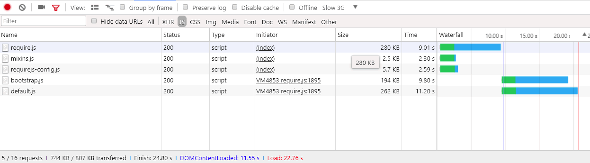

# 고급 [!DNL JavaScript] 번들

성능 향상을 위해 [!DNL JavaScript] 모듈을 번들로 제공하는 것은 다음 두 가지를 줄이는 것입니다.

1. 서버 요청 수입니다.
1. 해당 서버 요청의 크기입니다.

모듈식 응용 프로그램에서는 서버 요청 수가 수백 개에 이를 수 있습니다. 예를 들어, 다음 스크린샷은 깔끔한 설치의 홈 페이지에 로드된 [!DNL JavaScript] 모듈 목록의 시작만 표시합니다.


## 병합 및 번들링

기본적으로 [!DNL Commerce]은(는) 서버 요청 수를 줄이는 두 가지 방법인 병합과 번들링을 제공합니다. 이러한 설정은 기본적으로 꺼져 있습니다. 관리자 UI의 **[!UICONTROL Stores]** > **설정** > **[!UICONTROL Configuration]** > **[!UICONTROL Advanced]** > **[!UICONTROL Developer]** > **[!UICONTROL [!DNL JavaScript] Settings]** 또는 명령줄에서 켤 수 있습니다.


### 기본 번들

명령줄에서 기본 제공 번들링을 활성화하려면 다음을 수행합니다.

```bash
php -f bin/magento config:set dev/js/enable_js_bundling 1
```

시스템에 있는 모든 자산을 결합하고 같은 크기의 번들(bundle_0.js, bundle_1.js ... bundle_x.js)에 배포하는 기본 [!DNL Commerce] 메커니즘입니다.

![[!DNL Commerce] 번들](../assets/performance/images/magentoBundling.png)

더 좋지만 브라우저가 필요한 번들만 로드하는 것이 아니라 모든 [!DNL JavaScript] 번들을 로드합니다.

[!DNL Commerce] 번들링을 사용하면 페이지당 연결 수가 줄어들지만, 요청된 페이지가 번들 중 하나 또는 두 개 내의 파일에만 종속될 수 있는 경우에도 각 페이지 요청에 대해 모든 번들이 로드됩니다. 브라우저가 번들을 캐시한 후 성능이 향상됩니다. 그러나 브라우저가 이러한 번들을 동기식으로 로드하므로 [!DNL Commerce] 상점 첫 방문에서 렌더링하여 사용자 경험을 손상시키는 데 시간이 걸릴 수 있습니다.

### 기본 병합

명령줄에서 기본 제공 병합을 활성화하려면 다음을 수행합니다.

```bash
php -f bin/magento config:set dev/js/merge_files 1
```

이 명령은 모든 동기 [!DNL JavaScript] 파일을 하나의 파일로 병합합니다. [!DNL Commerce]이(가) RequireJS를 사용하므로 번들링도 활성화하지 않고 병합을 활성화하면 유용하지 않습니다. 번들을 사용하지 않으면 [!DNL Commerce]에서 RequireJS와 해당 구성만 병합합니다. 번들링과 병합을 모두 사용하도록 설정하면 [!DNL Commerce]에서 단일 [!DNL JavaScript] 파일을 만듭니다.


## 실제 렌더링 시간

이전의 번들 및 병합된 로드 시간은 개발 환경에서 훌륭하게 표시됩니다. 그러나 실제 환경에서는 느린 연결, 큰 연결 임계값, 제한된 네트워크 등 많은 것들이 렌더링 속도를 늦출 수 있습니다. 또한 모바일 장치는 데스크톱만큼 빠르게 렌더링되지 않습니다.

실제 환경에 맞게 상점 배포를 테스트하고 준비하려면 Chrome의 &quot;느린 3G&quot; 기본 조절 프로필로 테스트하는 것이 좋습니다. 슬로우 3G를 사용하면 이전 번들 출력 시간에 많은 사용자의 연결 현실이 반영됩니다.


느린 3G 연결에서는 깔끔한 [!DNL Commerce] 설치의 홈 페이지에 대한 모든 번들을 로드하는 데 약 44초가 걸립니다.

번들을 단일 파일로 병합하는 경우에도 마찬가지입니다. 사용자는 아래와 같이 여전히 초기 페이지 로드 시간을 42초 정도 대기할 수 있습니다.


[!DNL JavaScript] 번들링에 대한 고급 접근 방식을 통해 이러한 로드 시간을 개선할 수 있습니다.

## 고급 번들

[!DNL JavaScript] 번들링의 목표는 브라우저에 로드되는 각 페이지에 대해 요청된 에셋의 수와 크기를 줄이는 것입니다. 이를 위해 스토어의 각 페이지가 액세스하는 각 페이지에 대한 공통 번들과 페이지별 번들만 다운로드하면 되도록 번들을 빌드하려고 합니다.

이를 수행하는 한 가지 방법은 페이지 유형별로 번들을 정의하는 것입니다. [!DNL Commerce]의 페이지를 범주, 제품, CMS, 고객, 장바구니 및 체크아웃을 비롯한 여러 페이지 유형으로 분류할 수 있습니다. 이러한 페이지 유형 중 하나로 분류된 각 페이지에는 서로 다른 RequireJS 모듈 종속성 세트가 있습니다. 페이지 유형별로 RequireJS 모듈을 번들로 제공하면 스토어에 있는 페이지의 종속성을 다루는 소수의 번들만 제공됩니다.

예를 들어, 모든 페이지에 공통되는 종속성에 대한 번들, CMS 전용 페이지에 대한 번들, 카탈로그 전용 페이지에 대한 번들, 검색 전용 페이지에 대한 또 다른 번들 및 체크아웃 페이지에 대한 번들로 끝날 수 있습니다.

공용 기능, 제품 관련 기능, 배송 기능, 체크아웃 기능, 세금 및 양식 유효성 검사를 위해 번들을 용도별로 생성할 수도 있습니다. 번들을 정의하는 방법은 사용자와 스토어의 구조에 달려 있습니다. 일부 번들 전략이 다른 번들링 전략보다 더 잘 작동한다는 것을 알 수 있습니다.

깔끔한 [!DNL Commerce] 설치를 통해 페이지 유형별로 번들을 분할하여 충분한 성능을 얻을 수 있지만, 일부 사용자 지정에서는 더 자세한 분석과 다른 자산 배포가 필요할 수 있습니다.

### 필수 도구

다음 단계를 수행하려면 을 설치하고 다음 도구에 익숙해야 합니다.

- [nodejs](https://nodejs.org/en/download/)
- [r.js](http://requirejs.org/docs/optimization.html#download)
- [[!DNL PhantomJS]](https://phantomjs.org/)(선택 사항)

### 샘플 코드

이 문서에 사용된 샘플 코드의 전체 버전은 여기에서 사용할 수 있습니다.

- [build.js](../assets/performance/code-samples/build.js)
- [deps.js](../assets/performance/code-samples/deps.js)
- [deps-map.sh](../assets/performance/code-samples/deps-map.sh.txt)

### 1부: 번들 구성 만들기

#### 1\. build.js 파일 추가

[!DNL Commerce] 루트 디렉터리에 `build.js` 파일을 만듭니다. 이 파일에는 번들에 대한 전체 빌드 구성이 포함됩니다.

```javascript
({
    optimize: 'none',
    inlineText: true
})
```

나중에 `optimize:` 설정을 `none`에서 `uglify2`(으)로 변경하여 번들 출력을 최소화하겠습니다. 그러나 지금은 개발 중에 더 빠른 빌드를 위해 `none`(으)로 설정된 상태로 둘 수 있습니다.

#### 2\. RequireJS 종속성, shim, 경로 및 맵 추가

다음 RequireJS 빌드 구성 노드 `deps`, `shim`, `paths` 및 `map`을(를) 빌드 파일에 추가합니다.

```javascript
({
    optimize: 'none',
    inlineText: true,

    deps: [],
    shim: {},
    paths: {},
    map: { "*": {} },
})
```

#### 3\. requirejs-config.js 인스턴스 값 집계

이 단계에서는 저장소의 `requirejs-config.js` 파일에서 여러 `deps`, `shim`, `paths` 및 `map` 구성 노드를 모두 `build.js` 파일의 해당 노드로 집계해야 합니다. 이렇게 하려면 브라우저의 개발자 도구 패널에서 **[!UICONTROL Network]** 탭을 열고 홈 페이지와 같은 스토어의 모든 페이지로 이동할 수 있습니다. 네트워크 탭에는 상단의 `requirejs-config.js` 파일 저장소 인스턴스가 표시되어 여기에 강조 표시됩니다.


이 파일 내에서 각 구성 노드(`deps`, `shim`, `paths`, `map`)에 대해 여러 항목을 찾습니다. 이러한 여러 노드 값을 build.js 파일의 단일 구성 노드에 집계해야 합니다. 예를 들어 스토어의 `requirejs-config.js` 인스턴스에 15개의 개별 `map` 노드에 대한 항목이 있는 경우 15개의 모든 노드에 대한 항목을 `build.js` 파일의 단일 `map` 노드에 병합해야 합니다. `deps`, `shim` 및 `paths` 노드에 대해서도 마찬가지입니다. 이 프로세스를 자동화하는 스크립트가 없으면 시간이 걸릴 수 있습니다.

다음과 같이 `paths` 구성 노드에서 경로 `mage/requirejs/text`을(를) `requirejs/text`(으)로 변경해야 합니다.

```javascript
({
    //...
    paths: {
        //...
        "text": "requirejs/text"
    },
})
```

#### 4\. 모듈 노드 추가

`build.js` 파일의 끝에 나중에 상점 앞에 대해 정의할 번들의 자리 표시자로서 모듈[] 배열을 추가합니다.

```javascript
({
    optimize: 'none',
    inlineText: true,

    deps: [],
    shim: {},
    paths: {},
    map: { "*": {} },

    modules: [],
})
```

#### 5\. RequireJS 종속성 검색

다음을 사용하여 스토어의 페이지 유형에서 모든 [!DNL RequireJS] 모듈 종속성을 검색할 수 있습니다.

1. 명령줄에서 [!DNL PhantomJS]을(를) 가져왔습니다([!DNL PhantomJS]이(가) 설치되어 있다고 가정).
1. 브라우저 콘솔에서 RequireJS 명령을 사용합니다.

#### [!DNL PhantomJS]을(를) 사용하려면

[!DNL Commerce] 루트 디렉터리에서 `deps.js`(이)라는 새 파일을 만들고 아래 코드를 복사합니다. 이 코드는 [!DNL [!DNL PhantomJS]]을(를) 사용하여 페이지를 열고 브라우저가 모든 페이지 자산을 로드할 때까지 기다립니다. 그런 다음 주어진 페이지에 대한 모든 [!DNL RequireJS] 종속성을 출력합니다.

```javascript
"use strict";
var page = require('webpage').create(),
    system = require('system'),
    address;

if (system.args.length === 1) {
    console.log('Usage: $phantomjs deps.js url');
    phantom.exit(1);
} else {
    address = system.args[1];
    page.open(address, function (status) {
        if (status !== 'success') {
            console.log('FAIL to load the address');
        } else {
            setTimeout(function () {
                console.log(page.evaluate(function () {
                    return Object.keys(window.require.s.contexts._.defined);
                }));
                phantom.exit();
            }, 5000);
        }
    });
}
```

[!DNL Commerce] 루트 디렉터리 내에서 터미널을 열고 특정 페이지 유형을 나타내는 저장소의 각 페이지에 대해 스크립트를 실행합니다.

<pre>
phantomjs deps.js <i>url과 특정 페이지 간</i> &gt; <i>text-file-representing-pagetype-dependencies</i>
</pre>

예를 들어 4개의 번들(홈 페이지, 카테고리, 제품, 장바구니)을 만드는 데 사용할 4개의 페이지 유형을 나타내는 Luma 테마 샘플 저장소의 4개 페이지가 여기에 있습니다.

```
phantomjs deps.js http://m2.loc/ > bundle/homepage.txt
phantomjs deps.js http://m2.loc/women/tops-women/jackets-women.html > bundle/category.txt
phantomjs deps.js http://m2.loc/beaumont-summit-kit.html > bundle/product.txt
phantomjs deps.js http://m2.loc/checkout/cart/?SID=m2tjdt7ipvep9g0h8pmsgie975 > bundle/cart.txt (prepare a shopping cart)
..............
```

#### 브라우저 콘솔을 사용하려면:

[!DNL PhantomJS]을(를) 사용하지 않으려면 브라우저의 콘솔에서 다음 명령을 실행하여 상점의 각 페이지 유형을 볼 수 있습니다.

```shell
Object.keys(window.require.s.contexts._.defined)
```

이 명령([!DNL PhantomJS] 스크립트 내에서 사용됨)은 동일한 [!DNL RequireJS] 종속성 목록을 만들고 브라우저의 콘솔 내에 표시합니다. 이 접근 방식의 단점은 나만의 번들/페이지 유형 텍스트 파일을 만들어야 한다는 것입니다.

#### 6\. 출력 형식 지정 및 필터링

[!DNL RequireJS] 종속성을 페이지 유형 텍스트 파일에 병합한 후 각 페이지 유형 종속성 파일에서 다음 명령을 사용하여 파일의 쉼표를 새 줄로 바꿀 수 있습니다.

```bash
sed -i -e $'s/,/\\\n/g' bundle/category.txt
sed -i -e $'s/,/\\\n/g' bundle/homepage.txt
sed -i -e $'s/,/\\\n/g' bundle/product.txt
....
```

mixin은 종속성이 중복되므로 각 파일에 대한 모든 mixin도 제거해야 합니다. 각 종속성 파일에 다음 명령을 사용합니다.

```bash
sed -i -e 's/mixins\!.*$//g' bundle/homepage.txt
sed -i -e 's/mixins\!.*$//g' bundle/category.txt
sed -i -e 's/mixins\!.*$//g' bundle/product.txt
...
```

#### 7\. 고유 번들 및 공통 번들 식별

목표는 모든 페이지에 필요한 [!DNL JavaScript]개 파일의 공통 번들을 만드는 것입니다. 이러한 방식으로 브라우저는 하나 이상의 특정 페이지 유형과 함께 공통 번들을 로드하기만 하면 됩니다.

[!DNL Commerce] 루트 디렉터리에서 터미널을 열고 다음 명령을 사용하여 별도의 번들로 분할할 수 있는 종속성이 있는지 확인합니다.

```bash
sort bundle/*.txt |uniq -c |sort -n
```

이 명령은 `bundle/*.txt` 파일에 있는 종속성을 병합하고 정렬합니다.  또한 출력에는 각 종속성이 포함된 파일 수가 표시됩니다.

```
1 buildTools,
1 jquery/jquery.parsequery,
1 jsbuild,
2 jquery/jquery.metadata,
2 jquery/validate,
2 mage/bootstrap,
3 jquery
3 jquery/ui
3 knockoutjs/knockout
...
```

이 출력은 `buildTools`이(가) bundle/*.txt 파일 중 하나에만 종속되어 있음을 보여 줍니다. `jquery/jquery.metadata` 종속성은 두 개의 파일에 있으며 `es6-collections`은(는) 세 개의 파일에 있습니다.

출력에는 다음과 같은 세 가지 페이지 유형(홈 페이지, 카테고리 및 제품)만 표시됩니다.

- 3개의 종속성은 하나의 페이지 유형(숫자 1로 표시됨)에만 고유합니다.
- 세 가지 종속성이 두 페이지 유형(숫자 2로 표시됨)에 대해 추가로 발생합니다.
- 마지막 세 종속성은 세 가지 페이지 유형(숫자 3으로 표시됨) 모두에 공통됩니다.

이는 어떤 페이지 유형에 어떤 종속성이 필요한지 알게 되면 종속성을 다른 번들로 분할하여 스토어의 페이지 로드 속도를 향상시킬 수 있음을 알려줍니다.

#### 8\. 종속성 배포 파일 만들기

종속성이 필요한 페이지 유형을 확인하려면 [!DNL Commerce] 루트 디렉터리(`deps-map.sh`)에 새 파일을 만들고 아래 코드를 복사합니다.

```shell
awk 'END {
 for (R in rec) {
   n = split(rec[R], t, "/")
   if (n > 1)
     dup[n] = dup[n] ? dup[n] RS sprintf("\t%-20s -->\t%s", rec[R], R) : \
       sprintf("\t%-20s -->\t%s", rec[R], R)
   }
 for (D in dup) {
   printf "records found in %d files:\n\n", D
   printf "%s\n\n", dup[D]
   }
 }
{
 rec[$0] = rec[$0] ? rec[$0] "/" FILENAME : FILENAME
}' bundle/*.txt
```

[https://www.unix.com/shell-programming-and-scripting/140390-get-common-lines-multiple-files.html](https://www.unix.com/shell-programming-and-scripting/140390-get-common-lines-multiple-files.html)에서도 스크립트를 찾을 수 있습니다.

[!DNL Commerce] 루트 디렉터리에서 터미널을 열고 다음 파일을 실행합니다.

```bash
bash deps-map.sh
```

세 가지 예제 페이지 유형에 적용되는 이 스크립트의 출력은 다음과 같아야 합니다(하지만 훨씬 더 오래).

```
bundle/product.txt   -->   buildTools,
bundle/category.txt  -->   jquery/jquery.parsequery,
bundle/product.txt   -->   jsbuild,

bundle/category.txt/bundle/homepage.txt -->    jquery/jquery.metadata,
bundle/category.txt/bundle/homepage.txt -->    jquery/validate,
bundle/category.txt/bundle/homepage.txt -->    mage/bootstrap,

bundle/category.txt/bundle/homepage.txt/bundle/product.txt --> jquery,
bundle/category.txt/bundle/homepage.txt/bundle/product.txt --> jquery/ui,
bundle/category.txt/bundle/homepage.txt/bundle/product.txt --> knockoutjs/knockout,
```

이 정도면 번들 구성을 구축하는 데 충분한 정보입니다.

#### 9\. build.js 파일에서 번들 만들기

`build.js` 구성 파일을 열고 번들을 `modules` 노드에 추가합니다. 각 번들은 다음 속성을 정의해야 합니다.

- `name`— 번들의 이름입니다. 예를 들어 `bundles/cart` 이름은 `bundles` 하위 디렉터리에 `cart.js` 번들을 생성합니다.

- `create`— 번들을 만드는 부울 플래그(값: `true` 또는 `false`).

- `include`— 페이지에 대한 종속성으로 포함된 에셋(문자열)의 배열입니다. RequireJS는 모든 종속성을 추적하고 제외되지 않는 한 번들에 포함합니다.

- `exclude`— 번들에서 제외할 번들 또는 자산의 배열입니다.

```javascript
{
    name: 'bundles/catalog',
    create: true,
    include: [
        'addToWishlist',
        'priceBundle',
        'priceUtils',
        'priceOptions',
        'sticky',
        'productSummary',
        'slide'
    ],
    exclude: [
        'requirejs/require',
        'bundles/default',
        'mage/bootstrap'
    ],
}
```

이 예제에서는 `mage/bootstrap` 및 `requirejs/require` 자산을 재사용하여 가장 중요한 구성 요소 및 동기적으로 로드해야 하는 구성 요소에 더 높은 우선 순위를 지정합니다. 존재하는 번들은 다음과 같습니다.

- `requirejs/require`—동기적으로 로드된 유일한 번들
- `mage/bootstrap` - UI 구성 요소가 있는 부트스트랩 번들
- `bundles/default` - 모든 페이지에 필요한 기본 번들
- `bundles/cart`—장바구니 페이지에 필요한 번들
- `bundles/shipping` - 장바구니 및 체크아웃 페이지에 대한 일반 번들(장바구니 페이지가 이전에 열려 있고 배송 번들이 이미 로드된 경우 체크아웃을 직접 열지 않는다고 가정할 경우 체크아웃 페이지가 더 빨리 로드됨)
- `bundles/checkout`—체크아웃할 모든 항목
- `bundles/catalog`—제품 및 범주 페이지에 대한 모든 항목

### 2부: 번들 생성

아래 단계에서는 보다 효율적인 [!DNL Commerce] 번들을 생성하기 위한 기본 프로세스를 설명합니다. 원하는 대로 이 프로세스를 자동화할 수 있지만 실제로 번들을 생성하려면 `nodejs` 및 `r.js`을(를) 사용해야 합니다. 또한 테마에 [!DNL JavaScript] 관련 사용자 지정이 있고 동일한 `build.js` 파일을 다시 사용할 수 없는 경우 테마당 여러 개의 `build.js` 구성을 만들어야 할 수 있습니다.

#### 1. 정적 저장소 사이트 생성

번들을 생성하기 전에 정적 배포 명령을 실행합니다.

```bash
php -f bin/magento setup:static-content:deploy -f -a frontend
```

이 명령은 설정한 각 테마 및 로케일에 대한 정적 저장소 배포를 생성합니다. 예를 들어 Luma 테마와 사용자 지정 테마를 영어 및 프랑스어로 로케일과 함께 사용하는 경우 4개의 정적 배포를 생성합니다.

- ...luma/en_US
- ...luma/fr_FR
- ...custom/en_US
- ...custom/fr_FR

모든 스토어 테마 및 로케일에 대한 번들을 생성하려면 각 스토어 테마 및 로케일에 대해 아래 단계를 반복합니다.

#### 2. 정적 저장소 콘텐츠를 임시 디렉터리로 이동합니다.

먼저 RequireJS가 대상 디렉터리 내의 모든 콘텐츠를 대체하므로 정적 콘텐츠를 대상 디렉터리에서 일부 임시 디렉터리로 이동해야 합니다.

```bash
mv pub/static/frontend/Magento/{theme}/{locale} pub/static/frontend/Magento/{theme}/{locale}_tmp
```

For example:

```bash
mv pub/static/frontend/Magento/luma/en_US pub/static/frontend/Magento/luma/en_US_tmp
```

#### 3. r.js 최적화 프로그램 실행

그런 다음 [!DNL Commerce]의 루트 디렉터리에서 `build.js` 파일에 대해 r.js 최적화 프로그램을 실행합니다. 모든 디렉터리 및 파일의 경로는 작업 디렉터리를 기준으로 합니다.

```bash
r.js -o build.js baseUrl=pub/static/frontend/Magento/luma/en_US_tmp dir=pub/static/frontend/Magento/luma/en_US
```

이 명령은 대상 디렉터리의 `bundles` 하위 디렉터리에 번들을 생성합니다. 이 경우 `pub/static/frontend/Magento/luma/en_US/bundles`이(가) 발생합니다.

새 번들 디렉토리의 컨텐트를 나열하는 방법은 다음과 같습니다.

```bash
ll pub/static/frontend/Magento/luma/en_US/bundles
```

```
total 1900
drwxr-xr-x  2 root root    4096 Mar 28 11:24 ./
drwxr-xr-x 70 root root    4096 Mar 28 11:24 ../
-rw-r--r--  1 root root  116417 Mar 28 11:24 cart.js
-rw-r--r--  1 root root  187090 Mar 28 11:24 catalog.js
-rw-r--r--  1 root root  307619 Mar 28 11:24 checkout.js
-rw-r--r--  1 root root 1240608 Mar 28 11:24 default.js
-rw-r--r--  1 root root   74233 Mar 28 11:24 shipping.js
```

#### 4. 번들을 사용하도록 RequireJS 구성

번들을 사용하도록 RequireJS를 가져오려면 `build.js` 파일의 `modules` 노드 뒤에 `onModuleBundleComplete` 콜백을 추가하십시오.

```javascript
[
    {
       //...
       exclude: [
           'requirejs/require',
           'bundles/default',
           'bundles/checkout',
           'bundles/cart',
           'bundles/shipping',
           'mage/bootstrap'
       ],
   },
],
bundlesConfigOutFile: `${config.dir}/requirejs-config.js`,
onModuleBundleComplete: function(data) {
    if (this.bundleConfigAppended) {
        return;
    }
    this.bundleConfigAppended = true;

    // bundlesConfigOutFile requires a simple require.config call in order to modify the configuration
    const bundleConfigPlaceholder = `
(function (require) {
require.config({});
})(require);
    `;

    fs.appendFileSync(this.bundlesConfigOutFile, bundleConfigPlaceholder);
}
```

#### 5. 배포 명령 다시 실행

배포하려면 다음 명령을 실행합니다.

```bash
r.js -o app/design/frontend/Magento/luma/build.js baseUrl=pub/static/frontend/Magento/luma/en_US_tmp dir=pub/static/frontend/Magento/luma/en_US
```

`pub/static/frontend/Magento/luma/en_US` 디렉터리에서 `requirejs-config.js`을(를) 열어 RequireJS가 번들링 구성 호출로 파일을 추가했는지 확인합니다.

```javascript
require.config({
    bundles: {
        "bundles/default": ["mage/template", "mage/apply/scripts", "mage/apply/main", "mage/mage", "mage/translate", "mage/loader"],
        "bundles/cart": ["Magento_Ui/js/lib/validation/utils", "Magento_Ui/js/lib/validation/rules", "Magento_Ui/js/lib/validation/validation"]
    }
}
```

>[!NOTE]
>
>번들을 구성할 때는 `requirejs.config()` 호출을 실행할 순서대로 넣으십시오. 호출이 표시되는 순서대로 실행되기 때문입니다.

#### 6. 결과 테스트

페이지가 로드되면 브라우저가 서로 다른 종속성 및 번들을 로드하는 것을 볼 수 있습니다. 예를 들어 &#39;Slow 3G&#39; 프로필에 대한 결과는 다음과 같습니다.



이제 빈 홈 페이지의 페이지 로드 시간이 기본 [!DNL Commerce] 번들링을 사용하는 것보다 두 배 빠릅니다. 하지만 우리는 훨씬 더 잘할 수 있어요.

#### 7. 번들 최적화

압축한 경우에도 [!DNL JavaScript] 파일은 여전히 큽니다. [!DNL JavaScript]을(를) 축소하는 데 Uglifier를 사용하는 RequireJS를 사용하여 축소합니다.

`build.js` 파일에서 최적화 기능을 활성화하려면 `build.js` 파일의 맨 위에 있는 최적화 속성에 대한 값으로 `uglify2`을(를) 추가하십시오.

```javascript
({
    optimize: 'uglify2',
    inlineText: true
})
```

결과는 중요할 수 있습니다.


이제 기본 [!DNL Commerce] 번들링보다 로드 시간이 3배 더 빠릅니다.
