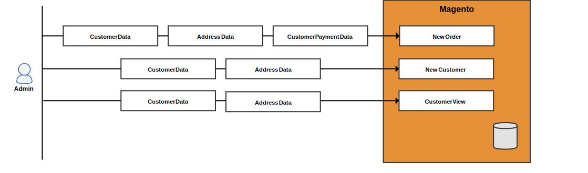

# 고객 개인 정보 참조(버전 1.x)

>[!NOTE]
>
>이는 Adobe Commerce 판매자 및 개발자가 개인 정보 보호 규정 준수를 준비하는 데 도움이 되는 일련의 항목 중 하나입니다. 귀하의 비즈니스가 법적 의무를 준수하는지 여부와 그 방법을 결정하려면 법률 고문과 상의하십시오.

다음과 같은 개인 정보 보호 규정을 위한 준수 프로그램을 개발할 때 참조할 수 있도록 다음 데이터 흐름 다이어그램 및 데이터베이스 엔티티 매핑을 사용하십시오.

- [GDPR](gdpr.md)
- [CCPA](ccpa.md)

## 데이터 흐름 다이어그램

데이터 흐름 다이어그램은 고객 및 관리자가 상점 및 관리자에서 입력하고 검색할 수 있는 데이터 유형을 보여 줍니다.

### 프론트엔드 데이터 진입점

사용자는 계정 등록 시, 체크아웃 시, 유사한 이벤트 시 고객, 주소, 결제 정보를 입력할 수 있다.

### 프론트엔드 데이터 액세스 포인트

Commerce은 고객이 로그인하고 여러 페이지를 보거나 체크아웃할 때 고객 정보를 로드합니다.

### 백엔드 데이터 진입점

판매자는 관리자로부터 고객, 주소 및 결제 정보를 입력하여 고객 또는 주문을 생성할 수 있습니다.

### 백엔드 데이터 액세스 포인트

Commerce은 판매자가 여러 유형의 그리드를 볼 때 고객 정보를 로드하고 그리드를 클릭하여 자세한 정보를 확인하고 기타 다양한 작업을 수행합니다.

## 데이터베이스 엔티티

Magento 1은 고객, 판매 및 기타 데이터베이스 테이블에 고객 정보를 저장합니다.

### 고객 데이터

Magento 1은 고객 정보를 `customer_entity` 및 `customer_address_entity` 테이블. 이 두 테이블에는 모두 사용자 지정 고객 속성을 포함할 수 있는 여러 참조 테이블이 있습니다.

#### `customer_entity` 및 참조 테이블

의 다음 열 `customer_entity`표에는 고객 정보가 포함되어 있습니다.

| 열 | 데이터 유형 |
| --- | --- |
| `email` | varchar(255) |

다음 표는 다음을 참조합니다. `customer_entity` 및 에는 사용자 지정 고객 특성이 포함될 수 있습니다.

| 표 | 열 | 데이터 유형 |
| --- | --- | --- |
| `customer_entity_datetime` | `value` | datetime |
| `customer_entity_decimal` | `value` | 십진수(12,4) |
| `customer_entity_int` | `value` | int(11) |
| `customer_entity_text` | `value` | 텍스트 |
| `customer_entity_varchar` | `value` | varchar(255) |

#### `customer_address_entity` 및 참조 테이블

다음 표 참조 `customer_address_entity` 및 에는 사용자 지정 고객 특성이 포함될 수 있습니다.

| 표 | 열 | 데이터 유형 |
| --- | --- | --- |
| `customer_address_entity_datetime` | `value` | datetime |
| `customer_address_entity_decimal` | `value` | 십진수(12,4) |
| `customer_address_entity_int` | `value` | int(11) |
| `customer_address_entity_text` | `value` | 텍스트 |
| `customer_address_entity_varchar` | `value` | varchar(255) |

### 주문 데이터

다음 `sales_flat_order` 및 관련 테이블에는 고객 이름, 청구 및 운송 주소 및 관련 정보가 포함되어 있습니다.

#### `sales_flat_order` 표

의 다음 열 `sales_order` 표에는 고객 정보가 포함되어 있습니다.

| 열 | 데이터 유형 |
| --- | --- |
| `customer_id` | int(10) |
| `customer_email` | varchar(128) |
| `customer_firstname` | varchar(128) |
| `customer_gender` | int(11) |
| `customer_lastname` | varchar(128) |
| `customer_middlename` | varchar(128) |
| `customer_prefix` | varchar(32) |
| `customer_suffix` | varchar(32) |
| `customer_taxvat` | varchar(32) |
| `remote_ip` | varchar(32) |

#### `sales_flat_order_address` 표

다음 `sales_flat_order_address` 테이블에는 고객의 주소가 들어 있습니다.

| 열 | 데이터 유형 |
| --- | --- |
| `customer_id` | int(10) |
| `fax` | varchar(255) |
| `region` | varchar(255) |
| `postcode` | varchar(255) |
| `lastname` | varchar(255) |
| `street` | varchar(255) |
| `city` | varchar(255) |
| `email` | varchar(255) |
| `telephone` | varchar(255) |
| `firstname` | varchar(255) |
| `prefix` | varchar(255) |
| `suffix` | varchar(255) |
| `middlename` | varchar(255) |
| `company` | varchar(255) |
| `vat_id` | 텍스트 |

#### `sales_flat_order_grid` 표

의 다음 열 `sales_flat_order_grid` 표에는 고객 정보가 포함되어 있습니다.

| 열 | 데이터 유형 |
| --- | --- |
| `customer_id` | int(10) |
| `shipping_name` | varchar(255) |
| `billing_name` | varchar(255) |

#### `sales_flat_order_payment` 표

의 다음 열 `sales_flat_order_payment` 표에는 고객 정보가 포함되어 있습니다.

| 열 | 데이터 유형 |
| --- | --- |
| `cc_exp_month` | varchar(255) |
| `cc_ss_start_year` | varchar(255) |
| `echeck_bank_name` | varchar(128) |
| `echeck_type` | varchar(255) |
| `cc_ss_start_month` | varchar(255) |
| `cc_owner` | varchar(255) |
| `cc_exp_year` | varchar(255) |
| `echeck_routing_number` | varchar(255) |
| `echeck_account_name` | varchar(255) |

### 견적 데이터

견적에는 고객의 이름, 이메일, 주소 및 관련 정보가 포함되어 있습니다.

#### `sales_flat_quote` 표

의 다음 열 `sales_flat_quote` 표에는 고객 정보가 포함되어 있습니다.

| 열 | 데이터 유형 |
| --- | --- |
| `customer_id` | int(10) |
| `customer_tax_class_id` | int(10) |
| `customer_group_id` | int(10) |
| `customer_email` | varchar(255) |
| `customer_prefix` | varchar(40) |
| `customer_firstname` | varchar(255) |
| `customer_middlename` | varchar(40) |
| `customer_lastname` | varchar(255) |
| `customer_suffix` | varchar(40) |
| `customer_dob` | datetime |
| `customer_note` | varchar(255) |
| `remote_ip` | varchar(255) |
| `customer_gender` | varchar(255) |

#### `sales_flat_quote_address` 표

의 다음 열 `sales_flat_quote_address` 표에는 고객 정보가 포함되어 있습니다.

| 열 | 데이터 유형 |
| --- | --- |
| `email` | varchar(255) |
| `prefix` | varchar(40) |
| `firstname` | varchar(255) |
| `middlename` | varchar(40) |
| `lastname` | varchar(255) |
| `suffix` | varchar(40) |
| `company` | varchar(255) |
| `street` | varchar(255) |
| `city` | varchar(255) |
| `region` | varchar(255) |
| `postcode` | varchar(255) |
| `fax` | varchar(255) |

#### `sales_flat_quote_payment` 표

다음 `sales_flat_quote_payment` 표에는 신용 카드 정보 및 기타 트랜잭션 정보가 포함되어 있습니다.

| 열 | 데이터 유형 |
| --- | --- |
| `cc_last_4` | varchar(255) |
| `cc_owner` | varchar(255) |
| `cc_exp_month` | smallint(5) |
| `cc_exp_year` | smallint(5) |
| `cc_ss_owner` | varchar(255) |
| `cc_ss_start_month` | smallint(5) |
| `cc_ss_start_year` | smallint(5) |

### 데이터 보관

다음 테이블과 열에는 고객 정보가 포함되어 있습니다.

| 표 | 열 | 데이터 유형 |
| --- | --- | --- |
| `enterprise_sales_creditmemo_grid_archive` | `billing_name` | varchar(255) |
| `enterprise_sales_invoice_grid_archive` | `billing_name` | varchar(255) |
| `enterprise_sales_order_grid_archive` | `billing_name` | varchar(255) |
| `enterprise_sales_order_grid_archive` | `customer_id` | int(10) |
| `enterprise_sales_order_grid_archive` | `shipping_name` | varchar(255) |
| `enterprise_sales_shipment_grid_archive` | `shipping_name` | varchar(255) |

### 판매 데이터

다음 테이블과 열에는 고객 정보가 포함되어 있습니다.

| 표 | 열 | 데이터 유형 |
| --- | --- | --- |
| `sales_flat_creditmemo_grid` | `billing_name` | varchar(255) |
| `sales_flat_invoice_grid` | `billing_name` | varchar(255) |

### RMA 데이터

다음 RMA 테이블 및 열에는 고객 정보가 포함되어 있습니다.

| 표 | 열 | 데이터 유형 |
| --- | --- | --- |
| `enterprise_rma` | `customer_custom_email` | varchar(255) |
| `enterprise_rma_grid` | `customer_id` | int(10) |
| `enterprise_rma_grid` | `customer_name` | varchar(255) |

### 기타 데이터

다음 테이블과 열에는 고객 정보가 포함되어 있습니다.

| 표 | 열 | 데이터 유형 |
| --- | --- | --- |
| `core_email_queue_recipients` | `recipient_email` | varchar(128) |
| `core_email_queue_recipients` | `recipient_name` | varchar(255) |
| `customer_flowpassword` | `email` | varchar(255) |
| `customer_flowpassword` | `ip` | varchar(50) |
| `enterprise_giftregistry_person` | `email` | varchar(150) |
| `enterprise_giftregistry_person` | `firstname` | varchar(100) |
| `enterprise_giftregistry_person` | `lastname` | varchar(100) |
| `enterprise_giftregistry_person` | `middlename` | 텍스트 |
| `enterprise_invitation` | `customer_id` | int(10) |
| `enterprise_invitation` | `email` | varchar(255) |
| `enterprise_invitation` | `referral_id` | int(10) |
| `enterprise_reminder_rule_coupon` | `customer_id` | int(10) |
| `enterprise_reminder_rule_coupon` | `emails_failed` | smallint(5) |
| `enterprise_scheduled_operations` | `email_receiver` | varchar(150) |
| `enterprise_scheduled_operations` | `email_sender` | varchar(150) |
| `gift_message` | `customer_id` | int(10) |
| `gift_message` | `recipient` | varchar(255) |
| `gift_message` | `sender` | varchar(255) |
| `newsletter_subscriber` | `customer_id` | int(10) |
| `newsletter_subscriber` | `subscriber_email` | varchar(150) |
| `persistent_session` | `customer_id` | int(10) |
| `persistent_session` | `info` | 텍스트 |
| `poll_vote` | `customer_id` | int(10) |
| `poll_vote` | `ip_address` | varbinary(16) |
| `rating_option_vote` | `customer_id` | int(10) |
| `rating_option_vote` | `remote_ip` | varchar(50) |
| `rating_option_vote` | `remote_ip_long` | varbinary(516) |
| `send_friend_log` | `ip` | varbinary(16) |

고객을 참조하는 기타 테이블:

- `catalog_compare_item`
- `downloadable_link_purchased`
- `enterprise_customerbalance`
- `enterprise_customersegment_customer`
- `enterprise_giftregistry_entity`
- `enterprise_reminder_rule_log`
- `enterprise_reward`
- `log_customer`
- `log_visitor_online`
- `oauth_token`
- `product_alert_price`
- `product_alert_stock`
- `report_compared_product_index`
- `report_viewed_product_index`
- `review_detail`
- `sales_billing_agreement`
- `sales_flat_shipment`
- `sales_recurring_profile`
- `salesrule_coupon_usage`
- `salesrule_customer`
- `tag`
- `tag_relation`
- `wishlist`
