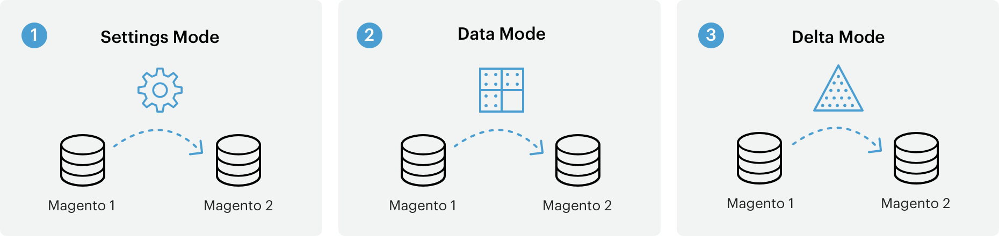

# 데이터 마이그레이션 작동 방식

이 항목에서는 를 사용하여 데이터를 Magento 1에서 Magento 2으로 마이그레이션하는 방법에 대한 높은 수준의 개요를 제공합니다 [!DNL Data Migration Tool].

다음 [!DNL Data Migration Tool] 는 Magento 1에서 Magento 2으로 데이터를 전송하는 데 사용되는 CLI(명령줄 인터페이스) 툴입니다. 이 도구는 Magento 1과 2 데이터베이스 구조(테이블 및 필드) 간의 일관성을 확인하고, 데이터 전송 진행 상황을 추적하고 로그를 생성하고, 데이터 확인 테스트를 실행합니다.

## 용어

* **모드** - Magento 1.x에서 Magento 2.x로 데이터를 마이그레이션하기 위해 정렬된 작업 세트입니다.
* **단계** - 마이그레이션할 데이터의 종류를 정의하는 모드의 작업
* **단계** - 데이터의 유효성 검사, 전송 및 확인을 수행하는 단계의 작업입니다.
* **파일 매핑** - 단계를 완료하기 위한 Magento 1.x와 Magento 2.x 데이터 구조 간의 규칙과 연결을 정의하는 XML 파일입니다.

## 모드

다음 [!DNL Data Migration Tool] 마이그레이션 프로세스를 3단계로 분할하거나 *모드* 데이터를 Magento 1.x에서 Magento 2.x로 전송하고 조정하도록 했습니다. 세 가지 모드는 여기에 나열되며 다음 순서로 실행해야 합니다.

1. **설정 모드**: 시스템 구성 및 웹 사이트 관련 설정을 마이그레이션합니다.
1. **데이터 모드**: 데이터베이스 자산을 일괄적으로 마이그레이션합니다.
1. **델타 모드**: 새 고객 및 주문과 같은 증분 변경(마지막 실행 이후 변경)을 마이그레이션합니다.

## 단계

다음 [!DNL Data Migration Tool] 다음 목록 사용 *단계* 각 모드 내에서 특정 유형의 데이터를 마이그레이션합니다. 예를 들어 설정 모드에서는 모든 설정 데이터를 마이그레이션하는 데 두 가지 단계가 있습니다. 저장 단계 및 설정 단계. 이러한 각 단계에서 마이그레이션된 특정 데이터에 대한 세부 사항은 [[!DNL Data Migration Tool] 기술 사양](technical-specification.md).

## 단계

각 단계 내에는 3개가 있습니다 *단계* 데이터가 제대로 마이그레이션되도록 하기 위해 항상 이 순서로 실행됩니다.

1. **무결성 검사**: 테이블 필드 이름, 유형 및 기타 정보를 비교하여 Magento 1과 2 데이터 구조 간의 호환성을 확인합니다.
1. **데이터 전송**: Magento 1 및 2에서 테이블로 데이터 테이블을 전송합니다.
1. **볼륨 확인**: 테이블 간 레코드 수를 비교하여 성공적으로 전송되었는지 확인합니다.

## 파일 매핑

가장 낮은 수준의 마이그레이션 프로세스는 XML입니다 *파일 매핑*. 다음 [!DNL Data Migration Tool] 단계 내에 맵 파일을 사용하여 Magento 1.x와 2.x 테이블 간에 서로 다른 데이터 구조를 변환합니다.

예를 들어, Magento Open Source 1.8.0.0 데이터베이스의 데이터를 Magento Open Source 2.x.x로 변형하면 맵 파일이 테이블 이름이 변경되었음을 확인하고 그에 따라 대상 데이터베이스에서 이름을 변경합니다. 데이터 구조나 데이터 형식에 차이가 없는 경우 [!DNL Data Migration Tool] 확장에서 만든 테이블의 데이터를 포함하여 있는 그대로 Magento 2 데이터베이스로 전송합니다.

맵 파일에서 차이가 선언되지 않으면 [!DNL Data Migration Tool] 오류가 표시되고 시작되지 않습니다.

매핑 파일은 [[!DNL Data Migration Tool] 기술 사양].

## 마이그레이션 흐름 다이어그램

[[!DNL Data Migration Tool] 기술 사양]: technical-specification.md

Magento 1.x의 세계 #1 상거래 플랫폼에서 Magento 2의 미래 플랫폼으로 이전하는 것을 고려하게 되어 기쁩니다. 마이그레이션이라고 하는 이 프로세스에 대한 세부 사항을 공유하게 되어 기쁘게 생각합니다.

## 마이그레이션 구성 요소

Magento 2 마이그레이션에는 네 가지 구성 요소가 있습니다. 데이터, 확장 및 사용자 지정 코드, 테마 및 사용자 지정.

### 데이터

Dell은 **Magento 2[!DNL Data Migration Tool]** 모든 제품, 고객 및 주문 데이터를 효율적으로 이동할 수 있도록 저장 구성, 프로모션 등을 Magento 2으로 제공할 수 있습니다. 이 안내서에서는 데이터 마이그레이션에 사용하는 도구 및 모범 사례에 대한 정보를 제공합니다.

### 확장 및 사용자 지정 코드

Adobe는 Magento 2에서 Magento 1 확장을 사용하는 데 도움이 되도록 개발 커뮤니티와 열심히 노력하고 있습니다. 이제 우리는 [Commerce Marketplace](https://marketplace.magento.com/): 즐겨찾는 확장의 최신 버전을 다운로드하거나 구입할 수 있습니다.

Magento 2용 확장 개발에 대한 자세한 내용은 [PHP 개발자 안내서](https://developer.adobe.com/commerce/php/development/).

### 테마 및 사용자 지정

Magento 2은 상인에게 혁신적인 쇼핑 경험을 만들고 새로운 수준으로 확장할 수 있는 탁월한 기능을 제공하는 새로운 접근 방식과 기술을 사용합니다. 이러한 고급 기능을 활용하려면 개발자가 테마 및 사용자 지정을 변경해야 합니다. Magento 2을 만들기 위해 온라인에서 설명서를 사용할 수 있습니다 [테마](https://developer.adobe.com/commerce/frontend-core/guide/themes/), [레이아웃](https://developer.adobe.com/commerce/frontend-core/guide/layouts/), 및 [사용자 지정](https://developer.adobe.com/commerce/frontend-core/guide/layouts/xml-manage/).

## 마이그레이션 작업

1.x 버전 간의 업그레이드(예: v1.12에서 v1.14로)와 마찬가지로, Magento 1에서 Magento 2으로 마이그레이션하기 위한 작업 수준은 사이트를 구축하는 방법과 해당 사용자 지정 수준에 따라 다릅니다.
하지만, 우리는 지속적으로 [!DNL Data Migration Tool] (자세한 내용은 [창로그](https://github.com/magento/data-migration-tool/blob/2.3/CHANGELOG.md) 자세한 내용) 그래서 마이그레이션 노력이 지속적으로 감소하고 있습니다.
