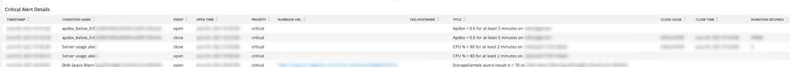

# [!UICONTROL Alerts] 탭

[!UICONTROL Alerts] 탭은 중요 경고를 열고 닫기 등 다양한 경고를 제공합니다.

## [!UICONTROL Open Alert Details]

**[!UICONTROL Open Alert Details]** 프레임에는 선택한 기간 동안 진행 중인 중요 경고 수가 표시됩니다. 경고에는 Adobe에서 생성한 경고 및 파트너 또는 판매자가 생성한 경고가 포함됩니다.

## [!UICONTROL Closed Critical Alerts]

**[!UICONTROL Closed Critical Alerts]** 프레임에는 선택한 기간 동안 닫힌 중요 경고 수가 표시됩니다. 경고에는 Adobe에서 생성한 경고 및 파트너 또는 판매자가 생성한 경고가 포함됩니다.

## [!UICONTROL Critical Alert Details]

**[!UICONTROL Critical Alert Details]** 프레임에는 타임스탬프, 조건 이름, 경고 이벤트가 열려 있는지 닫혀 있는지 여부 등 선택한 기간 동안 중요 경고 세부 정보 수가 표시됩니다.

## [!UICONTROL Infrastructure Alert Details]

**[!UICONTROL Infrastructure Alert Details]** 프레임에는 선택한 기간 동안 응용 프로그램, 호스트 및 기타 인프라 이벤트가 표시됩니다.
