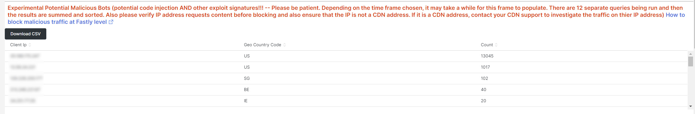

# [!UICONTROL bots] 탭

이 탭에는 [!DNL bots]이(가) 사이트 문제를 일으키는지 확인하는 방법을 설명하는 정보가 있습니다.

## [!DNL bots]의 높은 수준 개요:

* [!DNL bot]은(는) 반복적인 자동화된 작업을 실행하는 소프트웨어입니다. 인공 지능과 머신 러닝의 발전으로 [!DNL bots]의 작업, 메서드 및 상호 작용이 변화하고 있습니다. 사이트를 크롤링하고 인터넷 검색 엔진에 추가하여 이점을 얻는 *good* [!DNL bots]이(가) 있습니다. 그 결과 인터넷 사용자는 검색 엔진 결과를 통해 사이트로 이동할 수 있습니다. *양호* [!DNL bot]은(는) 일반적으로 검색 엔진 콘솔의 [!DNL bot] 파일 또는 설정에 의해 `robots.txt`에 배치된 경계를 준수합니다. 경계는 사이트 또는 사이트 일부에 대한 액세스를 제한할 수 있습니다.
* 악의적인 [!DNL bots]이(가) `robots.txt` 파일을 무시하거나 HTTP 요청 데이터의 요청 사용자 에이전트 필드를 통해 올바른 [!DNL bot]을(를) 스푸핑할 수 있습니다. 악의적인 [!DNL bots]이(가) 수행하는 일부 작업:
   * 사이트에 대한 정당한 사용자 액세스를 거부하기 위해 사이트에 로드를 추가합니다.
   * 권한 없이 콘텐츠를 스크랩하고 재사용할 수 있습니다.
   * 메일 서비스 또는 주소를 플러시하거나 다른 사이트([!DNL SPAM bots])로 리디렉션할 가짜 계정을 등록합니다.
   * 가짜 보기([!DNL Viewbots])를 만듭니다.
   * 제품 또는 티켓([!DNL Focused bots])을 구입합니다.
* [!DNL bots] 관리
   * [!DNL Observation for Adobe Commerce]에 [!DNL bot]개 트래픽 보기가 있습니다.
      * [!DNL bot]이(가) 사이트에 추가하고 있는 로드와 해당 로드가 발생하는 시기를 표시하는 캐시되지 않은 총 [!DNL bot] 활동을 표시합니다.
      * 오류를 생성하는 [!DNL bots]이(가) 표시됩니다. 일반적으로 [!DNL bot]이(가) 사이트 문제를 일으키는 로드를 추가하는 경우 해당 [!DNL bot] 또는 IP 주소의 오류 빈도가 가장 높습니다.
      * 다음을 통해 관리할 [!DNL bot]개의 이름(요청 사용자 에이전트 필드 값) 및 IP 주소가 표시됩니다.
         * [!DNL Fastly]&#x200B;(속도 제한 또는 [!DNL VCLs]&#x200B;(이름 값으로 IP 주소, 범위 또는 [!DNL bots]을(를) 차단).
         * 사이트 액세스 속도를 제한하거나 제한하기 위해 [!DNL bot]에 올바른 `robots.txt field` 정보를 추가하는 중입니다.
         * 검색 엔진 콘솔을 통해 [!DNL Bing] 또는 [!DNL Google bots] 관리

## [!UICONTROL Experimental Potential Malicious Bots frame]

**[!UICONTROL Experimental Potential Malicious Bots frame]** 프레임은 12개의 복잡한 별도의 쿼리를 실행합니다. 악의적인 IP 요청 서명을 감지한 다음, 결과를 집계하여 내림차순으로 집계하여 정렬합니다. 쿼리에는 CVE 악용 및 기타 악의적인 요청의 많은 데이터 서명이 포함되어 있습니다. 보안 수정/패치에 의해 악용이 차단되고 사이트에 위협이 되지 않는 경우에도, 요청은 여전히 웹 사이트에서 처리해야 합니다. 짧은 기간 내에 요청의 양이 상당히 커질 수 있습니다. 이 프레임에는 IP 주소의 총 요청이 표시되지 않고, 요청에 의심스러운 의도가 있음을 나타내는 신호가 있는 요청이 표시됩니다.

트래픽이 의심스럽고 유효한 요청을 전달할 수 있는 [!DNL Content Distributed Network]&#x200B;(CDN) 주소에서 발생하지 않는지 확인하십시오. 요청이 CDN IP 주소에서 발송된 것으로 확인되면 해당 서비스 공급업체에 연락하여 네트워크를 통한 의심스러운 트래픽 차단을 도와주십시오. 주소 또는 요청 URL을 차단해야 하는 경우 Adobe Commerce 지원 기술 자료에서 [Adobe Commerce에 대한 악성 트래픽 차단 [!DNL Fastly] 수준](https://experienceleague.adobe.com/docs/commerce-knowledge-base/kb/how-to/block-malicious-traffic-for-magento-commerce-on-fastly-level.html?lang=ko)을 참조하세요.

## [!UICONTROL Rate of HTTP request per second (top 25) during requested time period]

**[!UICONTROL Rate of HTTP request per second (top 25) during requested time period]** 프레임에는 선택한 기간 동안 초당 가장 높은 IP 주소 요청이 표시됩니다. 이러한 주소도 위 표에 있으면 CDN 주소 및 악성 주소가 아닌지 확인하고 [!DNL Fastly]을(를) 통해 차단하십시오.

## [!UICONTROL Total Bot traffic by bot name]:

**[!UICONTROL Total Bot traffic by bot name during selected time period]** 테이블에는 값에 [!UICONTROL request_user_agent] 필드의 문자열이 [!DNL bots]인 캐시되지 않은 요청의 집계된 수가 포함되어 있습니다. [!DNL bot] 필드 값이 스푸핑될 수 있으므로 이름이 [!UICONTROL request_user_agent]이거나 아닐 수 있습니다. [!UICONTROL Count] 열 아래의 값이 가장 중요합니다.

## [!UICONTROL Total Bot Traffic by Bot name/IP address]

**[!UICONTROL Total Bot Traffic by Bot name/IP address during selected time period How to block bot traffic on Fastly level OR manage bots through your robots.txt file Best practices for Adobe Commerce robots.txt]** 테이블은 이전 테이블과 동일한 데이터를 표시하지만 명명된 [!DNL bot] 대신 요청을 수행하는 IP 주소를 추가합니다. 악의적인 [!DNL bots] 스푸핑 좋은 [!DNL bots]&#x200B;(으)로, IP 주소는 악의적인 IP 주소를 식별하는 웹 사이트 또는 *whois* 서비스 또는 [!DNL DNS lookups]을(를) 통해 확인해야 합니다. 예를 들어 [!DNL Google]은(는) [[!DNL googlebot] IP 주소를 게시](https://developers.google.com/search/apis/ipranges/googlebot.json)하고 [!DNL Microsoft]에는 [[!DNL Bingbots]](https://www.bing.com/webmasters/help/Verify-Bingbot-2195837f)에 대한 확인 도구가 있습니다.

## [!UICONTROL Graph - Bots with HTTP status errors]

**[!UICONTROL Graph - Bots with HTTP status errors during selected time period How to block bot traffic on Fastly level OR manage bots through your robots.txt file Best practices for Adobe Commerce robots.txt]** 그래프는 요청 사용자 에이전트 필드에서 자신을 선언하는 [!DNL bots]의 오류를 표시합니다. 이 오류는 [!DNL bot] 또는 다른 트래픽의 볼륨으로 인해 발생하지는 않습니다. [!DNL bot]이(가) 존재하지 않는 정보를 요청하거나 요청에 다른 문제가 있을 수 있습니다.

사이트 불안정 또는 중단 중에 IP 주소에 오류가 급증하는 경우 사이트 문제가 의심될 수 있습니다.

## [!UICONTROL Table - IPs that do not identify as bots]

**[!UICONTROL Table - IPs that do not identify as bots with HTTP status errors during selected time period How to block bot traffic on Fastly level OR manage bots through your robots.txt file Best practices for Adobe Commerce robots.txt]** 테이블에는 요청 사용자 에이전트 필드에 [!DNL bots]&#x200B;(으)로 자체 식별되지 않는 HTTP 상태 코드가 200개가 아닌 IP 요청이 표시됩니다. 이러한 IP 주소는 특히 선택한 기간 동안 횟수가 많은 경우 악의적인 IP 주소일 수 있습니다.

200개가 아닌 http 상태 코드 수가 적고 IP 주소 범위가 유사하지 않으면 주소가 사이트 문제에 기여하지 않을 수 있습니다.

## [!UICONTROL Table – Cache Status 'ERROR']

IP 주소에서 오류가 자주 발생하는 경우 어떻게 하는지 묻습니다. **[!UICONTROL Table – Cache Status 'ERROR' detail table (what are these IPs doing?) How to block bot traffic on Fastly level OR manage bots through your robots.txt file Best practices for Adobe Commerce robots.txt]** 테이블에는 캐시 상태 [!UICONTROL ERROR] 값이 있는 요청에 대해 요청된 URL과 HTTP 상태 값이 표시됩니다. 빈도는 URL로 대체되므로 카운트가 낮을 수 있습니다. IP 주소는 선택한 기간 동안 수천 개의 요청을 수행할 수 있습니다. 일정 기간(레코드 표시 제한) 동안 최대 2000개의 요청에 대한 보기입니다.

## [!UICONTROL Show 5XX status distribution]

**[!UICONTROL Show 5XX status distribution across IP addresses (top 200 addresses) How to block bot traffic on Fastly level OR manage bots through your robots.txt file Best practices for Adobe Commerce robots.txt]** 프레임이 강력합니다. 선택한 기간 동안 5XX http 상태 코드가 있는 IP 주소를 표시합니다. IP 주소가 많은 양의 요청을 하고 사이트가 트래픽을 처리할 수 없는 지점까지 영향을 받는 경우 요청 빈도가 가장 높은 IP 주소는 일반적으로 가장 높은 오류 볼륨을 갖게 됩니다. 5XX http 상태 코드는 일반적으로 요청에 응답하기 어려운 사이트를 나타냅니다.

막대가 넓을수록 해당 기간 동안의 총 5xx 오류 수에서 IP 주소에 있는 오류의 %가 커집니다. 참고: IP 주소에 HTTP 상태 코드가 여러 개 있는 경우(예: 502 및 503 HTTP 상태) 그래프에 여러 세그먼트가 있을 수 있습니다.

일반적인 분포는 IP 주소의 너비가 동일하거나 개수가 매우 적은 넓은 막대가 몇 개 있는 막대의 오른쪽에 표시됩니다.

바 세그먼트 위로 마우스를 가져가면 선택한 기간 동안 표시된 오류 수가 표시됩니다.

## [!UICONTROL IP cache status (MISS, PASS, ERROR) and HTTP status]

이 **[!UICONTROL IP cache status (MISS, PASS, ERROR) and HTTP status during selected time period How to block bot traffic on Fastly level OR manage bots through your robots.txt file Best practices for Adobe Commerce robots.txt]** 프레임에는 선택한 기간 동안 IP별로 HTTPS 상태 코드 개수 및 캐시되지 않은 요청이 표시됩니다. 이는 각 IP 주소와 총 볼륨의 비례 로드를 나타냅니다. 요청이 가장 많은 IP 주소를 표시합니다.

## [!UICONTROL Fastly Cache Summary for selected time period]

아래 그래프에서 [!UICONTROL Error] 아이콘을 클릭하면 마지막 두 그래프를 서로 비교할 수 있습니다. 이렇게 하면 로드가 사이트 문제에 기여하는 위치를 표시하는 데 도움이 될 수 있습니다.

## [!UICONTROL Graph - IPs that do not identify as bots]

**[!UICONTROL Graph - IPs that do not identify as bots without error during selected time period How to block bot traffic on Fastly level OR manage bots through your robots.txt file Best practices for Adobe Commerce robots.txt]** 프레임에는 요청 사용자 에이전트 필드, IP 주소 및 요청 사용자 에이전트 필드에 [!DNL bot]이(가) 표시되지 않는 요청의 상태 코드가 표시됩니다. 이 프레임은 모든 IP 주소에서 고주파 요청을 표시할 수 있지만 특히 사이트에 문제가 있을 수 있는 기간 동안 고주파 요청에 주의를 기울입니다.

## [!UICONTROL Graph - Suspicious Non-Bot traffic]

**[!UICONTROL Graph - Suspicious Non-Bot traffic during selected time period]** 그래프는 Go-http-client의 요청 사용자 에이전트 값을 검색하지만 다른 의심스러운 요청 사용자 에이전트 값을 확인하기 위해 확장됩니다. 이 요청 사용자 에이전트 값은 서비스에서 연결하기 위해 사이트에서 사용되며 유효할 수 있지만 악의적인 [!DNL bots]에서도 사용됩니다.

## [!UICONTROL Graph - Bot traffic by Bot name]

**[!UICONTROL Graph - Bot traffic by Bot name during selected time period]** 프레임에 탭 상단의 선택한 기간 테이블 동안 [!DNL Bot] 이름별 총 봇 트래픽과 동일한 데이터가 표시됩니다. 타임라인을 통해 데이터를 표시하여 [!DNL bots]의 요청이 언제 수행되는지 및 해당 분포를 확인할 수 있습니다.

## [!UICONTROL Graph - Top 250 Bot Names and IP addresses]

**[!UICONTROL Graph - Top 250 Bot Names and IP addresses during selected time period How to block bot traffic on Fastly level OR manage bots through your robots.txt file Best practices for Adobe Commerce robots.txt]** 프레임에 탭 상단의 선택한 기간 테이블 동안 봇 이름/IP 주소별 총 [!DNL Bot] 트래픽과 동일한 데이터가 표시됩니다. 해당 데이터는 타임라인을 통해 표시되며 IP 주소별로 표시됩니다. 이는 [!DNL bots]의 요청이 수행된 시간, 요청을 수행하는 IP 및 요청 분포를 보여 줍니다.

## [!UICONTROL Blocked Bot name / IP addresses (in Fastly)]

이(가) 반환된 봇 트래픽 및 IP를 표시합니다

**[!UICONTROL Blocked Bot name / IP addresses (in Fastly) during selected time period. This graph displays bot traffic and IPs that were returned a 403 Forbidden HTTP Status code]** 프레임에는 차단된 봇 이름과 IP 주소가 표시됩니다. 앞으로 [!DNL Fastly]에서 모든 요청이 어떻게 차단되는지 이 그래프에서 확인할 수 있습니다.

## [!UICONTROL Blocked non-Bot name / IP addresses (in Fastly)]

이(가) 반환된 비봇 트래픽 및 IP를 표시합니다

**[!UICONTROL Blocked non-Bot name / IP addresses (in Fastly) during selected time period graph displays non-bot traffic and IPs that were returned a 403 Forbidden HTTP Status code]** 프레임에 [!DNL bot]을(를) 통해 차단된 [!DNL Fastly]&#x200B;(으)로 식별되지 않는 IP 주소가 표시됩니다.

## [!UICONTROL This table shows the number of user agents per IP address, number of successful, unsuccessful and blocked requests:]

악의적인 [!DNL bots]은(는) 종종 [!DNL bots] 필드의 값을 통해 다른 [!UICONTROL Request User Agent]을(를) 스푸핑합니다. 이 표에서는 해당 필드에 IP 주소가 갖는 고유 값 수를 보여 줍니다. [!UICONTROL Request User Agent] 필드의 값이 높을수록 IP 주소를 의심할 수 있습니다.

## [!UICONTROL IP with non-200 status errors]

**[!UICONTROL IP with non-200 status errors – without 403 status]** 프레임에서 HTTP 상태 코드가 200이 아닌 IP 주소의 선택한 일정에 따른 분포를 보여 줍니다. 단일 IP 또는 IP 주소 그룹에서 더 높은 값이 표시되면 추가 조사가 필요합니다.

## [!UICONTROL IP with 403 status codes:]

**[!UICONTROL IP with 403 status codes]** 프레임에 HTTP 상태가 403인 [!UICONTROL cache_status=ERROR]이(가) 없는 캐시되지 않은 요청이 표시됩니다. 원본 서버가 [!DNL Fastly]의 블록이 아닌 403(권한이 없음)의 원본임을 보여줄 수 있습니다.

## [!UICONTROL Top 5 with non-200 status codes]

**[!UICONTROL Top 5 with non-200 status codes showing cache_status]** 테이블은 IP/상태 수준에서 [!UICONTROL cache_status] 값을 가진 각 테이블의 개수를 표시합니다.

## [!UICONTROL Pageview Latency will show as spikes]

**[!UICONTROL Pageview Latency will show as spikes on this graph:]** 프레임에는 [!DNL bot] 트래픽과 일치할 수 있는 페이지 로드/API 응답 지연이 표시됩니다.
