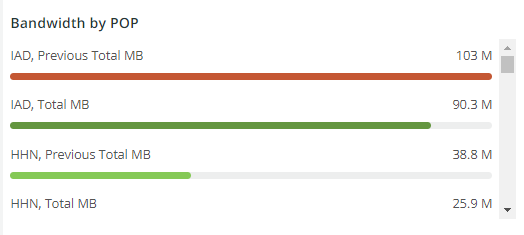

# 다음 [!UICONTROL CDN] 탭

이 탭에는 [!DNL content delivery network (CDN)]. Adobe Commerce Cloud의 경우 다음과 같습니다 [!DNL Fastly] 서비스.

## [!UICONTROL HIT rate]

다음 **[!UICONTROL HIT rate]** 프레임은 다음을 발생시킨 캐시 가능 요청 수를 보여줍니다. [!UICONTROL HITS] 마지막 순간에 캐싱이 성공했음을 나타냅니다. 오른쪽 화살표는 1주일 전에 같은 시간 위 또는 아래에 백분율이 표시됩니다.

## [!UICONTROL HIT Processing]

이 **[!UICONTROL HIT processing]** 상자에 결과를 가져오는 캐시 가능한 요청 수가 표시됩니다 [!UICONTROL HITS] 한 주 동안.

## [!UICONTROL MISS rate]

이 **[!UICONTROL MISS rate]** 상자에 마지막 순간에 캐시 가능한 요청의 누락 수가 표시됩니다. 누락은 요청이 캐시되지 않고 컨텐츠를 제공하기 위해 요청을 원본 서버에 전달해야 하는 경우입니다. 오른쪽의 값은 1주 전에 분당 시간(분)과 증가/감소를 비교하는 값입니다.

## [!UICONTROL MISS time]

## [!UICONTROL HIT Ratio]

## [!UICONTROL Error Percentage]

다음 **[!UICONTROL Error Percentage]** 상자는 요청의 오류 백분율에 값을 표시하며, 1주 전에 동일한 시간과 비교하여 상대적 증가/감소를 표시합니다.

## [!UICONTROL Total Requests]

## [!UICONTROL ERROR rate]

## [!UICONTROL Fastly Cache Average Response for selected time period in seconds]

이 프레임은 캐시 가능한 요청의 기간(초)을 보여줍니다. 즉, `cache_response` is [!UICONTROL MISS]에 지정된 경우 선택한 시간에 대해 캐시된 누락된 응답의 평균을 표시합니다.

## [!UICONTROL Fastly Cache Average Response for selected time period in seconds, faceted by POP]

## [!UICONTROL Total Bandwidth (All POPs) during the selected timeframe, compared with 1 week ago (% increase/decrease)]

## [!UICONTROL Requests – Since selected timeframe compared with one week ago]

이 프레임은 [!UICONTROL Total Requests] 맨 위에 있지만 은 이전 주의 요청 수를 표시합니다. 이는 캐시 가능한 요청뿐만 아니라 모든 요청입니다(여기서 `is_cacheable` 가 true입니다.)

## [!UICONTROL Response Count]

## [!UICONTROL Bandwidth by POP]

## [!UICONTROL Top 5 URLs (5xx or 3xx status codes)]

다음 **[!UICONTROL Top 5 URLs]** 보기는 5xx 또는 3xx 오류 응답을 경험하는 상위 5개 URL을 보여줍니다. space 제약 조건 때문에 URL 위로 마우스를 가져와야 해당 URL과 관련된 특정 오류 코드를 볼 수 있습니다. (위 그림의 빨간색 상자에 있는 예)

## [!UICONTROL Top 25 URLs (200 status)]

다음 **[!UICONTROL Top 25 URLs]** 프레임은 선택한 기간 동안 카운트별로 200 상태를 반환하는 URL을 보여줍니다.

## [!UICONTROL Duration by Response Status]

다음 **[!UICONTROL Duration by Response Status]** 그래프는 선택한 시간 동안의 카운트별 오류 응답을 오류 상태 코드에 따라 면처리된 오류 응답을 표시합니다.

## [!UICONTROL Duration by Response Status, top 25 urls]

다음 **[!UICONTROL Duration by Response Status, top 25 URLs]** 그래프는 응답 시간별 상위 25개의 URL을 초 단위로 보여줍니다. 전체 경로를 보려면 마우스를 URL 위로 가져와야 할 수 있습니다. 또한 URL을 제외한 모든 URL을 제거하려면 해당 URL을 클릭합니다. 그런 다음 다른 URL을 개별적으로 클릭하여 다시 추가할 수 있습니다. 개별 URL을 제거하려면 키를 누른 채로 각 URL을 클릭하여 그래프에서 제거할 수 있습니다.

## [!UICONTROL Duration by Response Status, top 25 non-200 status]

다음 **[!UICONTROL Duration by Response Status, top 25 non-200 status]** 그래프는 200이 아닌 상태 코드 또는 오류 상태 코드에 중점을 두었다는 점을 제외하고 마지막 그래프와 유사합니다. 오류 코드와 URL이 표시됩니다. 전체 경로를 보려면 마우스를 URL 위로 가져와야 할 수 있습니다. 또한 URL을 제외한 모든 URL을 제거하려면 해당 URL을 클릭합니다. 그런 다음 다른 URL을 개별적으로 클릭하여 다시 추가할 수 있습니다. 개별 URL을 제거하려면 키를 누른 채로 각 URL을 클릭하여 그래프에서 제거할 수 있습니다.

## [!UICONTROL Error Count by POP timeline]

다음 **[!UICONTROL Error Count by POP timeline]** 그래프에는 오류 코드에 따라 면처리된 선택한 시간 표시 막대 및 오류 상태의 수가 표시됩니다.

## [!UICONTROL Duration by Response status, top 25 client IP, non-200 status]

다음 **[!UICONTROL Duration by Response status, top 25 client IP, non 200 status]** 그래프는 상태 오류 코드가 있는 선택한 기간의 평균 기간별로 IP 주소를 보여줍니다.

## [!UICONTROL IP Frequency]

다음 **[!UICONTROL IP Frequency]** 프레임은 IP에서 각 IP의 (&#39;MISS&#39; 및 &#39;PASS&#39;) 상태를 계산합니다 [!DNL Fastly] 로그. 이러한 상태의 웹 요청은 원본 서버에 도달하고 서버에 로드를 추가합니다. 빈도로 상위 20개의 주소를 보여 줍니다. 이 프레임은 웹 사이트에서 IP 공격 또는 부하의 소스를 감지하는 데 사용할 수 있습니다. 이 그래프는 요약 탭에도 있으며 의 세부 사항과 쉽게 비교할 수 있도록 여기에 배치됩니다. [!DNL Fastly] 이 탭에 표시되는 로그 정보입니다.
