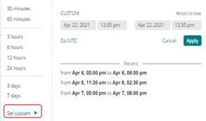

# 선택 [!UICONTROL focus] 탭

의 힘 [!DNL Observation for Adobe Commerce] 는 동일한 타임라인에서 방대한 양의 서로 다른 데이터 보기를 정렬하는 데 사용됩니다. [!DNL Observation for Adobe Commerce] 표시 가능 [!DNL New Relic] 에이전트는 수집된 데이터 샘플과 시스템 및 응용 프로그램 로그를 시각적으로 볼 수 있습니다. 복잡한 문제를 해결할 때 항상 데이터가 절반으로 분할됩니다. 타임라인에서 문제를 바라볼 때 첫 번째 질문은 &quot;언제 이런 일이 발생했습니까?&quot;입니다. 즉각적인 우려는 그 순간 이전에 일어났던 모든 것입니다. 타임라인에서 문제가 발생한 정확한 시간을 알고 있는 경우 문제 바로 이전에 타임라인을 선택할 수 있습니다. 사이트의 속도가 느리거나 속도가 느린 것 외에는 문제의 세부 정보를 알 수 없습니다. Adobe Commerce을 사용하면 구성 요소 서비스, 리소스 수준 및 실행 중인 프로세스 수가 잠재적 의심에 포함됩니다.

다음 **[!UICONTROL focus]** 탭에는 문제를 일으키거나 일으키는 영역에 초점을 맞추는 데 도움이 되는 정보가 표시됩니다. 데이터 신호를에 지속적으로 추가할 수도 있습니다 [!DNL Observation for Adobe Commerce]. 데이터 신호는 [!DNL New Relic] 수집된 데이터 또는 중요 단계의 수 또는 로그에서 오류 메시지. 오류 메시지는 사이트 문제와 관련이 있는 것으로 식별되므로 [!DNL Observation for Adobe Commerce] 중요한 정보의 표시를 개선하는 데 도움이 되는 쿼리입니다.

