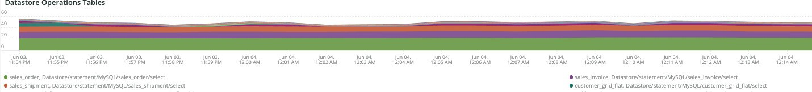

# [!DNL Cron] 탭

이 탭은 문제 및 [!DNL cron] 문제의 원인을 신속하게 파악하기 위한 것입니다.

## [!UICONTROL Cron transaction duration in seconds]

**[!UICONTROL Cron transaction duration in seconds]** 프레임에 [!DNL crons] 트랜잭션 기간이 초 단위로 표시됩니다. 런타임이 긴 트랜잭션을 표시합니다. APM에 대해 자세히 알아보면 트랜잭션/작업이 실행 중일 수 있는 쿼리에 대한 자세한 정보를 알 수 있습니다.

## [!UICONTROL MySQL Non-Sleeping Threads by Node]

**[!UICONTROL MySQL Non-Sleeping Threads by Node]** 프레임은 선택한 기간 동안 노드별로 MySQL 비절전 모드 스레드를 표시합니다.

## [!UICONTROL SQL Trace count by path]

경로별 

**[!UICONTROL SQL Trace count by path]** 프레임은 경로별로 MySQL 추적 수를 살펴봅니다. 이렇게 하면 선택한 기간 동안 SQL 문을 추적하는 데 도움이 될 수 있습니다.

## [!UICONTROL Cron database call]

**[!UICONTROL Cron database call]** 프레임은 선택한 기간 동안 데이터베이스에 대해 호출하는 [!DNL crons]의 수를 봅니다.

## [!UICONTROL Cron schedule table locks]

**[!UICONTROL Cron schedule table locks]** 프레임은 선택한 기간 동안 [!DNL cron] 일정 테이블 잠금을 봅니다.

## [!UICONTROL Cron schedule clean cron fired]

**[!UICONTROL Cron schedule clean cron fired]** 프레임은 선택한 기간 동안 정리된 [!DNL crons]의 수를 봅니다. 이 프레임에 데이터가 표시되지 않으면 [!DNL crons]이(가) 올바르게 실행되는 데 문제가 있을 수 있습니다. [!DNL cron] 작업 일정이 정리되지 않으면 [!DNL crons]이(가) 최적으로 실행되지 않으며 실행하는 데 더 오래 걸릴 수 있습니다.

## [!UICONTROL Cron schedule clean records details table]

**[!UICONTROL Cron schedule clean records details table]** 테이블은 선택한 일정 동안 `cron_schedule` 테이블에서 레코드를 정리하는 작업에 대한 세부 정보를 제공합니다.

## [!UICONTROL cron_schedule table updates]

**[!UICONTROL cron_schedule table updates]** 프레임은 선택한 기간 동안 [!DNL cron]개의 예약된 테이블 업데이트 횟수를 봅니다. 이 테이블의 삭제 또는 업데이트에 대한 활동이 높으면 [!DNL crons]에 문제가 있을 수 있습니다. 또한 [!DNL crons]은(는) 실행 및 완료 시 이 테이블을 업데이트하므로 이 테이블에 활동이 없고 구성된 [!DNL crons]이(가) 있으면 [!DNL crons]에 문제가 있을 수 있습니다.

## [!UICONTROL Datastore Operations Tables]

**[!UICONTROL Datastore Operations Tables]**&#x200B;이(가) 선택한 기간에 대해 `SELECT`, `DELETE` 및 `UPDATE`을(를) 포함한 데이터베이스 테이블 작업을 봅니다. 이 프레임에서는 데이터베이스 테이블에 대한 작업 빈도가 가장 높은 데이터베이스 테이블을 보여 줍니다.
