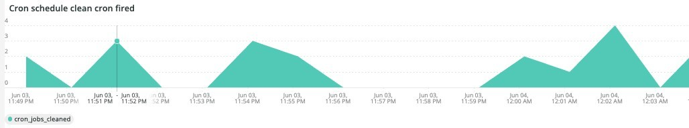

# 다음 [!UICONTROL Cron] 탭

이 탭은 크론 문제의 문제와 원인을 신속히 분리하려는 시도입니다.

## [!UICONTROL Cron transaction duration in seconds]

다음 **[!UICONTROL Cron transaction duration in seconds]** 프레임에는 crons 트랜잭션 기간(초)이 표시됩니다. 그러면 런타임 시간이 긴 트랜잭션이 표시됩니다. APM을 자세히 살펴보면 거래/작업이 실행 중일 수 있는 쿼리에 대한 자세한 정보가 표시됩니다.

## [!UICONTROL MySql Non-Sleeping Threads by Node]

다음 **[!UICONTROL MySql Non-Sleeping Threads by Node]** 프레임은 선택한 시간대의 노드별 MySql Non-Sleeping 스레드를 보여줍니다.

## [!UICONTROL SQL Trace count by path]

다음 **[!UICONTROL SQL Trace count by path]** 프레임은 경로별 MySql 추적 개수를 확인합니다. 이 경우 선택한 시간대에서 SQL 문을 추적하는 데 도움이 됩니다.

## [!UICONTROL Cron database call]

다음 **[!UICONTROL Cron database call]** 프레임은 선택한 시간대에서 데이터베이스에 대한 호출 크론 수를 확인합니다.

## [!UICONTROL Cron schedule table locks]

다음 **[!UICONTROL Cron schedule table locks]** 프레임은 선택한 기간에 대해 크론 예약 테이블 잠금을 확인합니다.

## [!UICONTROL Cron schedule clean cron fired]

다음 **[!UICONTROL Cron schedule clean cron fired]** 프레임은 선택한 시간대에 대해 정리된 크론 수를 확인합니다. 이 프레임에 데이터가 표시되지 않으면 문제가 올바로 실행되는 문제를 나타낼 수 있습니다. 크론 작업 일정을 정리하지 않으면 크론이 최적으로 실행되지 않고 실행하는 데 시간이 더 걸릴 수 있습니다.

## [!UICONTROL Cron schedule clean records details table]

다음 **[!UICONTROL Cron schedule clean records details table]** 이 표에서는 `cron_schedule` 선택한 일정 간의 테이블.

## [!UICONTROL cron_schedule table updates]

다음 **[!UICONTROL cron_schedule table updates]** 프레임은 선택한 일정 동안 크론 예약 테이블 업데이트 수를 확인합니다. 이 테이블의 삭제 또는 업데이트에 대한 높은 활동이 크론에서 문제를 나타낼 수 있습니다. 또한 crons가 실행되고 완료될 때 이 테이블을 업데이트하므로 이 테이블에 활동이 없고 구성된 cron이 있는 경우 cron에 문제가 있을 수 있습니다.

## [!UICONTROL Datastore Operations Tables]

다음 **[!UICONTROL Datastore Operations Tables]** 다음을 포함한 데이터베이스 테이블 작업 검색 `SELECT`, `DELETE`, 및 `UPDATE` 선택한 기간에 대해 설명합니다. 이 프레임은 데이터베이스 테이블에 대해 작동 빈도가 가장 높은 데이터베이스 테이블을 표시합니다.
