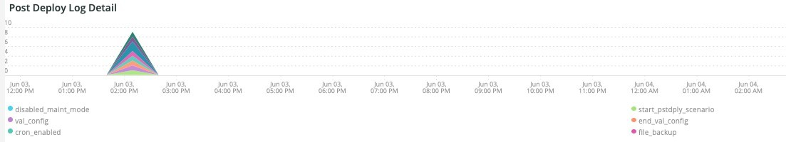

# 다음 [!UICONTROL Deploy] 탭

이 탭은 문제 및 배포 문제의 원인을 신속하게 격리하기 위한 것입니다.

## [!UICONTROL Deploy log Deployment Troubleshooter]

다음 **[!UICONTROL Deploy log Deployment Troubleshooter]** frame은 선택한 기간 동안 발생한 배포 로그 이벤트 수를 보여 줍니다. 배포 활동을 한 눈에 보고 횟수별로 배포의 복잡성을 결정하는 것이 목적입니다. 메시지가 기록될수록 일반적으로 배포는 더 복잡해집니다.

## [!UICONTROL Deploy State]

다음 **[!UICONTROL Deploy State]** 프레임은 선택한 기간 동안 발생한 배포 이벤트를 보여 줍니다. 이 프레임의 파서가 다음과 같은 특정 신호를 찾고 있습니다.

* &#39;`%NOTICE: Starting generate command%`&#39;) (으)로`start_gen`&#39;
* &#39;`%git apply /app/vendor/magento/ece-tools/patches%`&#39;) (으)로`apply_patches`&#39;
* &#39;`%Set flag: .static_content_deploy%`&#39;) (으)로`SCD`&#39;
* &#39;`%NOTICE: Generate command completed%`&#39;) (으)로`gen_compl`&#39;
* &#39;`%NOTICE: Starting deploy.%`&#39;) (으)로`start_deploy`&#39;
* &#39;`%NOTICE: Deployment completed%`&#39;) (으)로`deploy_compl`&#39;
* &#39;`%NOTICE: Starting post-deploy.%`&#39;) (으)로`start_pdeploy`&#39;
* &#39;`%NOTICE: Post-deploy is complete%`&#39;) (으)로`pdeploy`&#39;
* &#39;`%deploy-complete%`&#39;) (으)로`cl_deploy_compl`&#39;

## [!UICONTROL Deploy Log Detail]

다음 **[!UICONTROL Deploy Log Detail]** 프레임은 선택한 기간 동안 발생한 배포 로그 메시지 요약 세부 정보를 보여 줍니다. 배포 로그에서 다음 문자열에 대한 프레임을 구문 분석하고 있습니다.

* &#39;`%NOTICE: Starting deploy.%`&#39;) (으)로`start_dply`&#39;
* &#39;`%INFO: Starting scenario(s): scenario/deploy.xml%`&#39;) (으)로`start_scenario`&#39;
* &#39;`%NOTICE: Starting pre-deploy%`&#39;) (으)로`strt_predply`&#39;
* &#39;`%INFO: Restoring patch log file%`&#39;) (으)로`rstr_ptch_log`&#39;
* &#39;`%INFO: Updating cache configuration.%`&#39;) (으)로`updt_cach_config`&#39;
* &#39;`%INFO: Set Redis slave connection%`&#39;) (으)로`redis_sec_conn_set`&#39;
* &#39;`%INFO: Static content deployment was performed during build hook, cleaning old content%`&#39;) (으)로`scd_build_hk`&#39;
* &#39;`%INFO: Clearing pub/static%`&#39;) (으)로`clr_pub_static`&#39;
* &#39;`%NFO: Clearing redis cache:%`&#39;) (으)로`clr_redis_cach`&#39;
* &#39;`%INFO: Clearing var/cache directory%`&#39;) (으)로`clr_var_cach`&#39;
* &#39;`%NOTICE: Enabling Maintenance mode%`&#39;) (으)로`enable_maint_mode`&#39;
* &#39;`%INFO: Disable cron%`&#39;) (으)로`disable_cron`&#39;
* &#39;`%INFO: Trying to kill running cron jobs and consumers processes%`&#39;) (으)로`kill_cron_try`&#39;
* &#39;`%INFO: Running Adobe Commerce cron and consumers processes were not found.%`&#39;) (으)로`no_cron_fnd`&#39;
* &#39;`%NOTICE: Validating configuration%`&#39;) (으)로`validate_config`&#39;
* &#39;`%The following admin data is required to create an admin user during initial installation%`&#39;) (으)로`no_admin`&#39;
* &#39;`%recommended PHP version satisfying the constraint%`&#39;) (으)로`php_ver_constraint`&#39;
* &#39;`%WARNING: Fix configuration with given suggestions:%`&#39;) (으)로`fix_config_sugg`&#39;
* &#39;`%WARNING: [2003] The directory nesting level value for error reporting has not been configured.%`&#39;) (으)로`nest_err_reporting`&#39;
* &#39;`%NOTICE: End of validation%`&#39;) (으)로`end_validation`&#39;
* &#39;`%NOTICE: Starting update.%`&#39;) (으)로`start_update`&#39;
* &#39;`%INFO: Updating env.php.%`&#39;) (으)로`update_php_env`&#39;
* &#39;`%INFO: Updating env.php DB connection configuration.%`&#39;) (으)로`update_php_env_db`&#39;
* &#39;`%INFO: Updating env.php AMQP configuration%`&#39;) (으)로`update_php_env_amqp`&#39;
* &#39;`%INFO: Set search engine to: elasticsearch7%`&#39;) (으)로`set_elastic7`&#39;
* &#39;`%elasticsearch 6.5.4 has passed EOL%`&#39;) (으)로`elastic_ver_EOL`&#39;
* &#39;`%INFO: Set search engine to: elasticsearch6%`&#39;) (으)로`set_elastic6`&#39;
* &#39;`%INFO: Updating secure and unsecure URLs%`&#39;) (으)로`update_urls`&#39;
* &#39;`%INFO: Running setup upgrade.%`&#39;) (으)로`setup_upgrade_run`&#39;
* &#39;`%INFO: Post-deploy hook enabled. Cron enabling, cache cleaning, and pre-warming operations are postponed%`&#39;) (으)로`post_hook_enabled`&#39;
* &#39;`%NOTICE: Maintenance mode is disabled.%`&#39;) (으)로`maint_mode_disabled`&#39;
* &#39;`%INFO: Scenario(s) finished%`&#39;) (으)로`scenario_finished`&#39;
* &#39;`%WARNING: Command maintenance:enable finished with an error. Creating a maintenance flag file%`&#39;) (으)로`enable_maintenance_fail`&#39;
* &#39;`%MySQL server has gone away%`&#39;) (으)로`MySQL_has_gone_away`&#39;

## [!UICONTROL Post Deploy Log Detail]

다음 **[!UICONTROL Post Deploy Log Detail]** 프레임은 선택한 기간 동안 발생한 배포 후 로그 세부 정보를 보여 줍니다. 이 프레임은 다음 문자열이 포함된 특정 로그 메시지에 중점을 둡니다.

* &#39;`%Disabled maintenance mode%`&#39;) (으)로`disabled_maint_mode`&#39;
* &#39;`%INFO: Starting scenario(s): scenario/post-deploy.xml%`&#39;) (으)로`start_pstdply_scenario`&#39;
* &#39;`%NOTICE: Validating configuration%`&#39;) (으)로`val_config`&#39;
* &#39;`%NOTICE: End of validation%`&#39;) (으)로`end_val_config`&#39;
* &#39;`%INFO: Enable cron%`&#39;) (으)로`cron_enabled`&#39;
* &#39;`%INFO: Create backup of important files.%`&#39;) (으)로`file_backup`&#39;
* &#39;`%INFO: Successfully created backup%`&#39;) (으)로`file_backup_success`&#39;
* &#39;`%INFO: Starting page warming up%`&#39;) (으)로`pg_warmup_start`&#39;
* &#39;`%INFO: Warmed up page:%`&#39;) (으)로`warmed_up_pg`&#39;
* &#39;`%ERROR: Warming up failed:%`&#39;) (으)로`warm_up_pg_err`&#39;
* &#39;`%INFO: Scenario(s) finished%`&#39;) (으)로`scenario_finished`&#39;

## [!UICONTROL Cloud Log Detail]

다음 **[!UICONTROL Cloud Log Detail]** 프레임은 선택한 기간 동안 발생한 클라우드 로그 세부 정보를 보여 줍니다. 다음 문자열은 구문 분석되어 아래의 &#39;AS&#39; 레이블로 반환됩니다.

* &#39;`%DEBUG: /bin/bash -c "set -o pipefail; php ./bin/magento setup:upgrade%`&#39;) (으)로`start_update`&#39;
* &#39;`%Schema creation/updates:%`&#39;) (으)로`schema_updates`&#39;
* &#39;`%Nothing to import.%`&#39;) (으)로`mod_import_finish`&#39;
* &#39;`%NOTICE: End of update.%`&#39;) (으)로`update_finished`&#39;
* &#39;`%DEBUG: Running step: deploy-static-content%`&#39;) (으)로`scd_run`&#39;
* &#39;`%NOTICE: Skipping static content deploy. SCD on demand is enabled.%`&#39;) (으)로`scd_ondemand`&#39;
* &#39;`%INFO: Clearing%`&#39;) (으)로`clr_dirs`&#39;
* &#39;`%DEBUG: Step "deploy-static-content" finished%`&#39;) (으)로`scd_finished`&#39;
* &#39;`%NOTICE: Skipping static content compression. SCD on demand is enabled.%`&#39;) (으)로`scd_compression_run`&#39;
* &#39;`%INFO: Clearing var/cache directory%`&#39;) (으)로`clr_var_cach`&#39;
* &#39;`%DEBUG: Step "compress-static-content" finished%`&#39;) (으)로`scd_compression_finished`&#39;
* &#39;`%DEBUG: Running step: deploy-complete%`&#39;) (으)로`deploy_finished`&#39;
* &#39;`%INFO: Post-deploy hook enabled. Cron enabling, cache cleaning, and pre-warming operations are postponed to post-deploy stage.%`&#39;) (으)로`Post_deploy_hook_enabled`&#39;
* &#39;`%NOTICE: Maintenance mode is disabled.%`&#39;) (으)로`maint_mode_disabled`&#39;
* &#39;`%INFO: Scenario(s) finished%`&#39;) (으)로`scenario_finished`&#39;
* &#39;`%post-deploy.xml%`&#39;) (으)로`post_deploy_start`&#39;
* &#39;`%NOTICE: Validating configuration%`&#39;) (으)로`validate_config`&#39;
* &#39;`%WARNING: [2003] The directory nesting level value for error reporting has not been configured.%`&#39;) (으)로`nest_err_reporting`&#39;
* &#39;`%NOTICE: End of validation%`&#39;) (으)로`end_validation`&#39;
* &#39;`%INFO: Enable cron%`&#39;) (으)로`enable_cron`&#39;
* &#39;`%INFO: Create backup of important files%`&#39;) (으)로`create_backup`&#39;
* &#39;`%DEBUG: Step "backup" finished%`&#39;) (으)로`backup_finished`&#39;
* &#39;`%INFO: Starting page warming up%`&#39;) (으)로`warmup_start`&#39;
* &#39;`%ERROR: Warming up failed:%`&#39;) (으)로`warm_up_fail`&#39;
* &#39;`%DEBUG: Step "warm-up" finished%`&#39;) (으)로`warmup_finished`&#39;
* &#39;`%DEBUG: Step "time-to-first-byte" finished%`&#39;) (으)로`ttfb_finished`&#39;
* &#39;`%INFO: Scenario(s) finished%`&#39;) (으)로`post_deploy_finished`&#39;
* &#39;`%DEBUG: Running step: pre-build%`&#39;) (으)로`run_pre-build`&#39;
* &#39;`%DEBUG: Flag .static_content_deploy has already been deleted%`&#39;) (으)로`scd_flag_del`&#39;
* &#39;`%DEBUG: Step "pre-build" finished%`&#39;) (으)로`pre-build_completed`&#39;
* &#39;`%NOTICE: Applying patches%`&#39;) (으)로`apply_patches`&#39;
* &#39;`%has been applied%`&#39;) (으)로`patches_applied`&#39;
* &#39;`%DEBUG: Step "apply-patches" finished%`&#39;) (으)로`apply_patches_complete`&#39;
* &#39;`%Deploy using quick strategy%`&#39;) (으)로`quick_strategy_deploy`&#39;
* &#39;`%NOTICE: Running DI compilation%`&#39;) (으)로`di_compliation_start`&#39;
* &#39;`%NOTICE: End of running DI compilation%`&#39;) (으)로`di_compliation_finished`&#39;
* &#39;`%NOTICE: Generating fresh static content%`&#39;) (으)로`gen_frsh_static_content`&#39;
* &#39;`%magento setup:static-content:deploy%`&#39;) (으)로`scd_executing`&#39;
* &#39;`%NOTICE: End of generating fresh static content%`&#39;) (으)로`gen_frsh_static_cont_finished`&#39;
* &#39;`%INFO: Starting scenario(s): scenario/build/transfer.xml%`&#39;) (으)로`start_transferxml`&#39;
* &#39;`%INFO: Trying to kill running cron jobs%`&#39;) (으)로`kill_crons`&#39;
* &#39;`%INFO: Clearing redis cache:%`&#39;) (으)로`clear_redis_cache`&#39;
* &#39;`%INFO: Checking if db exists and has tables%`&#39;) (으)로`db_check`&#39;
* &#39;`%WARNING: [2010] Elasticsearch service is installed at infrastructure layer, but is not used as a search engine.%`) 을(를) (으)로`es_not_used`&#39;
* &#39;`%NOTICE: Starting update.%`&#39;) (으)로`starting_update`&#39;
* &#39;`%INFO: Set search engine to: mysql%`&#39;) (으)로`mysql_search`&#39;
* &#39;`%SQLSTATE[HY000] [2006] MySQL server has gone away%`&#39;) (으)로`mysql_gone`&#39;

## [!UICONTROL Count of modules imported during deploy]

다음 **[!UICONTROL Count of modules imported during deploy]** frame은 선택한 기간 동안 배포하는 동안 가져온 모듈의 수를 보여줍니다.

## [!UICONTROL Deployed module list]

다음 **[!UICONTROL Deployed module list]** 프레임은 선택한 기간에 걸쳐 배포된 모듈을 보여 줍니다.
