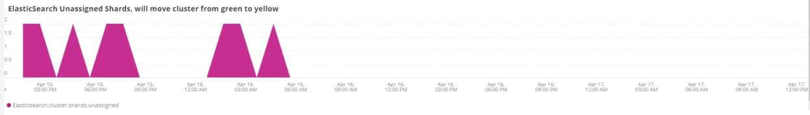

# [!UICONTROL Elasticsearch] 탭

## [!UICONTROL Cluster Status Summary]:

선택한 일정 동안 **[!UICONTROL Cluster Status Summary]** 프레임에 [!DNL Elasticsearch] 클러스터가 거친 색상 상태가 표시됩니다. 이 예에서 선택한 기간 동안 클러스터는 한 번 녹색 상태에 있었고 선택한 기간 동안 한 번 노란색 상태에 있었습니다.

## [!UICONTROL Active Primary Shards]

**[!UICONTROL Active Primary Shards]** 프레임에는 선택한 계정의 [!DNL Elasticsearch] 서비스에 대해 활성화된 기본 샤드의 수에 따라 다른 숫자가 표시됩니다.

[!DNL Elasticsearch]부터: 최종 안내서 [2.x]:

&quot;[동적으로 업데이트할 수 있는 인덱스](https://www.elastic.co/guide/en/elasticsearch/guide/2.x/dynamic-indices.html)에서 샤드는 Lucene 인덱스이고 [!DNL Elasticsearch] 인덱스는 샤드의 컬렉션임을 설명했습니다. 응용 프로그램이 색인에 연결하면 [!DNL Elasticsearch]에서 요청을 적절한 파드로 보냅니다. 샤드는 규모의 단위입니다. 가질 수 있는 가장 작은 색인은 단일 샤드가 있는 색인입니다. 이는 사용자의 요구 사항에 충분할 수 있지만, 하나의 분할로 많은 데이터를 저장할 수 있지만, 확장 능력을 제한합니다.&quot;

색인이 만들어지면 해당 색인으로 만들어진 샤드가 여러 개 있습니다. 기본적으로 5개의 기본 샤드가 각 새 색인에 할당되어 색인이 5개의 노드에 걸쳐 분산될 수 있습니다(노드당 하나의 샤드). 복제본 샤드도 있습니다. 주로 장애 조치(failover)용입니다. 복제본 샤드는 읽기 요청을 처리할 수 있습니다.

## [!UICONTROL Active Shards in Cluster]

**[!UICONTROL Active Shards in Cluster]** 프레임에는 [!DNL Elasticsearch] 클러스터에 있는 기본 및 복제 파드의 총 수가 표시됩니다.

## [!UICONTROL Index health - this will show the index name and color status]

이 프레임에는 색인 이름과 색인 색상 상태 카운트가 표시됩니다. 테이블 아래로 스크롤하면 노란색 및 빨간색 상태와 동일한 색인 이름이 표시됩니다. 27 색인 이름 뒤에 오는 숫자는 상태 색상의 수입니다. 이 값이 0이면 선택한 기간 동안 해당 색상 상태에 있는 색인의 인스턴스가 없습니다.

## [!UICONTROL Elasticsearch Status by node information]

**[!UICONTROL Elasticsearch Status by node information]** 프레임은 색상 및 노드별로 [!DNL Elasticsearch] 클러스터 상태를 표시합니다. 이렇게 하면 선택한 일정 동안 [!DNL Elasticsearch] 클러스터의 어느 노드가 어떤 상태를 반환하는지 알 수 있습니다.

## [!UICONTROL Elasticsearch index information]

**[!UICONTROL Elasticsearch index information]** 테이블은 인덱스 이름, 인덱스 이름, 노드, 인덱싱된 문서 수, 인덱스 상태 및 특정 시점의 인덱스 크기(MB)를 표시합니다.

## [!UICONTROL Elasticsearch process CPU %]

**[!UICONTROL Elasticsearch process CPU %]** 프레임에는 선택한 기간 동안 [!DNL Elasticsearch] 프로세스별 프로세스 CPU 비율이 표시됩니다.

## [!UICONTROL Elasticsearch Memory garbage collection]

[!DNL Elasticsearch]은(는) Java 프로세스입니다. 할당된 메모리가 부족하면 가비지 수집을 시작하여 메모리를 늘립니다. 가비지 수집이 빈번하면 할당된 메모리에 대한 인덱스나 샤드가 너무 많을 수 있음을 나타냅니다. 인덱스와 샤드를 정리할 수 있는 기회가 있거나 [!DNL Elasticsearch]에 더 많은 메모리가 필요할 수 있습니다.

## [!UICONTROL Elasticsearch Index information]

색인이 만들어지고 업데이트됨에 따라 색인 상태가 변경될 수 있습니다.

## [!UICONTROL Elasticsearch Index Size]

**[!UICONTROL Elasticsearch Index Size]** 프레임은 선택한 일정의 인덱스 이름과 크기를 나타냅니다. 이는 사이트가 색인화되는 방식에 대한 문제를 나타낼 수 있습니다.

## [!UICONTROL Elasticsearch Errors]

**[!UICONTROL Elasticsearch Errors]** 프레임에는 공간이 부족하거나, 노란색에서 빨간색 상태로 전환하거나, 모든 샤드가 실패하거나, 검색에 매개 변수 문제가 있거나, 버전 오류가 있거나, 모든 노드를 사용할 수 없는 경우 등의 오류가 [!DNL Elasticsearch]과(와) 함께 표시됩니다.

## [!UICONTROL Elasticsearch Unassigned Shards]:

할당되지 않은 샤드로 인해 클러스터가 녹색 상태에서 노란색 상태로 이동합니다.
