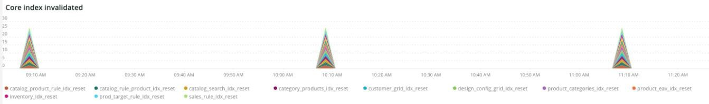

# 다음 [!UICONTROL Indexing] 탭

다음 **[!UICONTROL Indexing]** 탭에서 색인 지정 및 잠재적 원인 식별과 관련된 문제를 설명합니다.

## [!UICONTROL Core index invalidated]

다음 **[!UICONTROL Core index invalidated]** 프레임은 선택한 기간에 대한 색인 무효화를 확인합니다. 다른 리소스 집약적인 경우와 동시에 색인화가 발생하는 경우 사이트 리소스에 많은 로드가 발생합니다.

* &#39;%Catalog Product Rule Indexer가 &#39;catalog_product_rule_idx_reset&#39;으로 무효화되었습니다.
* &#39;%Catalog_rule_product_idx_reset&#39;으로 &#39;%Catalog Rule Product Indexer가 &#39;%&#39;(으)로 무효화되었습니다.
* &#39;%Catalog Search Indexer가 &#39;catalog_search_idx_reset&#39;으로 무효화되었습니다.
* &#39;%Category Products 색인이 &#39;%&#39;이(가) &#39;category_products_idx_reset&#39;으로 무효화되었습니다.
* &#39;%Customer Grid Indexer가 &#39;customer_grid_idx_reset&#39;(으)로 무효화되었습니다.
* &#39;%Design Config Grid 인덱서가 &#39;%&#39;(으)로 &#39;design_config_grid_idx_
* &#39;%Product Categories indexer가 &#39;%&#39;)(&#39;product_categories_idx_reset&#39;)
* &#39;%Product EAV 인덱서가 &#39;%&#39;) &#39;product_eav_idx_reset&#39;으로 무효화되었습니다.
* &#39;%Product Price Indexer가 &#39;%&#39;) &#39;product_price_idx_reset&#39;으로 무효화되었습니다.
* &#39;%Stock 인덱서가 무효화됨%&#39;)을 &#39;stock_idx_reset&#39;으로 설정했습니다.
* &#39;%Inventory 색인이 &#39;%&#39;이(가) &#39;inventory_idx_reset&#39;으로 무효화되었습니다.
* &#39;%Inventory 색인이 &#39;%&#39;이(가) &#39;inventory_idx_reset&#39;으로 무효화되었습니다.
* &#39;%Sales_rule_idx_reset&#39;으로 &#39;%Sales Rule Indexer가 &#39;%&#39;(으)로 무효화되었습니다.

## [!UICONTROL Core index rebuilds]

다음 **[!UICONTROL Core index rebuilds]** 프레임은 선택한 기간에 걸쳐 코어 인덱스를 다시 만듭니다. 다음은 색인 재작성 완료를 나타내기 위해 로그에서 구문 분석되는 문자열입니다.

* &#39;%Catalog Product Rule 인덱스가 다시 빌드되었습니다.&#39;) &#39;catalog_product_rule_idx&#39;
* &#39;%Catalog Rule 제품 인덱스가 다시 빌드됨%&#39;) &#39;catalog_rule_product_idx&#39;로
* &#39;%Catalog Search 색인이 다시 빌드되었습니다.&#39;) &#39;catalog_search_idx&#39;
* &#39;%Category Products 인덱스가 성공적으로 다시 작성되었습니다%&#39;). &#39;category_products_idx&#39;
* &#39;%Customer Grid 색인이 다시 빌드되었습니다%&#39;) &#39;customer_grid_idx&#39;
* &#39;%Design Config Grid 색인이 다시 빌드되었습니다.&#39;) &#39;design_config_grid_idx&#39;
* &#39;%Product Categories 인덱스가 다시 빌드됨%&#39;) &#39;product_categories_idx&#39;로
* &#39;%Product EAV 인덱스가 다시 빌드되었습니다%&#39;)(&#39;product_eav_idx&#39;)
* &#39;%제품 가격 인덱스가 다시 작성되었습니다%&#39;)(&#39;product_price_idx&#39;)
* &#39;%Stock 인덱스가 다시 빌드됨%&#39;) &#39;stock_idx&#39;로
* &#39;%Inventory 인덱스가 성공적으로 다시 작성되었습니다%&#39;) &#39;inventory_idx&#39;
* %Product/Target 규칙 인덱스가 &#39;prod_target_rule_idx&#39;로 다시 작성되었습니다.%&#39;)
* &#39;%Sales 규칙 인덱스가 성공적으로 다시 작성되었습니다%&#39;). &#39;sales_rule_idx&#39;

## [!UICONTROL catalogsearch index table(s)]

다음 **[!UICONTROL catalogsearch index table(s)]** 프레임은 선택한 시간대에 대해 카탈로그 검색 색인 테이블을 살펴봅니다. 이 쿼리는 테이블 이름에 &#39;%catalogsearch%&#39;이(가) 있는 테이블에 대한 데이터 저장소 작업의 기간을 보고 있습니다.

## [!UICONTROL product index table(s)]

다음 **[!UICONTROL product index table(s)]** 프레임은 선택한 기간에 걸쳐 제품 색인 테이블을 봅니다. 이 쿼리는 테이블 이름에 &#39;%product%&#39;이(가) 있는 테이블에 대한 데이터 저장소 작업의 기간을 보고 있습니다.
