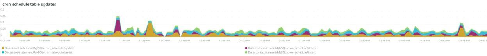

# 다음 [!UICONTROL MySQL] 탭

## [!UICONTROL MySQL% free storage by node]

MySQL(`datadir` MySQL 구성 설정, 기본값은 입니다. `/data/mysql`) 또는 `tmpdir` 공간이 부족합니다. 기본값 `tmpdir` (MySQL 설정)은 `/tmp`. 다음 **[!UICONTROL MySQL% free storage by node]** 프레임에서 `/, /tmp` ( 별도의 마운트 로 정의된 경우) 및 `/data/mysql` 사용 가능한 스토리지의 비율입니다. MySQL 버전 5.7(MariaDB 버전 10.2)부터 압축되지 않음 `tmp` 표는 `tmp` 의 테이블스페이스 `/data/mysql` 디렉터리(ibtmp1)를 클릭합니다. 이 파일은 기본적으로 제한 없이 자동으로 확장됩니다. 테이블스페이스이므로 크기가 줄어들지 않고 MySQL이 다시 시작될 때 12MB로 재설정됩니다.

## [!UICONTROL MySQL Connections by Node]

다음 **[!UICONTROL MySQL Connections by Node]** 프레임은 데이터베이스 노드 작동 중지 기간 또는 대량의 연결을 나타냅니다.

## [!UICONTROL MySQL Node Summary]

다음 **[!UICONTROL MySQL Node Summary]** 표는 소프트웨어 버전 및 인스턴스 유형(크기)과 같은 데이터베이스 노드 세부 정보를 보여줍니다.

## [!UICONTROL Galera Number of Nodes in cluster]

다음 **[!UICONTROL Galera Number of Nodes in cluster]** 프레임은 MySQL 로그의 정보를 표시합니다. 노드가 클러스터를 조인하고 종료하면 선택한 일정의 메시지만 표시됩니다. 노드가 일정 이전에 클러스터를 나가는 경우 해당 기간 동안 메시지가 존재하지 않습니다. 데이터베이스가 노드 부족 상태일 수 있다고 의심되는 경우 기간을 더 큰 기간으로 확장하여 추가 정보를 볼 수 있는지 확인합니다. 기간 동안 [!DNL Galera] 클러스터에서 기간을 확장하여 노드가 클러스터에서 나가는 시점을 확인할 수 있습니다.

## [!UICONTROL MySQL shutdowns and starts]

다음 **[!UICONTROL MySQL shutdowns and starts]** 프레임은 노드가 종료될 때를 감지합니다. 다음 [!DNL Galera] 노드는 제거되고 자동으로 제거됩니다 [!DNL Galera] 노드 아래에 있어야 합니다. 이렇게 하면 일반적으로 MySQL 서비스가 다시 시작됩니다.

## [!UICONTROL Galera log]

다음 **[!UICONTROL Galera log]** 프레임은 [!DNL Galera] 노드, 상태 및 상태 변경 [!DNL Galera] 클러스터

* &#39;%1047 WSREP가 &#39;node_not_prep_for_use&#39;로 응용 프로그램 사용%&#39; 노드를 아직 준비하지 않았습니다.
* &#39;%\[오류\] WSREP: 다음 위치에서 읽지 못했습니다. wsrep_sst_xtrabackup-v2%&#39;) as &#39;xtrabackup_read_fail&#39;
* &#39;%\[오류\] WSREP: 프로세스가 완료되었으나 오류가 발생했습니다. wsrep_sst_xtrabackup-v2%&#39;) as &#39;xtrabackup_compl_w_err&#39;
* &#39;%\[오류\] WSREP: rbr write fail%&#39;) &#39;rbr_write_fail&#39;
* &#39;%self-leave%&#39;) as &#39;susp_node&#39;
* &#39;%members = 3/3 (join/total%&#39;) as&#39;3of3&#39;
* &#39;%members = 2/3(join/total%&#39;) as&#39;2of3&#39;
* &#39;%members = 2/2%&#39;) as &#39;2of2&#39;
* &#39;%members = 1/2%&#39;) as &#39;1of2&#39;
* &#39;%members = 1/3%&#39;) as &#39;1of3&#39;
* &#39;%members = 1/1%&#39;) &#39;1of1&#39;
* &#39;%\[참고\] /usr/sbin/myqld(myqld 10).%&#39;) as&#39;sql_restart&#39;
* &#39;%Quorum: &#39;no_node_count&#39;로서 완료 상태:%&#39;가 있는 노드가 없음
* &#39;%WSREP: 구성원 0%) &#39;mem_0&#39;
* &#39;%WSREP: 구성원 1.0%) &#39;mem_1&#39;
* &#39;%WSREP: 멤버 2%&#39;) &#39;mem2&#39;
* &#39;%WSREP: 그룹과 동기화됨, 연결 준비%) &#39;준비&#39;
* &#39;%/usr/sbin/myqld, 버전:%&#39;) as &#39;mysql_restart_mysql.slow&#39;
* &#39;%\[참고\] WSREP: 새 클러스터 보기: global state:%&#39;) &#39;galera_cluster_view_ching&#39;

## [!UICONTROL Galera Log by Host]

다음 **[!UICONTROL Galera Log by Host]** 프레임은 **[!UICONTROL Galera log]** 프레임(문제 해결에 도움이 되도록 노드별로 분할된다는 점을 제외).

## [!UICONTROL Database performance]

다음 **[!UICONTROL Database performance]** 프레임은 특정 요청 중 데이터베이스 성능을 표시합니다. 그래프 아래의 색상 아이콘에서 각 지표를 클릭하여 볼 수 있습니다. 많은 지표가 호출되었습니다. [New Relic을 사용하여 MySQL 데이터베이스 성능 모니터링](https://newrelic.com/blog/how-to-relic/how-to-monitor-mysql) 이 프레임에 있습니다.

* average(query.queriesPerSecond)
* average(query.slowQueriesPerSecond)
* average(db.createdTmpDiskTablesPerSecond)
* average(db.createdTmpFilesPerSecond)
* average(db.tablesLocksWaitPerSecond)
* average(db.innodb.rowLockTimeAvg)
* average(db.innodb.rowLockWaitsPerSecond)

## [!UICONTROL Transaction Database Call Count]

다음 **[!UICONTROL Transaction Database Call Count]** 프레임은 각 트랜잭션 패싯에서 수행한 데이터베이스 호출 수를 보여줍니다. 이는 문장이 아닌 행 중심의 것으로 보입니다.

## [!UICONTROL Cron_schedule table updates]

다음 **[!UICONTROL Cron_schedule table updates]** 프레임은 선택한 기간 동안의 cron_schedule 테이블에 대한 데이터베이스 업데이트의 최대 기간을 표시합니다.

## [!UICONTROL Slow Query Traces]

다음 **[!UICONTROL Slow Query Traces]** 프레임은 느린 쿼리 추적이 존재하는 테이블 및 요청 유형을 표시합니다. 5초 이상 걸리는 쿼리 트랜잭션에 대해 느린 쿼리 추적이 만들어집니다. 이 프레임의 중요성은 업데이트 쿼리입니다. 테이블을 `UPDATE`, `DELETE`, 및 `INSERT` 문, 일정 기간 동안 테이블을 잠글 수 있습니다.

짝수 `SELECT` FOR UPDATE와 함께 사용하는 경우 문에서 행을 잠글 수 있습니다.

## [!UICONTROL Datastore Operations tables]

## [!UICONTROL Cron table change]

다음 **[!UICONTROL Cron table change]** 프레임은 특정 PHP 메모리 오류 및 그와 관련된 잠금과 함께 &quot;cron 작업에 대한 잠금을 가져올 수 없습니다.&quot; 오류 메시지를 찾습니다 `cron_schedule` 테이블. 만약 `cron_schedule` 테이블이 잠겼습니다(예: `DELETE` 쿼리가 실행되고 있습니다.) 다른 함수가 실행되지 않도록 차단됩니다.

## [!UICONTROL Deadlocks]

다음 **[!UICONTROL Deadlocks]** 프레임은 MySQL 로그에서 구문 분석된 다음 문자열을 확인합니다.

* &#39;%PHP 오류: php_mem_error로 허용되는 메모리 크기(%&#39;)
* `%get 잠금; 트랜잭션을 다시 시작합니다. 쿼리: DELETE FROM \&#39;cron_schedule%&#39;) as cron_sched_lock_del
* cron 작업에 대한 &#39;% 잠금: indexer_reindex_all_invalid%&#39;) as &#39;lock_indexer_reindex_all_invalid%&#39;
* cron 작업에 대한 &#39;% 잠금: cron_schedule%) &#39;lock_cron_schedule&#39;
* &#39;total_cron_lock&#39;으로 &#39;cron 작업:%&#39;(&#39;) 잠금
* &#39;%일반 오류: 1205 잠금 대기 시간 초과%) &#39;sql_1205_lock&#39;으로 사용
* &#39;%오류 1213 (40001): &#39;sql_1213_lock&#39;으로 &#39;lock%를(를) 가져오는 동안 교착 상태가 발견되었습니다.
* &#39;%SQLSTATE[40001]: 직렬화 실패: 1213 교착 상태 발견%) as &#39;sql_1213_lock2&#39;
* cron 작업에 대한 &#39;% 잠금: indexer_update_all_views%&#39;) as &#39;lock_indexer_update_all_views&#39;
* cron 작업에 대한 &#39;% 잠금: &#39;lock_sales_grid_order_async_insert%&#39;(lock_sales_grid_order_invoice_async_insert),
* cron 작업에 대한 &#39;% 잠금: staging_remove_updates%&#39;) as &#39;lock_staging_remove_updates&#39;
* cron 작업에 대한 &#39;% 잠금: &#39;lock_sales_grid_order_shipment_async_insert%&#39;)(&#39;lock_sales_grid_order_shipment_async_insert&#39;)
* cron 작업에 대한 &#39;% 잠금: amazon_payments_process_queued_recoveres%&#39;) &#39;lock_amazon_payments_process_queued_recoveres&#39;
* cron 작업에 대한 &#39;% 잠금: &#39;lock_sales_send_order_shipment_emails%&#39;)
* cron 작업에 대한 &#39;% 잠금: staging_synchronize_entities_period%&#39;) as &#39;lock_staging_synchronize_entities_period&#39;
* cron 작업에 대한 &#39;% 잠금: indexer_clean_all_changelogs%)(&#39;lock_indexer_clean_all_changelogs&#39;)
* cron 작업에 대한 &#39;% 잠금: magento_targetrule_index_reindex%&#39;) &#39;lock_magento_targetrule_index_reindex&#39;
* cron 작업에 대한 &#39;% 잠금: newsletter_send_all%&#39;) &#39;lock_newsletter_send_all&#39;
* cron 작업에 대한 &#39;% 잠금: newsletter_send_all%&#39;) &#39;lock_newsletter_send_all&#39;
* cron 작업에 대한 &#39;% 잠금: sales_send_order_emails%&#39;) &#39;lock_sales_send_order_emails&#39;
* cron 작업에 대한 &#39;% 잠금: &#39;lock_sales_send_order_creditmemo_emails%&#39;) as &#39;lock_sales_send_order_creditmemo_emails&#39;
* cron 작업에 대한 &#39;% 잠금: &#39;lock_sales_grid_order_creditmemo_async_insert%&#39;)(&#39;lock_sales_grid_order_creditmemo_async_insert&#39;)
* cron 작업에 대한 &#39;% 잠금: &#39;lock_bulk_cleanup&#39;)
* cron 작업에 대한 &#39;% 잠금: &#39;lock_flush_preview_quotas&#39;) &#39;lock_preview_quotas&#39;
* cron 작업에 대한 &#39;% 잠금: &#39;lock_sales_send_order_invoice_emails%&#39;)(&#39;lock_sales_send_order_invoice_emails&#39;)
* cron 작업에 대한 &#39;% 잠금: &#39;lock_sales_send_order_invoice_emails%&#39;)(&#39;lock_sales_send_order_invoice_emails&#39;)
* cron 작업에 대한 &#39;% 잠금: captcha_delete_expired_images%&#39;) &#39;lock_captcha_delete_expired_images&#39;
* cron 작업에 대한 &#39;% 잠금: &#39;lock_magento_newrerelicreporting_cron%&#39;)&#39;
* cron 작업에 대한 &#39;% 잠금: &#39;lock_precured_authentication_failures_cleanup%&#39;) as &#39;lock_precured_authentication_failures_cleanup&#39;
* cron 작업에 대한 &#39;% 잠금: &#39;lock_send_notification&#39;)
* cron 작업에 대한 &#39;% 잠금: magento_gftcardaccount_generage_codes_pool%&#39;(lock_magento_gftcardaccount_generage_codes_pool&#39;)
* cron 작업에 대한 &#39;% 잠금: &#39;lock_catalog_product_frontend_actions_flush%&#39;) as &#39;lock_catalog_product_frontend_actions_flush&#39;
* cron 작업에 대한 &#39;% 잠금: myqlmq_clean_messages%) as &#39;myqlmq_clean_messages&#39;
* cron 작업에 대한 &#39;% 잠금: catalog_product_attribute_value_synchronize%)(&#39;lock_catalog_product_attribute_value_synchronize&#39;)
* cron 작업에 대한 &#39;% 잠금: dlog_automation_importer%&#39;) as &#39;lock_dg_automation_importer&#39;
* cron 작업에 대한 &#39;% 잠금: dlog_automation_reviews_and_wishlist%&#39;) &#39;lock_dg_automation_reviews_and_wishlist&#39;
* cron 작업에 대한 &#39;% 잠금: &#39;lock_captcha_delete_old_attempts%&#39;) as &#39;lock_captcha_delete_old_attempts&#39;
* cron 작업에 대한 &#39;% 잠금: &#39;lock_catalog_product_inrecated_price_values_cleanup%&#39;) as &#39;lock_catalog_product_inked_price_values_cleanup&#39;
* cron 작업에 대한 &#39;% 잠금: &#39;lock_consumer_runner&#39;)&#39;
* cron 작업에 대한 &#39;% 잠금: dlog_automation_customer_subscriber_guest_sync%&#39;) &#39;lock_ddg_automation_customer_subscriber_guest_sync&#39;
* cron 작업에 대한 &#39;% 잠금: get_amazon_capture_updates%&#39;) &#39;lock_get_amazon_capture_updates&#39;
* cron 작업에 대한 &#39;% 잠금: get_amazon_authorization_updates%&#39;) &#39;lock_send_get_amazon_authorization_updates&#39;
* cron 작업에 대한 &#39;% 잠금: &#39;lock_temando_process_platform_events%&#39;)&#39;(&#39;lock_temando_process_platform_events&#39;)
* cron 작업에 대한 &#39;% 잠금: dlog_automation_status%&#39;) &#39;lock_dg_automation_status&#39;
* cron 작업에 대한 &#39;% 잠금: dlog_automation_status%&#39;) &#39;lock_dg_automation_status&#39;
* cron 작업에 대한 &#39;% 잠금: sales_clean_orders%&#39;) &#39;lock_sales_clean_orders&#39;
* cron 작업에 대한 &#39;% 잠금: &#39;lock_catalog_index_refresh_price&#39;) as &#39;lock_catalog_index_refresh_price&#39;
* cron 작업에 대한 &#39;% 잠금: &#39;lock_magento_rewards_warehouse_warning_notification%&#39;(lock_magento_reward_warning_notification&#39;)
* cron 작업에 대한 &#39;% 잠금: analytics_update%&#39;) &#39;lock_analytics_update&#39;
* cron 작업에 대한 &#39;% 잠금: messagequue_clean_inrecruled_locks%&#39;) as &#39;lock_messagequeue_clean_inked_locks&#39;
* cron 작업에 대한 &#39;% 잠금: messagequue_clean_inrecruled_locks%&#39;) as &#39;lock_messagequeue_clean_inked_locks&#39;
* cron 작업에 대한 &#39;% 잠금: staging_apply_version%&#39;) as &#39;lock_staging_apply_version&#39;
* cron 작업에 대한 &#39;% 잠금: &#39;lock_magento_rewards_expire_points%&#39;) 로서의 &#39;lock_magento_reward_expire_points&#39;
* cron 작업에 대한 &#39;% 잠금: &#39;lock_yotpo_orders_sync%&#39;) &#39;lock_yotpo_yotpo_orders_sync&#39;
* cron 작업에 대한 &#39;% 잠금: &#39;lock_catalog_event_status_checker&#39;)&#39;
* cron 작업에 대한 &#39;% 잠금: dlog_automation_campaign%&#39;) &#39;lock_dg_automation_campaign&#39;
* cron 작업에 대한 &#39;% 잠금: visitor_clean%&#39;) as &#39;lock_visitor_clean&#39;
* cron 작업에 대한 &#39;% 잠금: scconnector_verify_website%&#39;) as &#39;lock_scconnector_verify_website&#39;
* cron 작업에 대한 &#39;% 잠금: dlog_automation_email_templates%) as &#39;lock_dg_automation_email_templates&#39;
* cron 작업에 대한 &#39;% 잠금: aggregate_sales_report_order_data%&#39;) as &#39;lock_aggregate_sales_report_order_data&#39;
* cron 작업에 대한 &#39;% 잠금: dlog_automation_catalog_sync%)(&#39;lock_dg_automation&#39;)

## [!UICONTROL DB Statistics]

다음 **[!UICONTROL DB Statistics]** 프레임은 초당 삭제, 쓰기, 행 읽기, 업데이트 및 느린 쿼리를 표시합니다.

## [!UICONTROL Request frequency]

## [!UICONTROL Database Errors]

다음 **[!UICONTROL Database Errors]** 프레임은 다양한 데이터베이스를 표시합니다 [경고 및 오류](https://mariadb.com/kb/en/mariadb-error-codes/):

* &#39;%임시 테이블에 할당된 메모리 크기가 &#39;temp_tbl_buff_pool&#39;으로 innodb_buffer_pool_size%&#39;의 20%를 넘습니다.
* &#39;%\[오류\] WSREP: rbr write fail%&#39;) &#39;rbr_write_fail&#39;
* &#39;%myqld: 디스크 전체%)(&#39;disk_full&#39;)
* &#39;%오류 번호 28%&#39;)이 &#39;err_28&#39;입니다.
* &#39;%rollback%&#39;) &#39;rollback&#39;으로 사용
* &#39;%Foreign key 제약 조건이 table%&#39;에 대해 실패합니다.) &#39;foreign_key_constraint&#39;
* &#39;%Error_code: &#39;sql_1114_full&quot;%CRITICAL: SQLSTATE[HY000] [2006년] MySQL 서버가 &#39;sql_gone&#39;으로 사라짐%)
* &#39;%SQLSTATE[HY000] [1040년] &#39;sql_1040&#39;에 너무 많은 연결%&#39;)
* &#39;%중요: SQLSTATE[HY000] [2002년]%&#39;) &#39;sql_2002&#39;
* &#39;%SQLSTATE[08S01]:%&#39;) &#39;sql_1047&#39;
* &#39;%[경고] &#39;aborted_conn&#39;으로 &#39;aborted connection%&#39;)
* &#39;%SQLSTATE[23000]: 무결성 제약 조건 위반:%&#39;) &#39;sql_23000&#39;
* &#39;%1205 잠금 대기 시간 초과%&#39;) as &#39;sql_1205&#39;
* &#39;%SQLSTATE[HY000] [1049년] 알 수 없는 데이터베이스%) as &#39;sql_1049&#39;
* &#39;%SQLSTATE[42S02]: 기본 테이블 또는 뷰를 찾을 수 없음:%) as &#39;sql_42S02&#39;
* &#39;%일반 오류: 1114%) 로서의 &#39;sql_1114&#39;
* &#39;%SQLSTATE[40001]%&#39;) &#39;sql_1213&#39;
* &#39;%SQLSTATE[42S22]: 열을 찾을 수 없음: 1054 알 수 없는 열%) as &#39;sq1_1054&#39;
* &#39;%SQLSTATE[42000]: 구문 오류 또는 액세스 위반:%&#39;) as&#39;sql_42000&#39;
* &#39;%SQLSTATE[21000]: 카디널리티 위반:%) as &#39;sql_1241&#39;
* &#39;%SQLSTATE[22003]:%&#39;) &#39;sql_22003&#39;
* &#39;%SQLSTATE[HY000] [9000년] &#39;sql_9000&#39;(IP 주소%)이 있는 클라이언트
* &#39;%SQLSTATE[HY000]: 일반 오류: (2014%) &#39;sql_2014&#39;)
* &#39;%1927 연결이 &#39;%&#39;)(으)로 &#39;sql_1927&#39;
* &#39;%1062 \[ERROR\] InnoDB:%&#39;) as &#39;sql_1062_e&#39;
* &quot;%[참고] WSREP: 메모리 맵을 디스크에 플러싱..%&#39;) &#39;mem_map_flush&#39;
* &#39;%Internal MariaDB 오류 코드: 1146%) 로서의 &#39;sql_1146&#39;
* &#39;%Internal MariaDB 오류 코드: 1062%&#39;) as &#39;sql_1062&#39; * &#39;%1062 [경고] InnoDB:%) as &#39;sql_1062_w&#39;
* &#39;%Internal MariaDB 오류 코드: 1064%) 로서의 &#39;sql_1064&#39;
* &#39;%InnoDB: &#39;assertion_err&#39;(% 파일의 검증 실패)
* &#39;%mysqld_safe 현재 실행 중인 프로세스 수: 0%&#39;) &#39;mysql_oom&#39;
* &#39;%\[ERROR\] myqld는 signal%&#39;)를 &#39;mysql_sigterm&#39;으로 지정했습니다.
* &#39;%1452&#39;)을 &#39;sql_1452&#39;로 추가할 수 없습니다.
* &#39;%ERROR 1698%&#39;) as &#39;sql_1698&#39;
* &#39;%SQLSTATE[HY000]: 일반 오류: 3%&#39;) &#39;cnt_wrt_tmp&#39;
* &#39;%일반 오류: 1%&#39;) &#39;sql_syntax&#39;
* &#39;%42S22%&#39;) as &#39;sql_42S22&#39;
* &#39;%InnoDB: 오류(중복 키)%) &#39;innodb_dup_key&#39; FROM 로그 TIMESERIES

## [!UICONTROL DB Error Table]

다음 **[!UICONTROL DB Error Table]** 프레임에는 와 동일한 정보가 표시됩니다 **[!UICONTROL Database Errors]** 프레임이지만 노드 및 표 형식으로 볼 수 있습니다. 자세한 내용은 [MariaDB 오류 코드](https://mariadb.com/kb/en/mariadb-error-codes/) 추가 정보.

## [!UICONTROL Database Traces]

다음 **[!UICONTROL Database Traces]** 프레임은 선택한 타임라인에서 유형별로 데이터베이스 추적을 표시합니다.

## [!UICONTROL Database processes]

다음 **[!UICONTROL Database processes]** 프레임은 데이터베이스 프로세스, 환경 및 노드 식별자를 보여 줍니다.

## [!UICONTROL MySQL Non-Sleeping Threads by Node]

다음 **[!UICONTROL MySQL Non-Sleeping Threads by Node]** 프레임은 데이터베이스에 대한 연결 스레드를 표시합니다. 이 프레임에는 활성 스레드가 표시됩니다.

## [!UICONTROL MySQL Running and Sleeping Threads by environment]

다음 **[!UICONTROL MySQL Running and Sleeping Threads by environment]** 프레임은 데이터베이스에 대한 활성 및 휴지 연결을 모두 표시합니다. 느린 쿼리가 절전 모드로 전환된 데이터베이스에 대한 연결이 있으면 휴지 연결이 됩니다. Sleeping 연결은 잠긴 행 또는 테이블에 의해 차단되는 데이터베이스 쿼리일 수 있습니다. 이러한 대기 연결들은 또한 PHP 작업자 연결을 유지하고 있습니다.

## [!UICONTROL MySQL mem used by node]

다음 **[!UICONTROL MySQL mem used by node]** 프레임은 MySQL별 메모리 노드 사용을 보여 줍니다. 대규모 사이트에서는 GB 이상의 메모리가 사용되는 연속 막대가 될 수 있습니다.

## [!UICONTROL Database mysql-slow.log]

다음 **[!UICONTROL Database mysql-slow.log]** 프레임에는 `mysql-slow.log` 선택한 기간에 파일을 작성합니다.

