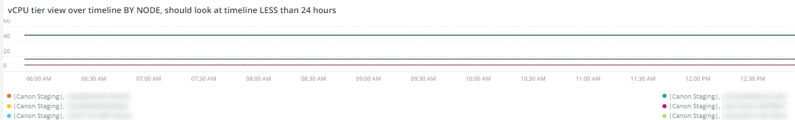

# [!DNL Infra] 탭

**[!DNL Infra]** 탭은 인프라 문제의 문제와 원인을 격리합니다. 탭에서 볼 수 있는 프레임에 대해 자세히 설명합니다.

## [!UICONTROL Service Alerts – Infrastructure Alerts by Application name]

**[!UICONTROL Service Alerts – Infrastructure Alerts by Application name]** 그래프는 [!DNL New Relic] 인프라 에이전트에서 수집한 서비스 경고를 보여 줍니다. 많은 서비스가 배포와 연결되어 다시 시작되는 것을 보여 줍니다.

## [!UICONTROL Inode usage by mount]

**[!UICONTROL Inode usage by mount]** 프레임에는 선택한 기간 동안 [!DNL inode]의 탑재 사용량이 표시됩니다. 사용 가능한 저장소가 많아도 노드에 [!DNL inodes]이(가) 부족하면 사용 가능한 저장소가 부족하게 표시됩니다. 파일(특히 작은 파일)을 제거하면 두 공간이 모두 확보되고 [!DNL inodes]을(를) 사용할 수 있습니다.

## [!UICONTROL vCPU tier view over timeline GREATER 2 weeks]

**[!UICONTROL vCPU tier view over timeline GREATER 2 weeks]** 프레임에는 2주 이상 선택한 기간 동안 vCPU 계층 보기가 표시됩니다. 이 프레임에서는 표시된 [!DNL New Relic] 응용 프로그램 이름에 할당된 vCPU 수를 확인합니다.

## [!UICONTROL vCPU tier view over timeline]

타임라인에서 

**[!UICONTROL vCPU tier view over timeline]** 프레임에는 24시간 이상 선택한 기간 동안 vCPU 계층 보기가 표시됩니다. 이 프레임에서는 표시된 [!DNL New Relic] 응용 프로그램 이름에 할당된 vCPU 수를 확인합니다. 클러스터 업사이징과 다운사이징을 모두 표시합니다.

## [!UICONTROL vCPU tier view over timeline BY NODE]

**[!UICONTROL vCPU tier view over timeline BY NODE]** 프레임에는 선택한 기간 동안의 vCPU 계층 보기가 노드별로 표시됩니다. 이 프레임은 노드 손실을 감지하거나 노드가 확장 또는 축소될 때 유용합니다. 노드별 타임라인에 대한 vCPU 계층 보기는 타임라인을 24시간 미만으로 확인해야 합니다.

## [!UICONTROL Instance details]

**[!UICONTROL Instance details]** 테이블에는 각 [!DNL New Relic] 응용 프로그램의 인스턴스 세부 정보가 표시됩니다.

## [!UICONTROL Logging, if there is a broken line for a node, it indicates non-responsive node during that time period]

**[!UICONTROL Logging, if there is a broken line for a node, it indicates non-responsive node during that time period]** 프레임에 일정 기간 동안 응답하지 않는 노드가 표시됩니다.
