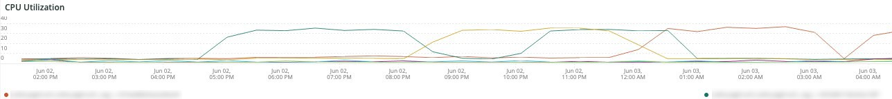

# 다음 [!DNL QuickView] 탭

다음 **[!UICONTROL QuickView]** 이 탭에서는 디스크 공간 및 서버 사용량에 있는 경고 유형을 포함하여 표시될 수 있는 다양한 경고 유형에 대해 설명합니다. 추가로 탭의 프레임이 설명되어 있습니다.

## [!UICONTROL Alerts]

다음 **[!UICONTROL Alerts]** 프레임에는 선택한 기간 동안의 디스크 공간 경고 및 서버 사용 경고를 포함한 다양한 경고가 표시됩니다. 이 프레임은 `SELECT`, `DELETE`, 및 `UPDATE` 선택한 기간에 대해 설명합니다.

## [!UICONTROL Upsize / Downsize by node]

다음 **[!UICONTROL Upsize / Downsize by node]** 프레임은 선택한 기간에 대해 노드별로 업사이징 및 다운크기를 표시합니다. 선택한 기간 동안 클러스터 크기가 변경되었는지 여부를 평가하는 데 사용됩니다.

## [!UICONTROL CPU Utilization]

다음 **[!UICONTROL CPU Utilization]** 프레임은 선택한 기간의 노드별 CPU 사용률을 보여줍니다.
