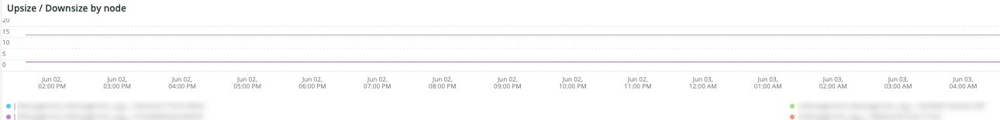

# 다음 [!DNL QuickView] 탭

다음 **[!UICONTROL QuickView]** 탭에서는 디스크 공간 및 서버 사용량이 적은 경고 유형을 포함하여 다양한 경고 유형을 설명합니다. 또한 탭의 프레임이 설명되어 있습니다.

## [!UICONTROL Alerts]

다음 **[!UICONTROL Alerts]** 프레임에는 선택한 기간에 대한 디스크 공간 경고 및 서버 사용량 경고를 비롯한 다양한 경고가 표시됩니다. 이 프레임은 다음을 포함한 데이터베이스 테이블 작업을 봅니다. `SELECT`, `DELETE`, 및 `UPDATE` 을(를) 선택해 주십시오.

## [!UICONTROL Upsize / Downsize by node]

다음 **[!UICONTROL Upsize / Downsize by node]** 프레임은 선택한 기간 동안 노드별 업사이징 및 다운사이징을 보여 줍니다. 선택한 기간 동안 클러스터 크기가 변경되었는지 여부를 평가하는 데 사용됩니다.

## [!UICONTROL CPU Utilization]

다음 **[!UICONTROL CPU Utilization]** 프레임은 선택한 기간 동안 노드별 CPU 사용률을 보여 줍니다.
