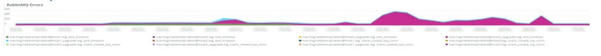

# 다음 [!UICONTROL RabbitMQ] 탭

다음 **[!UICONTROL RabbitMQ]** 탭에는 [!DNL RabbitMQ] 신호.

## [!UICONTROL RabbitMQ Infrastructure events]

다음 **[!UICONTROL RabbitMQ Infrastructure events]** 프레임은 [!DNL RabbitMQ] 선택한 기간에 발생한 시간:

* %응답 [오류] 노드 [rabbit@host1]: &#39;unexpected_resp_node1&#39;로서 &#39;from%&#39;에 예기치 않은 http 응답
* &#39;%응답 [오류] 노드 [rabbit@host2]: &#39;unexpected_resp_node2&#39;로서 &#39;from%&#39;에서 예기치 않은 http 응답
* &#39;%응답 [오류] 노드 [rabbit@host3]: &#39;unexpected_resp_node3&#39;로서 &#39;from%&#39;에 예기치 않은 http 응답
* &#39;%응답 [오류] 노드 [rabbit@host3]: &quot;http://localhost:15672/api/healthchecks/node/rabbit@host3&quot; 가져오기: context defined%) as &#39;node3_timeout_exceeded&#39;
* &#39;%응답 [오류] 노드 [rabbit@host1]: &quot;http://localhost:15672/api/healthchecks/node/rabbit@host1&quot; 가져오기: &#39;node1_timeout_exceeded&#39;)
* &#39;%응답 [오류] 노드 [rabbit@host2]: &quot;http://localhost:15672/api/healthchecks/node/rabbit@host2&quot; 가져오기: &#39;node2_timeout_exceeded&#39;)
* &#39;%401 Unauthorized%&#39;) as &#39;401_unauth&#39;
* &#39;%401 Unauthorized%&#39;) as &#39;401_unauth&#39;
* %서비스가 다시 시작됨: rmq-server%) &#39;rmq_service_restart&#39;
* &#39;%응답 [실패] 노드 [rabbit@host1]: nodedown%&#39;) &#39;rmq_node1_down&#39;
* &#39;%응답 [실패] 노드 [rabbit@host2]: nodedown%&#39;) &#39;rmq_node2_down&#39;
* &#39;%응답 [실패] 노드 [rabbit@host2]: nodedown%&#39;) &#39;rmq_node2_down&#39;
* &#39;%N이(가) 수정됨: exchange/bindings.destination%&#39;) as &#39;rmq_entity_modified&#39;
* &#39;%N이(가) 수정됨: exchange/bindings.destination%&#39;) as &#39;rmq_entity_modified&#39;
* &#39;%N이(가) 수정됨: &#39;rmq_entity_created_q_exclusive&quot;%Entity 수정됨: queue/auto_delete%&#39;) as &#39;rmq_entity_q_delete&#39;
* &#39;%N이(가) 수정됨: &#39;rmq_entity_modified_q_durable&#39;)
* &#39;%N이(가) 수정됨: version/management%&#39;) as &#39;rmq_entity_modified_ver_mgt&#39;
* &#39;%N이(가) 수정됨: version/management%&#39;) as &#39;rmq_entity_modified_ver_mgt&#39;

## [!UICONTROL RabbitMQ service start/stop signals]

이 프레임은 [!DNL RabbitMQ] 선택한 기간 동안 발생한 서비스 시작/중지 신호:

* &#39;%RabbitMQ를 중지하도록 요청..%&#39;) &#39;rabbitmq_stop&#39; 사용
* &#39;%RabbitMQ%&#39;)을 &#39;rabbitq_start&#39;로 시작하는 중

## [!UICONTROL RabbitMQ errors]

이 프레임은 [!DNL RabbitMQ] 선택한 일정 동안 발생한 오류:

* &#39;exit_timeout&#39;인 이유 {case_clause,timeout} 및 stacktrace {rabbit_mgmt_wm_healchecks%&#39;가 있습니다.
* &#39;%client가 예기치 않게 TCP 연결%&#39;을(를) &#39;client_closed_tcp_conn&#39;으로 닫았습니다.
* &#39;%at 정의되지 않은 종료(context shutdown_error%&#39;에서 이유 종료가 있음) &#39;undefined_exit&#39;
* &#39;%허용되지 않는 노드%&#39;의 연결 시도(&#39;disallowed_node&#39;)
* &#39;%AMQP 연결%&#39;를 &#39;rmq_err_amqp_conn&#39;으로 닫는 중

## [!UICONTROL RabbitMQ node status]

* &#39;%rabbit on node rabbit@host1 down%&#39;) as &#39;rmq_node1_down&#39;
* &#39;%rabbit on node rabbit@host2 down%&#39;) as &#39;rmq_node2_down&#39;
* &#39;%rabbit on node rabbit@host3 down%&#39;) as &#39;rmq_node3_down&#39;
* &#39;%rabbit on node rabbit@host1 up%&#39;) as &#39;rmq_node1_up&#39;
* &#39;%rabbit on node rabbit@host2 up%&#39;) as &#39;rmq_node2_up&#39;
* &#39;%rabbit on node rabbit@host3 up%&#39;) as &#39;rmq_node3_up&#39;

## [!UICONTROL RabbitMQ Message High-Level Summary status by Queue]

다음 **[!UICONTROL RabbitMQ Message High-Level Summary status by Queue]** 그래프에는 [!DNL RabbitMQ] 선택한 일정의 큐입니다.

## [!UICONTROL RabbitMQ Message Detail Summary]

* &#39;%report.ERROR: Cron Job consumer_runner에 오류가 있습니다. NOT_FOUND - no queue%&#39;) as &#39;queue_err&#39;
* &#39;%report.ERROR: Cron Job consumer_runner에 오류가 있습니다. NOT_FOUND - no queue%&#39;) as &#39;queue_err&#39;
* &#39;%auth%&#39;(으)로 인증되고 액세스 권한을 부여함)
* &#39;%AMQP 연결%&#39;을(를) &#39;close_conn&#39;으로 닫는 중

## [!UICONTROL RabbitMQ Queue Consumption MB]

다음 **[!UICONTROL RabbitMQ Queue Consumption MB]** 그래프는 각 사용자가 사용한 바이트 수를 보여줍니다. [!DNL RabbitMQ] 선택한 일정 동안 대기합니다.

## [!UICONTROL RabbitMQ Published Messages by Queue]

다음 **[!UICONTROL RabbitMQ Published Messages by Queue]** 그래프는 각 사용자가 사용한 바이트 수를 보여줍니다. [!DNL RabbitMQ] 선택한 일정 동안 대기합니다.

## [!UICONTROL RabbitMQ Published Message Throughput by Queue]

다음 **[!UICONTROL RabbitMQ Published Message Throughput by Queue]** 그래프에는 게시된 메시지의 각 초당 평균 수를 보여줍니다 [!DNL RabbitMQ] 선택한 일정 동안 대기합니다.

## [!UICONTROL RabbitMQ Total Message Throughput by Queue]

다음 **[!UICONTROL RabbitMQ Total Message Throughput by Queue]** 그래프는 각 초당 평균 총 메시지 수를 보여줍니다 [!DNL RabbitMQ] 선택한 일정 동안 대기합니다.

## [!UICONTROL RabbitMQ Consumers by Queue]

다음 **[!UICONTROL RabbitMQ Consumers by Queue]** 그래프에서는 각 소비자의 평균 총 소비자 수를 보여줍니다 [!DNL RabbitMQ] 선택한 일정 동안 대기합니다.
