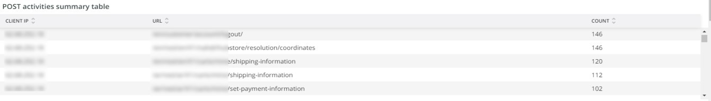
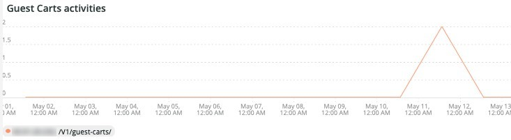

# [!UICONTROL Security] 탭

**[!UICONTROL Security]** 탭은 보안 문제를 설명하고 잠재적인 원인을 격리합니다. 또한 탭의 프레임에 대해서도 설명합니다.

## [!UICONTROL API calls by IP, details by URL]

**[!UICONTROL API calls by IP, details by URL]** 프레임에는 선택한 일정 동안 IP별로 여러 개의 API 호출이 표시됩니다. 이 프레임에는 IP 주소와 해당 IP 주소가 액세스한 API URL이 표시됩니다.

## [!UICONTROL Forgot Password]

**[!UICONTROL Forgot Password]** 액세스 프레임에 선택한 일정 동안의 암호 찾기 시도 횟수가 표시됩니다. IP 주소에 대한 높은 활동은 사이트에 대한 공격일 수 있습니다.

## [!UICONTROL Create Account access]

**[!UICONTROL Create Account access]** 프레임에는 선택한 일정 동안의 새 계정 활동 수가 표시됩니다. 단일 IP 주소에서 활동이 많으면 공격을 나타낼 수 있습니다.

## [!UICONTROL POST activities]

**[!UICONTROL POST activities]** 프레임에는 `POST` 로그에서 `client_ip`에 패싯된 사이트에 대한 [!DNL Fastly] 활동이 표시됩니다. 또한 IP 주소로 액세스되는 URL도 표시됩니다.

## [!UICONTROL POST activities summary table]

**[!UICONTROL POST activities summary table]** 프레임에는 `POST` 로그에서 `client_ip`에 패싯된 사이트에 대한 요약된 [!DNL Fastly] 활동이 표시됩니다. 또한 IP 주소로 액세스되는 URL의 카운트가 표시됩니다. 카운트는 선택한 기간에 대한 것입니다.

## [!UICONTROL POST activities details table]

**[!UICONTROL POST activities details table]** 프레임에는 `POST` 로그에서 사이트에 대한 [!DNL Fastly] 활동이 표시됩니다. 또한 이러한 요청에 대한 [!DNL Fastly] 로그의 모든 세부 정보를 표시합니다. 마지막 2000개의 요청으로 제한됩니다.

## [!UICONTROL Guest Carts activities]

**[!UICONTROL Guest Carts activities]** 프레임은 IP 주소 및 URL을 통해 액세스된 선택한 일정의 장바구니 활동 수를 표시합니다. 손님용 카트는 카딩 공격에서 사용될 수 있습니다. 이 프레임에는 게스트 카트의 URL에 액세스하는 총 요청 수가 표시됩니다.

## [!UICONTROL API – forgot password, create account by Countries]

**[!UICONTROL API – forgot password, create account by Countries]** 프레임에는 선택한 일정 동안 만든 계정의 수와 잊어버린 암호를 재설정하도록 요청하는 내용이 표시됩니다. 해당 요청의 원산지도 함께 표시하기 위해 배치합니다. 이 프레임은 요청의 원산지 국가에 중점을 둡니다.

## [!UICONTROL API - forgot password, create account by Countries and IP address]

**[!UICONTROL API - forgot password, create account by Countries and IP address]** 프레임에는 선택한 일정 동안 만든 계정의 수와 잊어버린 암호를 재설정하도록 요청하는 내용이 표시됩니다. IP 주소, 액세스한 URL 및 요청 원산지를 표시하기 위해 배치됩니다. 이 프레임은 IP 수에 중점을 둡니다.

## [!UICONTROL Guest cart activities by IP]

**[!UICONTROL Guest cart activities by IP]** 프레임에는 선택한 기간 동안 IP별 게스트 장바구니 활동이 표시됩니다.

## [!UICONTROL Guest cart activities by Countries]

**[!UICONTROL Guest cart activities by Countries]** 프레임에는 선택한 일정 동안의 국가별 장바구니 활동이 표시됩니다.

