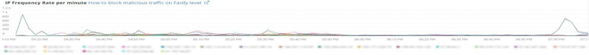
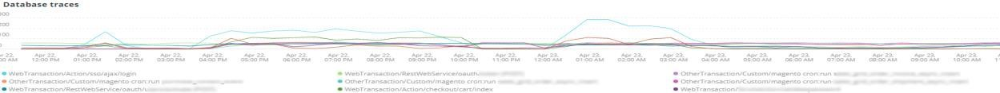

# [!UICONTROL Summary] 탭

[!DNL Observation for Adobe Commerce]의 [!UICONTROL Summary] 탭은 사이트에서 발생한 문제 중 일부를 빠르게 확인하여 사이트 문제의 잠재적 근본 원인을 자동으로 해결하거나 식별하는 데 도움이 되도록 만들어진 것입니다. 추가 탭은 구성 요소 서비스, 데이터베이스, 인프라 및 프로세스 상태에 대한 심층적인 정보를 제공합니다.

## [!UICONTROL Transaction Overview]

### [거래란?](https://docs.newrelic.com/docs/apm/transactions/intro-transactions/transactions-new-relic-apm/#:%7E:text=transactions%20are%20reported.-,내용%20is%20a%20transaction%3F,작업%20in%20a%20software%20application.&amp;text=For%20APM%2C%20it%20will%20frequently, when%20the%20response%20is%20sent)

&quot;[!DNL New Relic]에서 트랜잭션은 소프트웨어 응용 프로그램에서 하나의 논리적 작업 단위로 정의됩니다. 특히 해당 작업 단위를 구성하는 함수 호출과 메서드 호출을 가리킵니다. 종종 웹 트랜잭션을 참조합니다. 이 트랜잭션은 애플리케이션이 웹 요청을 수신할 때부터 응답이 전송될 때까지 발생하는 활동을 나타냅니다.&quot;

### 거래 유형:

**웹:** 웹 트랜잭션이 HTTP 요청으로 시작되었습니다. 대부분의 조직에서 이는 고객 중심의 상호 작용을 나타내므로 모니터링해야 할 가장 중요한 트랜잭션입니다.

**웹이 아닌 트랜잭션:** 웹이 아닌 트랜잭션은 웹 요청으로 시작되지 않습니다. 비웹 작업자 프로세스, 백그라운드 프로세스, 스크립트, 메시지 대기열 활동 및 기타 작업을 포함할 수 있습니다.

위의 **[!UICONTROL Transaction Overview]** 프레임을 보면 평균 APDEX 점수가 .76인 트랜잭션이 거의 53,000건이었고, 이 트랜잭션의 95%가 2.313초 이내에 발생했습니다. 짧은 기간 동안 APDEX 히트가 있는 경우 더 엄격한 기간이 현재 평균과의 편차를 보일 수 있는 프레임입니다.

## [!UICONTROL 404 page errors frame]

**[!UICONTROL 404 page errors]** 프레임에 선택한 일정의 [URI](https://en.wikipedia.org/wiki/Uniform_Resource_Identifier) 및 404 페이지 오류 수가 나열됩니다.

## [!UICONTROL % of Storage Free frame]

**[!UICONTROL % of Storage Free]** 프레임에는 클러스터의 모든 노드에서 저장소 마운트의 사용 가능한 평균 백분율이 표시됩니다. 예를 들어 3개의 노드 클러스터가 있는 경우 프레임에는 \&lt;mount point\>, \&lt;environment name\>이 표시됩니다. 이 프레임은 세 노드에 걸쳐 분산이 있는 경우 기만적일 수 있다. 변형의 예로는 `/data/mysql` 탑재 지점 사용 가능 값이 세 노드 클러스터에서 다른 경우 입니다. [!UICONTROL MySQL] 탭 아래에 노드 이름별로 탑재 지점을 패싯하여 각 노드에서 사용 가능한 `/data/mysql` 저장소가 실제로 무엇인지 보다 정확하게 확인하는 프레임이 있습니다.

## [!UICONTROL % of system memory that is free frame]

사용 가능한 프레임의 

사용 가능한 시스템 메모리의 **%** 프레임은 각 노드에서 사용 가능한 시스템 메모리의 양을 노드별로 표시합니다.

## [!UICONTROL Swap memory free in bytes]

**[!UICONTROL Swap memory free in bytes]** 프레임은 노드에 사용 가능한 SWAP 메모리의 양을 노드별로 표시합니다.

## [!UICONTROL CPU % by host]

호스트별 

모든 환경 및 노드의 집계가 **[!UICONTROL CPU % by host]** 프레임에 표시됩니다. 비프로덕션 환경은 선택 해제해야 합니다. 또한 프로덕션 환경의 모든 노드가 없는 모든 인스턴스를 확인합니다. 높은 CPU 사용률에 대한 자세한 정보는 [Adobe Commerce에서 New Relic을 사용하여 성능 문제 해결](https://experienceleague.adobe.com/docs/commerce-knowledge-base/kb/troubleshooting/miscellaneous/troubleshoot-performance-using-new-relic-on-magento-commerce.html)을 참조하세요.

## [!UICONTROL Alerts during timeframe]

**[!UICONTROL Alerts during timeframe]**&#x200B;은(는) Adobe Commerce 지원에서 추가한 [!UICONTROL Managed Alerts]을(를) 포함하여 모든 경고를 표시합니다.

## [!UICONTROL CPU Usage]

**[!UICONTROL CPU Usage]** 프레임이 비어 있으면 [!DNL New Relic]의 인프라 응용 프로그램이 활성화되지 않았음을 나타냅니다. 사이트가 Starter에 있는 경우 이 정보가 표시되지 않습니다. 사이트가 Pro를 사용하는 경우 [지원 티켓](https://experienceleague.adobe.com/docs/commerce-knowledge-base/kb/help-center-guide/magento-help-center-user-guide.html)을 열어 사이트에 대해 [!DNL New Relic Infrastructure]을(를) 사용하도록 설정하십시오.

## [!UICONTROL Average Response Time]

**[!UICONTROL Average Response Time]** 그래프는 트랜잭션(웹 및 기타)에 대한 평균 응답 시간을 보여 줍니다.

## [!UICONTROL Long duration cron_schedule updates]

**[!UICONTROL cron_schedule]** 테이블은 cron 작업의 시작 및 완료 시 작성됩니다. 긴 기간 cron 작업은 이 테이블 업데이트에 지연 시간을 나타낼 수 있으며, 이는 cron 스택 또는 cron 예약 방식의 문제를 나타낼 수 있습니다.

## [!UICONTROL Response Code]

**[!UICONTROL Response Code]** 프레임은 웹 트래픽과 요청 응답 코드를 잘 나타냅니다. 이 데이터는 [!DNL New Relic's] 트랜잭션 데이터이며 반환된 `httpResponseCode`에 의해 패싯됩니다.

## [!UICONTROL Web Traffic volume compared with one week ago Magento Managed Alerts Information]

이 프레임에는 지난 1주와 현재 1주의 비교 웹 트래픽 볼륨이 표시됩니다.

## [!UICONTROL Deployment Log Entries]

**[!UICONTROL Deployment Log Entries]** 프레임에는 배포 및 클라우드 로그 항목의 수와 배포 로그 이름별 패싯이 표시됩니다.

## [!UICONTROL Deployment State]

배포 로그의 **[!UICONTROL Deployment State]** 프레임 패싯 특정 배포 단계입니다. 다음은 로그 및 Facet 이름에서 계산되는 단계의 몇 가지 예입니다.

**배포 로그 단계:**

* &#39;%Starting generate command%&#39;)(으)로 &#39;start_gen&#39;
* &#39;%git apply /app/vendor/magento/ece-tools/patches%&#39;)를 &#39;apply_patches&#39;로
* &#39;%Set 플래그: .static_content_deploy%&#39;)를 &#39;SCD&#39;로
* &#39;%NOTICE: 명령 생성 완료%&#39;)을(를) &#39;gen_compl&#39;로 지정
* &#39;%NOTICE: 배포가 완료되었습니다%&#39;). &#39;deploy_compl&#39;(으)로
* &#39;%NOTICE: 사후 배포를 시작합니다.%&#39;)를 &#39;start_pdeploy&#39;로
* &#39;%NOTICE: Post-deploy is complete%&#39;) as &#39;pdeploy&#39;
* &#39;%deploy-complete%&#39;)을 &#39;cl_deploy_compl&#39;로

## [!UICONTROL IP Frequency]

**[!UICONTROL IP Frequency]** 프레임은 [!DNL Fastly] 로그에서 각 IP에 대한 (&#39;MISS&#39; 및 &#39;PASS&#39;) 상태를 계산합니다. 이러한 상태의 웹 요청은 원천 서버에 도달하며 서버에 로드를 추가합니다. 상위 20개 주소를 빈도로 표시합니다. 이 프레임은 웹 사이트에서 IP 공격 또는 과도한 부하를 감지하는 데 사용할 수 있습니다.

## [!UICONTROL IP Response – top 20 URLs in duration]

**[!UICONTROL IP Response – top 20 URLs in duration]** 프레임에서 응답 시간이 가장 긴 URL을 표시합니다. 응답 지속 시간이 가장 긴 큰 이미지 파일 또는 페이지, API 또는 페이지를 나타낼 수 있습니다.

## [!UICONTROL API Calls by IP]

**[!UICONTROL API Calls by IP]** 프레임은 API URL에서 요청을 하는 API 및 IP 주소에 대해 대량 트래픽을 식별하는 데 도움이 됩니다.

## [!UICONTROL API Calls by IP, details by URL]

url별 

**[!UICONTROL API Calls by IP, details by URL]** 프레임에서는 API에 대한 대량 트래픽의 세부 정보와 요청을 수행하는 URL의 세부 정보를 제공합니다.

## [!UICONTROL IP Frequency Rate per minute]

어떤 IP 주소가 다른 프레임에서 가장 많은 요청을 하는지 알 수 없는 경우가 있습니다. **[!UICONTROL IP Frequency Rate per minute]** 프레임에는 IP 주소당 분당 속도가 표시됩니다.

## [!UICONTROL Potential Bots]

**[!UICONTROL Potential Bots]** 프레임은 NULL 또는 &#39;%bot%&#39;과(와) 같은 request_user_agent 이름을 가진 요청을 찾습니다. 일반적으로 &#39;%bot%&#39; request_user_agent는 `robots.txt` 파일의 정책 설정을 따릅니다.

## [!UICONTROL Transaction Errors]

**[!UICONTROL Transaction Errors]** 프레임에 [!DNL New Relic]의 트랜잭션 오류 수가 표시됩니다.

## [!UICONTROL Nginx access by node]

노드별 

**[!UICONTROL Nginx access by node]** 프레임은 `access.log`에서 노드별로 카운트를 봅니다. 부하가 고르게 분포되어 있는지 확인하는 것이 도움이 된다. 종종 노드가 드롭될 때 표시됩니다. 프레임에는 사이트에 대한 로드도 표시됩니다.

## [!UICONTROL Galera Log]

데이터베이스 클러스터에 [[!DNL Galera]](https://galeracluster.com/library/galera-documentation.pdf)이(가) 사용됩니다. 이 프레임은 [!UICONTROL Galera] 클러스터의 특정 신호에 중점을 둡니다. 이 신호는 클러스터를 시작 및 종료하는 노드에 중점을 둡니다. 이 동작은 데이터베이스 데이터 무결성을 유지하기 위한 정상적인 동작입니다. [!UICONTROL Galera] 클러스터 상태가 변경될 때 노드가 계속 동기화됩니다.

**상태 변경 목록: [!UICONTROL Galera]:**

* &#39;%1047 WSREP에서 아직 &#39;node_not_prep_for_use&#39;(응용 프로그램 사용%&#39;)에 대한 노드를 준비하지 않았습니다.
* &#39;%\[ERROR\] WSREP: wsrep_sst_xtrabackup-v2%&#39;에서 &#39;xtrabackup_read_fail&#39;로 읽지 못했습니다.
* &#39;%\[ERROR\] WSREP: &#39;xtrabackup_compl_w_err&#39;로 표시되는 동안 오류가 발생하여 프로세스가 완료되었습니다. wsrep_sst_xtrabackup-v2 %&#39;
* &#39;%\[ERROR\] WSREP: rbr 쓰기 실패%&#39;)를 &#39;rbr_write_fail&#39;로 함
* &#39;%self-leave%&#39;)을(를) &#39;susp_node&#39;로 설정
* &#39;%members = 3/3 (joined/total)%&#39;)을 &#39;3of3&#39;으로 설정
* &#39;%members = 2/3 (joined/total)%&#39;)을 &#39;2of3&#39;으로 설정
* &#39;%members = 2/2%&#39;)를 &#39;2of2&#39; * &#39;%members = 1/2%&#39;)를 &#39;1of2&#39; * &#39;%members = 1/3%&#39;)로 &#39;1of3&#39;
* &#39;%members = 1/1%&#39;)을(를) &#39;1of1&#39;(으)로 설정
* &#39;%\[참고\] /usr/sbin/mysqld(mysqld 10.%&#39;)를 &#39;sql_restart&#39;로
* &#39;%Quorum: 완료 상태:%&#39;인 노드가 없음) &#39;no_node_count&#39;
* &#39;%WSREP: 멤버 0%&#39;)이 &#39;mem_0&#39;이 되었습니다.
* &#39;%WSREP: 멤버 1.0%&#39;)이 &#39;mem_1&#39;인 경우
* &#39;%WSREP: 멤버 2%&#39;)이 &#39;mem2&#39;인 경우
* &#39;%WSREP: 그룹과 동기화됨, 연결 준비%&#39;)이 &#39;준비&#39;입니다.
* &#39;%/usr/sbin/mysqld, 버전:%&#39;)을 &#39;mysql_restart_mysql.slow&#39;로 설정합니다.
* &#39;%\[참고\] WSREP: 새 클러스터 보기: 전역 상태:%&#39;) as &#39;galera_cluster_view_chng&#39;

이러한 신호는 상태가 자주 바뀌는 경우 저장, 메모리 또는 쿼리 문제를 나타낼 수 있습니다.

## [!UICONTROL Database errors]

**데이터베이스 오류 또는 검색된 메시지 목록:**

* &#39;%임시 테이블에 할당된 메모리 크기가 &#39;temp_tbl_buff_pool&#39;인 innodb_buffer_pool_size%의 20%보다 큽니다.
* &#39;%\[ERROR\] WSREP: rbr 쓰기 실패%&#39;)를 &#39;rbr_write_fail&#39;로 함
* &#39;%mysqld: Disk full%&#39;)이(가) &#39;disk_full&#39;인 경우
* &#39;%Error number 28%&#39;)을(를) &#39;err_28&#39;(으)로
* &#39;%rollback%&#39;)을 &#39;rollback&#39;으로
* &#39;%Foreign KEY 제약 조건이 테이블%&#39;에 대해 실패했습니다.) &#39;foreign_key_constraint&#39;(으)로
* &#39;%Error_code: 1114%&#39;)을(를) &#39;sql_1114_full&#39;로 함
* &#39;%CRITICAL: SQLSTATE\[HY000\] \[2006\] MySQL 서버가 없어짐%&#39;)를 &#39;sql_gone&#39;으로 지정했습니다.
* &#39;%SQLSTATE\[HY000\] \[1040\]이(가) &#39;sql_1040&#39;(으)로 확인됨
* &#39;%CRITICAL: SQLSTATE\[HY000\] \[2002\]%&#39;)를 &#39;sql_2002&#39;로 지정했습니다.
* &#39;%SQLSTATE\[08S01\]:%&#39;)가 &#39;sql_1047&#39;인 경우
* &#39;%\[Warning\] &#39;aborted connection%&#39;)가 &#39;aborted_conn&#39;이(가) 되었습니다.
* &#39;%SQLSTATE\[23000\]: 무결성 제약 조건 위반:%&#39;)이 &#39;sql_23000&#39;입니다.
* &#39;%1205 대기 시간 제한%&#39;)을(를) &#39;sql_1205&#39;(으)로 설정
* &#39;%SQLSTATE\[HY000\] \[1049\] 알 수 없는 데이터베이스%&#39;)가 &#39;sql_1049&#39;로 지정되었습니다.
* &#39;%SQLSTATE\[42S02\]: 기본 테이블 또는 뷰를 찾을 수 없음:%&#39;) as &#39;sql_42S02&#39;
* &#39;%General 오류: 1114%&#39;)을(를) &#39;sql_1114&#39;(으)로
* &#39;%SQLSTATE\[40001\]%&#39;)를 &#39;sql_1213&#39;(으)로
* &#39;%SQLSTATE\[42S22\]: 열을 찾을 수 없음: 1054 알 수 없는 열%&#39;) as &#39;sq1_1054&#39;
* &#39;%SQLSTATE\[42000\]: 구문 오류 또는 액세스 위반:%&#39;)이 &#39;sql_42000&#39;입니다.
* &#39;%SQLSTATE\[21000\]: 카디널리티 위반:%&#39;)이(가) &#39;sql_1241&#39;로 표시됨
* &#39;%SQLSTATE\[22003\]:%&#39;)를 &#39;sql_22003&#39;으로
* &#39;%SQLSTATE\[HY000\] \[9000\] 클라이언트(IP 주소 %&#39;) &#39;sql_9000&#39;(으)로 설정됨
* &#39;%SQLSTATE\[HY000\]: 일반 오류: 2014%&#39;)가 &#39;sql_2014&#39;입니다.
* &#39;%1927 연결이 끊어졌습니다.%&#39;) &#39;sql_1927&#39;(으)로
* &#39;%1062 \[\ERROR\] InnoDB:%&#39;)이(가) &#39;sql_1062_e&#39;인 경우
* &#39;%\[참고\] WSREP: 디스크에 메모리 맵을 플러시하는 중...%&#39;)을 &#39;mem_map_flush&#39;로 설정
* &#39;%Internal MariaDB 오류 코드: 1146%&#39;)을(를) &#39;sql_1146&#39;(으)로 설정
* &#39;%내부 MariaDB 오류 코드: 1062%&#39;) as &#39;sql_1062&#39; * &#39;%1062 \[Warning\] InnoDB:%&#39;) as &#39;sql_1062_w&#39;
* &#39;%Internal MariaDB 오류 코드: 1064%&#39;)을(를) &#39;sql_1064&#39;(으)로 설정
* &#39;%InnoDB: &#39;%&#39; 파일에서 어설션 오류가 발생했습니다. &#39;%Assertion_err&#39;(으)로 표시됨
* &#39;%mysqld_safe 현재 실행 중인 프로세스 수: 0%&#39;)가 &#39;mysql_oom&#39;인 경우
* &#39;%\[ERROR\] mysqld got signal%&#39;)이(가) &#39;mysql_sigterm&#39;(으)로 표시됨
* &#39;%1452%&#39;를 &#39;sql_1452&#39;로 추가할 수 없습니다.
* &#39;%ERROR 1698%&#39;)을(를) &#39;sql_1698&#39;(으)로
* &#39;%SQLSTATE\[HY000\]: 일반 오류: 3%&#39;)가 &#39;cnt_wrt_tmp&#39;입니다.
* &#39;%일반 오류: 1 %&#39;)을(를) &#39;sql_syntax&#39;로 지정했습니다.
* &#39;%42S22%&#39;)을(를) &#39;sql_42S22&#39;로 함
* &#39;%InnoDB: 오류(중복 키)%&#39;)가 &#39;innodb_dup_key&#39;입니다.

## [!UICONTROL Database traces]

**[!UICONTROL Database traces]** 프레임은 [!DNL New Relic]의 [sql trace](https://docs.newrelic.com/docs/apm/transactions/transaction-traces/transaction-traces-database-queries-page/) 엔터티의 데이터를 보고 추적 경로를 반환합니다.

## [!UICONTROL Database mysql-slow.log]

**[!UICONTROL Database mysql-slow.log]** 프레임은 쿼리 요청 유형별로 [mysql-slow.log](https://dev.mysql.com/doc/refman/5.7/en/slow-query-log.html)에 있는 항목 수를 계산합니다. 이 메서드는 mysql-slow.log(느린 쿼리 로그)에 관심 있을 수 있는 시간대를 시각적으로 격리합니다. 인덱스가 없는 테이블의 쿼리나 큰 테이블을 업데이트하는 쿼리는 다른 쿼리를 차단할 수 있습니다.

## [!UICONTROL Redis synchronization from Log]

[[!DNL Redis]](https://redis.io/docs/about/)은(는) 데이터베이스, 캐시 및 메시지 브로커로 사용되는 오픈 소스(BSD 라이선스) 메모리 내 데이터 구조 저장소입니다. 구성된 경우 데이터베이스 및 세션 캐싱을 수행할 수 있습니다. **[!UICONTROL Redis synchronization from Log]** 프레임은 [[!DNL Redis] 동기화](https://redis.io/docs/latest/operate/oss_and_stack/management/replication/)에 중점을 둡니다. [!DNL Redis] 데이터 세트가 클수록 동기화에 문제가 발생할 가능성이 높아집니다(동기화를 유지하기 위한 데이터가 더 많음).

**[!DNL Redis]개의 오류 및 메시지:**

* &#39;%SLAVE 동기화: 장치%&#39;에 &#39;space&#39;로 남은 공간이 없습니다.
* &#39;%Server가 시작되었습니다. Redis 버전%&#39;)이 &#39;serv_start&#39;로 표시됨
* &#39;%서버가 이제 연결%&#39;을(를) &#39;준비&#39;로 승인할 준비가 되었습니다.
* &#39;%마스터와의 연결이 끊어졌습니다.%&#39;)를 &#39;mstr_lost&#39;로
* &#39;%+sdown sentinel%&#39;)을 &#39;+sentinal&#39;로 변환
* &#39;%-sdown sentinel%&#39;)을 &#39;-sentinal&#39;로 변환
* &#39;%-sdown slave%&#39;)를 &#39;-slave&#39;로, &#39;%+sdown slave%&#39;)를 &#39;+slave&#39;로
* &#39;%-failover-abort-not-selected master mymaster%&#39;)가 &#39;-failover&#39;(으)로 표시됨
* &#39;%+failover-abort-not-selected master mymaster%&#39;)를 &#39;+failover&#39;로 설정
* &#39;%Partial 다시 동기화를 수행할 수 없습니다(캐시된 마스터 없음)%&#39;). &#39;part_sync_err&#39;
* &#39;%기본 복제가 중단되었습니다. 오류: ERR Can%&#39;) as &#39;mstr_sync_err&#39;
* &#39;%기본이(가) PSYNC를 지원하지 않거나 오류 상태%&#39;에 있습니다.) &#39;mstr_psync_err&#39;(으)로
* &#39;%SLAVE 동기화: &#39;%SLV_sync_suc&#39;(으)로 완료됨
* &#39;%기본 복제가 중단되었습니다. 오류: ERR Can%&#39;) as &#39;mstr_sync_err,coun&#39;
* &#39;%OOM 명령을 사용할 때 사용할 수 없음%&#39;) &#39; max_mem_err&#39;(으)로
* &#39;%CredisException(코드: 0): 연결%에서 읽기 오류 발생) &#39;credis_read_error&#39;(으)로
* &#39;%Uncatch RedisException:%&#39;)이(가) &#39;redis_excp_err&#39;인 경우
* &#39;%psync가 출력 버퍼%을(를) 극복하기 위해 가능한 한 빨리 닫히도록 예약되었습니다.&#39;) &#39;output_buf_err&#39;

## [!UICONTROL PHP process states]

PHP 프로세스가 작동하는 방식은 [구성](https://www.php.net/manual/en/install.fpm.configuration.php)에 따라 다릅니다. 많은 변수와 옵션이 있는 구성이 복잡합니다. **[!UICONTROL PHP process states]** 프레임은 PHP 프로세스가 종료되고 다시 시작되는 시기를 이해하는 데 도움이 됩니다.

### [!UICONTROL PHP errors]

**[!UICONTROL PHP errors]** 프레임에는 선택한 기간 동안 작업자의 PHP 오류 수가 표시됩니다. 자세한 내용은 [Adobe Commerce PHP 설정](../../installation/prerequisites/php-settings.md)을 참조하세요.

**PHP 오류 및 메시지:**

* &#39;%worker_connections가 &#39;worker&#39;로 충분하지 않음(%)
* &#39;%PHP 치명적인 오류: 메모리 크기가 허용되었습니다!%&#39;)를 &#39;mem_size&#39;로
* &#39;%exited on signal 11 (SIGSEGV)%&#39;) as &#39;sig_11&#39;
* &#39;%가 신호 7(SIGBUS)%&#39;)에서 &#39;sig_7&#39;(으)로 종료됨
* &#39;%increase pm.start_servers%&#39;) as &#39;pmstart_serv&#39;
* &#39;%max_children%&#39;)을(를) &#39;max_children_cnt&#39;로
* &#39;%PHP 심각한 오류: &#39;%&#39;(으)로 허용된 메모리 크기(mem_exhst_coun&#39;)
* &#39;%pool%&#39;에 대한 메모리를 할당할 수 없습니다.) &#39;opc_mem_count&#39;
* &#39;%Warning interned string buffer overflow%&#39;)를 &#39;opc_str_buf&#39;로 지정합니다.
* &#39;%Illegal string offsetl%&#39;)을(를) &#39;opc_sv_comments&#39;로 지정했습니다.
* &#39;%PHP 치명적인 오류: RedisException: connection%&#39;에서 &#39;php_exc&#39;(으)로 표시되는 읽기 오류

## [!UICONTROL PHP processes]

[PHP-FPM](https://php-fpm.org/)은(는) [!DNL Nginx]에서 사용하는 [!UICONTROL FastCGI Process Manager]입니다. 시스템 요구 사항에 대해 알아보려면 [Adobe Commerce 버전에 매핑된 PHP 버전 요구 사항](../../installation/system-requirements.md)을 참조하세요. **[!UICONTROL PHP processes]** 프레임에는 선택한 타임라인에서 특정 시간에 실행되는 PHP 프로세스 수가 표시됩니다.

## [!UICONTROL Secondary processes]

보조 프로세스가 사이트 응답에 영향을 줄 수 있습니다. **[!UICONTROL Secondary processes]** 프레임은 사이트에 로드를 추가할 수 있는 프로세스를 나타냅니다. 데이터베이스에는 주로 가장 많은 보조 프로세스가 실행되고 있습니다.

## [!UICONTROL Traffic vs Week Ago]

**[!UICONTROL Traffic vs Week Ago]** 프레임은 (&#39;MISS&#39;, &#39;PASS&#39;) 캐시 상태가 있는 [!DNL Fastly] 로그의 웹 사이트 트래픽(요청)을 봅니다. 이러한 요청은 원천 서버에 로드를 추가합니다. 이 프레임에는 동일한 기간 동안 현재 주와 지난 주의 비교 웹 요청 볼륨이 표시됩니다.

## [!UICONTROL Fastly Cache]

**[!UICONTROL Fastly Cache]** 프레임은 [!DNL Fastly] 로그에서 요청의 캐시 상태에 대한 집계 보기를 표시합니다. ERROR 를 선택하면 요청의 오류 비율이 표시됩니다. 일반적으로 원천 서버가 페이지 요청에 충분히 신속하게 응답하지 않으면 증가합니다.

## [!UICONTROL Page Rendering]

**[!UICONTROL Page Rendering]** 프레임에는 같은 기간 동안의 이전 주와 비교하여 [!DNL New Relic]의 페이지 보기 원본에서 현재 주의 평균 페이지 렌더링 기간이 표시됩니다.

## [!UICONTROL Page loading detail]

**[!UICONTROL Page loading detail]** 프레임은 페이지 로드 이벤트를 설명합니다. 그것은 이러한 측면들의 의미들을 자세히 설명합니다. 다음은 이 프레임에 대해 실행되는 쿼리입니다.

`SELECT percentile(timeToResponseStart, 50) AS 'first byte', percentile(firstPaint, 50) as 'First paint', percentile(firstContentfulPaint, 50) as 'First contentful paint', percentile(timeToDomContentLoadedEventEnd, 50) AS 'DOM content loaded', percentile(duration, 50) AS 'Window load + AJAX' FROM BrowserInteraction TIMESERIES`

## [!UICONTROL Transactions – Avg, Max, Min]

트랜잭션 기간은 초 단위입니다. 거래에 따라 장기 실행 중인 경우 다른 거래에 영향을 줄 수 있습니다. 이름 및 기간에 나열된 트랜잭션은 특정 기간에 대한 것입니다. 간결한 문제 일정이 있는 경우 [!DNL Observation for Adobe Commerce] 날짜/시간 선택기의 크기를 해당 좁은 일정으로 조정하십시오.

## [!UICONTROL Admin Activities]

**[!UICONTROL Admin Activities]** 프레임은 관리자 사용자와의 트랜잭션을 식별합니다.

## [!UICONTROL Order transactions (default?)]

**[!UICONTROL Order transactions (default?)]** 프레임은 트랜잭션에서 `request.headers.host` 트랜잭션을 찾습니다. 여기서 이름은 = `WebTransaction/Action/checkout/onepage/success`입니다. 주문 성공 URL이 다른 경우 이 프레임에는 데이터가 없습니다.

## [!UICONTROL Elasticsearch Index information]

**[Elasticsearch 상태:](https://www.elastic.co/guide/en/elasticsearch/reference/current/cluster-health.html)**

* 녹색: 모든 파드가 할당됩니다.
* 노란색: 모든 주 샤드가 할당되지만 하나 이상의 복제본 샤드가 할당되지 않습니다. 클러스터의 한 노드가 실패하면 해당 노드가 복구될 때까지 일부 데이터를 사용할 수 없습니다.
* 빨간색: 하나 이상의 기본 샤드가 할당 해제되었으므로 일부 데이터를 사용할 수 없습니다. 이 문제는 기본 샤드가 지정됨에 따라 클러스터 시작 중에 잠시 발생할 수 있습니다.

## [!UICONTROL Elasticsearch Errors]

**[!DNL Elasticsearch]개 오류:**

* &#39;%all shards failed%&#39; as &#39;all_shards_failed&#39;
* &#39;%NoNodesAvailableException%&#39;을 &#39;no_alive_nodes&#39;로 설정
* &#39;%PHP 치명적인 오류: 알 수 없는 오류: &#39;wrong_param&#39;으로 표시되는 Elasticsearch%&#39;에 대한 잘못된 매개 변수
* &#39;%Magento 클라우드 인프라의 Elasticsearch 서비스를 버전%&#39;로 업그레이드하면 이 문제를 &#39;ver_err&#39;로 해결할 수 있습니다.
* &#39;%cluster 상태가 \[YELLOW\]에서 \[RED\] (이유:%)로 &#39;yel_red&#39;(으)로 변경되었습니다.
* &#39;%no_space&#39;(으)로 장치%&#39;에 남은 공간 없음
* &#39;% &#39;failed_query&#39;로 &lbrack;SearchRequest&lbrace;searchType=%&#39;을(를) 실행하지 못했습니다.

## [!UICONTROL Cron view]

**[!UICONTROL Cron view]** 프레임은 크론 로그를 확인하여 시작된 크론 수와 완료된 크론 수 간의 균형을 유지합니다.

## [!UICONTROL Cron error]

**cron.log의 Cron 오류:**

* &#39;%_stg%&#39;을(를) &#39;stg_crons&#39;(으)로
* &#39;%cron_lock&#39;(으)로 cron job%&#39;에 대한 잠금을 가져올 수 없습니다.
* &#39;%일반 오류: 2006 MySQL 서버가 &#39;mysql_has_gone_away&#39;(으)로 &#39;%&#39; 사라졌습니다.
* &#39;%error%&#39;을(를) &#39;error&#39;로 표시
* &#39;%일반 오류: 1205 잠금 대기 시간 제한 초과%&#39;(sql_1205_cron)

## [!UICONTROL cron_schedule table updates]

**[!UICONTROL cron_schedule table updates]** 프레임은 데이터 저장소 작업 업데이트에 cron_schedule 테이블이 포함된 최대 기간(초)을 봅니다. SQL 요청 유형에 적용됩니다.

## [!UICONTROL Datastore Operations Tables]

이 **[!UICONTROL Datastore Operations Tables]** 프레임에는 기간, 테이블 이름 및 SQL 요청 유형별로 상위 25개 작업이 표시됩니다. 스파이크 위로 마우스를 가져가면 액세스 중인 테이블과 요청 유형에 의한 세부 정보를 볼 수 있습니다.

## [!UICONTROL Cache Flush]

**캐시 플러시가 검색됨:**

* &#39;%config%&#39;을(를) &#39;config_cache_flushed&#39;로 설정
* &#39;%layout%&#39;을(를) &#39;layout_cache_flush&#39;로
* &#39;%block_html%&#39;을(를) &#39;block_html_cache_flush&#39;(으)로
* &#39;%collections%&#39;을(를) &#39;collections_cache_flush&#39;로
* &#39;%reflection%&#39;을(를) &#39;reflection_cache_flush&#39;(으)로
* &#39;%db_ddl%&#39;을(를) &#39;db_ddl_cache_flush&#39;로 설정
* &#39;%compiled_config%&#39;을(를) &#39;compiled_config_cache_flush&#39;로 함
* &#39;%eav%&#39;을(를) &#39;eav_cache_flush&#39;로
* &#39;%customer_notification%&#39;을(를) &#39;cust_notif_cache_flush&#39;로
* &#39;%config_integration%&#39;을(를) &#39;config_integ_cache_flush&#39;(으)로 설정
* &#39;%config_integration_api%&#39;를 &#39;config_integ_api_cache_flush&#39;로 설정
* &#39;%full_page%&#39;을(를) &#39;full_page_cache_flush&#39;(으)로
* &#39;%config_webservice%&#39;를 &#39;config_webserv_cache_flush&#39;로
* &#39;%translate%&#39;를 &#39;translate_cache_flush&#39;로
