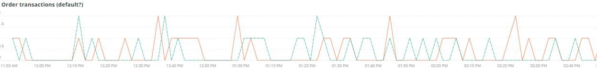

# 다음 [!UICONTROL Summary] 탭

다음 [!UICONTROL Summary] 탭 [!DNL Observation for Adobe Commerce] 는 사이트 문제의 잠재적 근본 원인을 자동으로 해결하거나 식별하는 데 도움이 되도록 사이트에서 경험한 몇 가지 문제를 빠르게 보기 위한 것입니다. 추가 탭에서는 구성 요소 서비스, 데이터베이스, 인프라 및 프로세스 상태에 대한 세부 정보를 제공합니다.

## [!UICONTROL Transaction Overview]

### [거래란 무엇입니까?](https://docs.newrelic.com/docs/apm/transactions/intro-transactions/transactions-new-relic-apm/#:%7E:text=transactions%20are%20reported.-,What%20is%20a%20transaction%3F,work%20in%20a%20software%20application.&amp;text=For%20APM%2C%20it%20will%20frequently,when%20the%20response%20is%20sent%20sent)

&quot;at [!DNL New Relic]즉, 트랜잭션이 소프트웨어 애플리케이션에서 하나의 논리적 작업 단위로 정의됩니다. 특히 해당 작업 단위를 구성하는 함수 호출 및 메서드 호출을 나타냅니다. 종종 웹 트랜잭션을 참조하며, 이 트랜잭션은 애플리케이션이 응답을 보낼 때까지의 웹 요청을 받을 때 발생하는 활동을 나타냅니다.&quot;

### 트랜잭션 유형:

**웹:** HTTP 요청으로 웹 트랜잭션이 시작됩니다. 대부분의 조직의 경우 고객 중심 상호 작용을 나타내므로 모니터링해야 하는 가장 중요한 트랜잭션입니다.

**웹이 아닌:** 웹이 아닌 트랜잭션은 웹 요청으로 시작되지 않습니다. 여기에는 웹이 아닌 작업자 프로세스, 백그라운드 프로세스, 스크립트, 메시지 큐 활동 및 기타 작업이 포함될 수 있습니다.

만약 **[!UICONTROL Transaction Overview]** 위의 프레임에는 평균 APDEX 점수가 .76인 약 53,000개의 트랜잭션이 있으며 이러한 트랜잭션의 95%가 2.313초 이내에 발생했습니다. 짧은 시간 동안 APDEX 히트가 있는 경우 더 긴박한 일정이 현재 평균과 차이를 보일 수 있는 프레임입니다.

## [!UICONTROL 404 page errors frame]

다음 **[!UICONTROL 404 page errors]** 프레임 목록 [URI](https://en.wikipedia.org/wiki/Uniform_Resource_Identifier) 및 선택한 기간에 대한 404 페이지 오류 카운트입니다.

## [!UICONTROL % of Storage Free frame]

다음 **[!UICONTROL % of Storage Free]** 프레임은 클러스터의 모든 노드에 대해 스토리지 마운트의 평균 사용 가능 비율을 표시합니다. 예를 들어 세 개의 노드 클러스터가 있는 경우 프레임에 \ 가 표시됩니다&lt;mount point=&quot;&quot;>, \&lt;environment name=&quot;&quot;>. 세 노드에 차이가 있으면 이 프레임이 거짓일 수 있습니다. 분산의 예는 다음과 같습니다. `/data/mysql` 사용 가능한 마운트 지점은 세 노드 클러스터에서 다른 값입니다. 아래에 프레임이 있습니다 [!UICONTROL MySQL] 마운트 포인트를 노드 이름별로 패싯하는 탭으로서 보다 정확하게 확인할 수 있습니다. `/data/mysql` 실제로 각 노드에서 스토리지를 사용할 수 있습니다.

## [!UICONTROL % of system memory that is free frame]

다음 **사용 가능한 시스템 메모리 비율(%)** 프레임은 각 노드에서 사용 가능한 시스템 메모리의 양을 노드별로 표시합니다.

## [!UICONTROL Swap memory free in bytes]

다음 **[!UICONTROL Swap memory free in bytes]** 프레임은 노드에서 사용 가능한 SWAP 메모리 양을 노드별로 표시합니다.

## [!UICONTROL CPU % by host]

모든 환경 및 노드의 집계는 **[!UICONTROL CPU % by host]** 프레임. 비프로덕션 환경은 선택 취소해야 합니다. 또한 프로덕션 환경에 대한 모든 노드가 없는 모든 인스턴스를 확인합니다. 높은 CPU 사용률에 대한 자세한 내용은 [Adobe Commerce에서 New Relic를 사용하여 성능 문제 해결](https://experienceleague.adobe.com/docs/commerce-knowledge-base/kb/troubleshooting/miscellaneous/troubleshoot-performance-using-new-relic-on-magento-commerce.html).

## [!UICONTROL Alerts during timeframe]

다음 **[!UICONTROL Alerts during timeframe]** 을 포함하여 모든 경고를 표시합니다 [!UICONTROL Managed Alerts] Adobe Commerce에서 지원을 추가했습니다.

## [!UICONTROL CPU Usage]

만약 **[!UICONTROL CPU Usage]** 프레임은 비어 있으며, 이는 [!DNL New Relic] 이 활성화되어 있지 않습니다. 사이트가 Starter에 있는 경우 이 정보가 표시되지 않습니다. 사이트가 Pro인 경우 [지원 티켓](https://experienceleague.adobe.com/docs/commerce-knowledge-base/kb/help-center-guide/magento-help-center-user-guide.html) 다음을 수행해야 합니다. [!DNL New Relic Infrastructure] 활성화되었습니다.

## [!UICONTROL Average Response Time]

다음 **[!UICONTROL Average Response Time]** 그래프는 트랜잭션(웹 및 기타)에 대한 평균 응답 시간을 보여줍니다.

## [!UICONTROL Long duration cron_schedule updates]

다음 **[!UICONTROL cron_schedule]** 테이블은 cron 작업의 시작 및 종료 시 작성됩니다. 긴 기간 크론 작업은 이 테이블을 업데이트하는 지연을 나타낼 수 있으며, 이는 크론 스택이나 크론 예약 방법에 대한 문제를 나타낼 수 있습니다.

## [!UICONTROL Response Code]

다음 **[!UICONTROL Response Code]** 프레임은 웹 트래픽과 요청 응답 코드를 잘 나타냅니다. 그렇습니다 [!DNL New Relic's] 트랜잭션 데이터에 대해, `httpResponseCode` 반환됨.

## [!UICONTROL Web Traffic volume compared with one week ago Magento Managed Alerts Information]

이 프레임은 지난 1주 및 현재 주의 비교 웹 트래픽 볼륨을 표시합니다.

## [!UICONTROL Deployment Log Entries]

다음 **[!UICONTROL Deployment Log Entries]** 프레임은 배포 및 클라우드 로그 항목 수를 표시하고 배포 로그 이름으로 카운트를 패싯합니다.

## [!UICONTROL Deployment State]

다음 **[!UICONTROL Deployment State]** 프레임 패싯은 배포 로그에서 특정 배포 단계를 처리합니다. 다음은 로그 및 패싯 이름에서 계산되는 단계에 대한 몇 가지 예입니다.

**배포 로그 단계:**

* &#39;%generate command%&#39;을(를) &#39;start_gen&#39;으로 시작하는 중
* &#39;%git apply /app/vendor/magento/ece-tools/patches%&#39;(apply_patches)
* &#39;%설정 플래그: .static_content_deploy%&#39;) as &#39;SCD&#39;
* &#39;%알림: &#39;generate command completed%&#39;) as &#39;gen_compl&#39;
* &#39;%알림: 배포 완료%)(deploy_compl&#39;)
* &#39;%알림: 배포 후 시작.%&#39;) &#39;start_pdeploy&#39;
* &#39;%알림: 배포 후 완료%) &#39;배포&#39;로
* &#39;%deploy-complete%&#39;) as &#39;cl_deploy_compl&#39;

## [!UICONTROL IP Frequency]

다음 **[!UICONTROL IP Frequency]** 프레임은 IP에서 각 IP의 (&#39;MISS&#39; 및 &#39;PASS&#39;) 상태를 계산합니다 [!DNL Fastly] 로그. 이러한 상태의 웹 요청은 원본 서버에 도달하고 서버에 로드를 추가합니다. 빈도로 상위 20개의 주소를 보여 줍니다. 이 프레임은 웹 사이트에서 IP 공격 또는 부하의 소스를 감지하는 데 사용할 수 있습니다.

## [!UICONTROL IP Response – top 20 URLs in duration]

다음 **[!UICONTROL IP Response – top 20 URLs in duration]** 프레임은 응답에서 가장 긴 기간을 사용하는 URL을 표시합니다. 응답 시간이 가장 긴 대용량 이미지 파일 또는 페이지, API 또는 페이지를 나타낼 수 있습니다.

## [!UICONTROL API Calls by IP]

다음 **[!UICONTROL API Calls by IP]** frame은 API에 대해 많은 트래픽을 식별하고 API URL에서 요청을 하는 IP 주소를 식별하는 데 도움이 됩니다.

## [!UICONTROL API Calls by IP, details by URL]

다음 **[!UICONTROL API Calls by IP, details by URL]** 프레임은 API에 대한 대량 트래픽의 세부 정보와 요청을 수행하는 URL의 세부 사항을 제공합니다.

## [!UICONTROL IP Frequency Rate per minute]

다른 프레임에서 가장 많은 요청이 있는 IP 주소를 알기 어려운 경우가 있습니다. 다음 **[!UICONTROL IP Frequency Rate per minute]** 프레임은 IP 주소당 분당 속도를 보여줍니다.

## [!UICONTROL Potential Bots]

다음 **[!UICONTROL Potential Bots]** 프레임은 NULL 또는 &#39;%bot%&#39;과 같은 request_user_agent 이름의 요청을 봅니다. 일반적으로 &#39;%bot%&#39; request_user_agent는 `robots.txt` 파일.

## [!UICONTROL Transaction Errors]

다음 **[!UICONTROL Transaction Errors]** 프레임은 트랜잭션 오류 수를 표시합니다. [!DNL New Relic].

## [!UICONTROL Nginx access by node]

다음 **[!UICONTROL Nginx access by node]** 프레임에서 카운트를 봅니다. `access.log` 노드 기준. 이렇게 하면 로드가 균등하게 분배되는지 확인하는 데 유용합니다. 종종 노드가 드롭되는 시점을 표시합니다. 프레임은 사이트 전체의 로드도 보여줍니다.

## [!UICONTROL Galera Log]

[[!DNL Galera]](https://galeracluster.com/library/galera-documentation.pdf) 데이터베이스 클러스터에 사용됩니다. 이 프레임은 [!UICONTROL Galera] 클러스터 이 신호는 클러스터에 들어오거나 나가는 노드에 중점을 둡니다. 이는 데이터베이스 데이터 무결성을 유지하기 위한 일반적인 동작입니다. 노드는 [!UICONTROL Galera] 클러스터 상태 변경.

**목록 [!UICONTROL Galera] 상태 변경:**

* &#39;%1047 WSREP가 &#39;node_not_prep_for_use&#39;로 응용 프로그램 사용%&#39; 노드를 아직 준비하지 않았습니다.
* &#39;%\[오류\] WSREP: 다음 위치에서 읽지 못했습니다. wsrep_sst_xtrabackup-v2%&#39;) as &#39;xtrabackup_read_fail&#39;
* &#39;%\[오류\] WSREP: 프로세스가 완료되었으나 오류가 발생했습니다. wsrep_sst_xtrabackup-v2%&#39;) as &#39;xtrabackup_compl_w_err&#39;
* &#39;%\[오류\] WSREP: rbr write fail%&#39;) &#39;rbr_write_fail&#39;
* &#39;%self-leave%&#39;) as &#39;susp_node&#39;
* &#39;%members = 3/3 (join/total%&#39;) as &#39;3of3&#39;
* &#39;%members = 2/3(join/total%&#39;) as &#39;2of3&#39;
* &#39;%members = 2/2%&#39;) as &#39;2of2&#39; * &#39;%members = 1/2%&#39;) as &#39;1of2&#39; * &#39;%members = 1/3%&#39;) as &#39;1of3&#39;
* &#39;%members = 1/1%&#39;) &#39;1of1&#39;
* &#39;%\[참고\] /usr/sbin/myqld(myqld 10).%&#39;) &#39;sql_restart&#39;
* &#39;%Quorum: &#39;no_node_count&#39;로서 완료 상태:%&#39;가 있는 노드가 없음
* &#39;%WSREP: 구성원 0%) &#39;mem_0&#39;
* &#39;%WSREP: 구성원 1.0%) &#39;mem_1&#39;
* &#39;%WSREP: 멤버 2%) &#39;mem2&#39;
* &#39;%WSREP: 그룹과 동기화됨, 연결 준비%) &#39;준비&#39;
* &#39;%/usr/sbin/myqld, 버전:%&#39;) as &#39;mysql_restart_mysql.slow&#39;
* &#39;%\[참고\] WSREP: 새 클러스터 보기: global state:%&#39;) &#39;galera_cluster_view_ching&#39;

상태가 자주 변경되는 경우 스토리지, 메모리 또는 쿼리 문제를 나타낼 수 있습니다.

## [!UICONTROL Database errors]

**검색된 데이터베이스 오류 또는 메시지 목록:**

* &#39;%임시 테이블에 할당된 메모리 크기가 innodb_buffer_pool_size%&#39;의 20%를 넘습니다.) &#39;temp_tbl_buff_pool&#39;
* &#39;%\[오류\] WSREP: rbr write fail%&#39;) &#39;rbr_write_fail&#39;
* &#39;%myqld: 디스크 전체%)(&#39;disk_full&#39;)
* &#39;%오류 번호 28%&#39;)이 &#39;err_28&#39;입니다.
* &#39;%rollback%&#39;) &#39;rollback&#39;으로 사용
* &#39;%Foreign key 제약 조건이 table%&#39;에 대해 실패합니다.) &#39;foreign_key_constraint&#39;
* &#39;%Error_code: 1114%) 로서의 &#39;sql_1114_full&#39;
* &#39;%중요: SQLSTATE\[HY000\] \[2006\] MySQL 서버가 제거됨%&#39;)을 &#39;sql_gone&#39;으로 사용
* &#39;%SQLSTATE\[HY000\] \[1040\] 너무 많은 연결%&#39;) as &#39;sql_1040&#39;
* &#39;%중요: SQLSTATE\[HY000\] \[2002\]%&#39;) as &#39;sql_2002&#39;
* &#39;%SQLSTATE\[08S01\]:%&#39;) as &#39;sql_1047&#39;
* &#39;%\[경고\] 중단된 연결%&#39;) &#39;aborted_conn&#39;(으)로
* &#39;%SQLSTATE\[23000\]: 무결성 제약 조건 위반:%&#39;) &#39;sql_23000&#39;
* &#39;%1205 잠금 대기 시간 초과%&#39;) as &#39;sql_1205&#39;
* &#39;%SQLSTATE\[HY000\] \[1049\] 알 수 없는 데이터베이스%&#39;) as &#39;sql_1049&#39;
* &#39;%SQLSTATE\[42S02\]: 기본 테이블 또는 뷰를 찾을 수 없음:%) as &#39;sql_42S02&#39;
* &#39;%일반 오류: 1114%) 로서의 &#39;sql_1114&#39;
* &#39;%SQLSTATE\[40001\]%&#39;) as &#39;sql_1213&#39;
* &#39;%SQLSTATE\[42S22\]: 열을 찾을 수 없음: 1054 알 수 없는 열%) as &#39;sq1_1054&#39;
* &#39;%SQLSTATE\[42000\]: 구문 오류 또는 액세스 위반:%) as &#39;sql_42000&#39;
* &#39;%SQLSTATE\[21000\]: 카디널리티 위반:%) as &#39;sql_1241&#39;
* &#39;%SQLSTATE\[22003\]:%&#39;) as &#39;sql_22003&#39;
* &#39;%SQLSTATE\[HY000\] \[9000\] IP 주소%&#39;을(를) &#39;sql_9000&#39;(으)로
* &#39;%SQLSTATE\[HY000\]: 일반 오류: (2014%) &#39;sql_2014&#39;)
* &#39;%1927 연결이 &#39;%&#39;)(으)로 &#39;sql_1927&#39;
* &#39;%1062 \[\ERROR\] InnoDB:%&#39;) as &#39;sql_1062_e&#39;
* &#39;%\[참고\] WSREP: 메모리 맵을 디스크에 플러싱..%&#39;) &#39;mem_map_flush&#39;
* &#39;%Internal MariaDB 오류 코드: 1146%) 로서의 &#39;sql_1146&#39;
* &#39;%Internal MariaDB 오류 코드: 1062%&#39;) &#39;sql_1062&#39; * &#39;%1062 \[경고\] InnoDB:%&#39;) as &#39;sql_1062_w&#39;
* &#39;%Internal MariaDB 오류 코드: 1064%) 로서의 &#39;sql_1064&#39;
* &#39;%InnoDB: &#39;assertion_err&#39;(% 파일의 검증 실패)
* &#39;%mysqld_safe 현재 실행 중인 프로세스 수: 0%&#39;) &#39;mysql_oom&#39;
* &#39;%\[ERROR\] myqld는 signal%&#39;)를 &#39;mysql_sigterm&#39;으로 지정했습니다.
* &#39;%1452&#39;)을 &#39;sql_1452&#39;로 추가할 수 없습니다.
* &#39;%ERROR 1698%&#39;) as &#39;sql_1698&#39;
* &#39;%SQLSTATE\[HY000\]: 일반 오류: 3%&#39;) &#39;cnt_wrt_tmp&#39;
* &#39;%일반 오류: 1%&#39;) &#39;sql_syntax&#39;
* &#39;%42S22%&#39;) as &#39;sql_42S22&#39;
* &#39;%InnoDB: &#39;innodb_dup_key&#39;로서 오류(중복 키)%&#39;)

## [!UICONTROL Database traces]

다음 **[!UICONTROL Database traces]** 프레임에서 데이터를 봅니다. [sql 추적](https://docs.newrelic.com/docs/apm/transactions/transaction-traces/transaction-traces-database-queries-page/) 엔터티 [!DNL New Relic] 추적 경로를 반환합니다.

## [!UICONTROL Database mysql-slow.log]

다음 **[!UICONTROL Database mysql-slow.log]** 프레임에서는 [mysql-slow.log](https://dev.mysql.com/doc/refman/5.7/en/slow-query-log.html) 쿼리 요청 유형별로 mysql-slow.log(느린 쿼리 로그)에 관심이 있을 수 있는 타임프레임을 시각적으로 격리합니다. 큰 테이블을 업데이트하는 색인이나 쿼리가 없는 테이블의 쿼리는 다른 쿼리를 차단할 수 있습니다.

## [!UICONTROL Redis synchronization from Log]

[[!DNL Redis]](https://redis.io/docs/about/) 는 데이터베이스, 캐시 및 메시지 브로커로 사용되는 오픈 소스(BSD 라이센스)의 메모리 내 데이터 구조 저장소입니다. 구성된 경우 데이터베이스 및 세션 캐싱을 수행할 수 있습니다. 다음 **[!UICONTROL Redis synchronization from Log]** 프레임 초점 [[!DNL Redis] 동기화](https://redis.io/docs/manual/replication/). 큰 경우 [!DNL Redis] 데이터 집합으로, 동기화에 문제가 있을 가능성이 높습니다(동기화를 유지하기 위해 더 많은 데이터).

**[!DNL Redis]오류 및 메시지:**

* &#39;%SLAVE 동기화: &#39;space&#39;로 &#39;device%&#39;에 남아 있는 공간이 없습니다.
* &#39;%Server가 시작됨, Redis version%&#39;) as &#39;serv_start&#39;
* &#39;%서버가 이제 &#39;ready&#39;로 연결%을(를) 수락할 준비가 되었습니다.&#39;
* &#39;%마스터와(과) 연결이 끊어졌습니다.%&#39;) &#39;mstr_lost&#39;
* &#39;%+sdown sentinel%&#39;)(&#39;+sential&#39;)
* &#39;%-sdown sentinel%&#39;) as &#39;-sential&#39;
* &#39;%-sdown slabor%&#39;) as &#39;-slabes&#39;, &#39;%+sdown slabor%&#39;) as &#39;+slabor&#39;
* &#39;%% 장애 조치(failover)-abort-not-selected master mymaster%&#39;) &#39;-failover&#39;
* &#39;%+failover-abort-not-선출된 마스터 mymaster%&#39;) &#39;+failover&#39;
* &#39;%부분 다시 동기화는 가능하지 않습니다(캐시된 마스터 없음)%&#39;). &#39;part_sync_err&#39;
* 오류가 발생하여 &#39;%기본으로 복제를 중단했습니다. ERR Can%) as &#39;mstr_sync_err&#39;
* &#39;%기본은 PSYNC를 지원하지 않거나 &#39;mstr_psync_err&#39;으로(가) &#39;오류 상태%&#39;입니다.)
* &#39;%SLAVE 동기화: &#39; slv_sync_suc&#39;로 &#39; success%&#39;로 완료됨
* 오류가 발생하여 &#39;%기본으로 복제를 중단했습니다. ERR Can%) as &#39;mstr_sync_err,count&#39;
* &#39;%OOM 명령은 memory%&#39;를 &#39;max_mem_err&#39;로 사용할 수 없습니다.
* &#39;%CredisException(코드: 0): connection%&#39;의 읽기 오류입니다. &#39;credenis_read_error&#39;
* &#39;%Uncatch RedisException:%&#39;) as &#39;redis_extp_err&#39;
* &#39;%psync가 &#39;output buffer%&#39;을(를) 극복하기 위해 ASAP를 닫도록 예약됨)을 &#39;output_buf_err&#39;로 지정합니다.

## [!UICONTROL PHP process states]

PHP 프로세스의 동작 방식은 [구성](https://www.php.net/manual/en/install.fpm.configuration.php). 많은 변수와 옵션이 있는 구성이 복잡합니다. 다음 **[!UICONTROL PHP process states]** 프레임은 PHP 프로세스가 종료되고 다시 시작되는 시기를 이해하는 데 도움이 됩니다.

### [!UICONTROL PHP errors]

다음 **[!UICONTROL PHP errors]** 프레임은 선택한 기간 동안 작업자의 PHP 오류 수를 표시합니다. 자세한 내용은 [Adobe Commerce PHP 설정](../../installation/prerequisites/php-settings.md).

**PHP 오류 및 메시지:**

* &#39;%worker_connections%&#39;이(가) &#39;worker&#39;로 부족합니다.
* &#39;%PHP 오류: 허용되는 메모리 크기입니다!%&#39;) &#39;mem_size&#39;
* &#39;%s이(가) 신호 11(SIGSEGV)%&#39;에서 &#39;sig_11&#39;으로 종료되었습니다.
* &#39;%s이(가) 신호 7(SIGBUS)%&#39;)에서 &#39;sig_7&#39;으로 종료되었습니다.
* &#39;%increase pm.start_servers%&#39;) as &#39;pmstart_serv&#39;
* &#39;%max_children%&#39;) as &#39;max_children_cnt&#39;
* &#39;%PHP 오류: &#39;mem_exhst_coupn&#39;으로 허용되는 메모리 크기(%)
* &#39;%opc_mem_count&#39;로서 &#39;pool%&#39;에 메모리를 할당할 수 없습니다.&#39;
* &#39;%Warning Interned 문자열 버퍼 오버플로%&#39;)(&#39;opc_str_buf&#39;)
* &#39;%opc_sv_comments&#39;(으)로 잘못된 문자열 offsetl%&#39;
* &#39;%PHP 오류: 발견되지 않은 RedisException: &#39;php_exc&#39;로 &#39;connection%&#39;에 대한 읽기 오류

## [!UICONTROL PHP processes]

[PHP-FPM](https://php-fpm.org/) is [!UICONTROL FastCGI Process Manager] 사용 [!DNL Nginx]. 시스템 요구 사항에 대해 알아보려면 [Adobe Commerce 버전에 매핑된 PHP 버전 요구 사항](../../installation/system-requirements.md). 다음 **[!UICONTROL PHP processes]** 프레임은 선택한 타임라인에서 특정 시간에 실행되는 PHP 프로세스 수를 보여줍니다.

## [!UICONTROL Secondary processes]

보조 프로세스는 사이트 응답에 영향을 줄 수 있습니다. 다음 **[!UICONTROL Secondary processes]** 프레임은 사이트에 로드를 추가할 수 있는 프로세스 또는 프로세스를 나타냅니다. 주로 데이터베이스가 가장 많은 보조 프로세스를 실행합니다.

## [!UICONTROL Traffic vs Week Ago]

다음 **[!UICONTROL Traffic vs Week Ago]** 프레임은 [!DNL Fastly] 캐시 상태가 &#39;MISS&#39;, &#39;PASS&#39;인 로그 이러한 요청은 원본 서버에 로드를 추가합니다. 이 프레임은 동일한 기간 동안 현재 주 및 지난 주 동안의 비교 웹 요청 볼륨을 표시합니다.

## [!UICONTROL Fastly Cache]

다음 **[!UICONTROL Fastly Cache]** 프레임은 의 요청 캐시 상태에 대한 집계 보기를 표시합니다 [!DNL Fastly] 로그. ERROR를 선택하면 요청에 오류 백분율이 표시됩니다. 일반적으로 원본 서버가 페이지 요청에 충분히 빠르게 응답하지 않을 때 증가합니다.

## [!UICONTROL Page Rendering]

다음 **[!UICONTROL Page Rendering]** 프레임은 페이지의 페이지 보기 원본에서 현재 주의 평균 페이지 렌더링 기간을 표시합니다 [!DNL New Relic] 동일한 기간 동안 이전 주와 비교한 것입니다.

## [!UICONTROL Page loading detail]

다음 **[!UICONTROL Page loading detail]** 프레임은 페이지 로드 이벤트를 설명합니다. 이것은 이러한 패싯의 의미를 자세히 설명합니다. 다음은 이 프레임에 대해 실행되는 쿼리입니다.

`SELECT percentile(timeToResponseStart, 50) AS 'first byte', percentile(firstPaint, 50) as 'First paint', percentile(firstContentfulPaint, 50) as 'First contentful paint', percentile(timeToDomContentLoadedEventEnd, 50) AS 'DOM content loaded', percentile(duration, 50) AS 'Window load + AJAX' FROM BrowserInteraction TIMESERIES`

## [!UICONTROL Transactions – Avg, Max, Min]

트랜잭션 기간은 초 단위입니다. 트랜잭션에 따라, 오래 실행되는 경우 다른 트랜잭션에 영향을 줄 수 있습니다. 이름 및 지속 시간에 나열된 트랜잭션은 특정 기간 동안 발생합니다. 간결한 문제 일정이 있는 경우 [!DNL Observation for Adobe Commerce] 해당 좁은 기간에 대한 날짜/시간 선택기입니다.

## [!UICONTROL Admin Activities]

다음 **[!UICONTROL Admin Activities]** 프레임은 관리자 사용자와 트랜잭션을 식별합니다.

## [!UICONTROL Order transactions (default?)]

다음 **[!UICONTROL Order transactions (default?)]** 프레임은 트랜잭션을 찾습니다. `request.headers.host` 트랜잭션에서 이름 = 인 경우 `WebTransaction/Action/checkout/onepage/success`. 주문 성공 URL이 다른 경우 이 프레임에 데이터가 없습니다.

## [!UICONTROL Elasticsearch Index information]

**[Elasticsearch 상태:](https://www.elastic.co/guide/en/elasticsearch/reference/current/cluster-health.html)**

* 녹색: 모든 섀드가 지정됩니다.
* 노란색: 모든 주 섀드가 할당되지만 하나 이상의 복제본 샤드가 할당되지 않습니다. 클러스터의 한 노드가 실패하면 해당 노드가 복구될 때까지 일부 데이터를 사용할 수 없습니다.
* 빨간색: 하나 이상의 기본 카드가 할당되지 않았으므로 일부 데이터를 사용할 수 없습니다. 이 작업은 기본 카드가 할당되므로 클러스터 시작 중에 잠시 발생할 수 있습니다.

## [!UICONTROL Elasticsearch Errors]

**[!DNL Elasticsearch]오류:**

* &#39;%all shards failed%&#39;, &#39;all_shards_failed&#39;
* &#39;%NoNodesAvailableException%&#39;을 &#39;no_alive_nodes&#39;로 사용
* &#39;%PHP 오류: 처리할 수 없는 오류: &#39;wrong_param&#39;으로서 Elasticsearch%&#39;에 대한 잘못된 매개 변수입니다.
* &#39;%Magento 클라우드 인프라의 Elasticsearch 서비스를 버전%&#39;으로 업그레이드하여 이 문제를 해결할 수 있습니다. &#39;ver_err&#39;
* &#39;%클러스터 상태 상태가 \[YELLOW\]에서 \[RED\](이유:%&#39;이(가) &#39;yel_red&#39;로 변경되었습니다.
* &#39;%장치%&#39;에 &#39;no_space&#39;로 남아 있는 공간이 없습니다.&#39;
* &#39;%에서 [SearchRequest{searchType=%&#39;을(를) &#39;failed_query&#39;로 실행하지 못했습니다.

## [!UICONTROL Cron view]

다음 **[!UICONTROL Cron view]** 프레임은 cron 로그에서 시작 크론 수와 완료 크론 수 사이의 균형을 확인합니다.

## [!UICONTROL Cron error]

**cron.log에서 오류 발생:**

* &#39;stg_crons&#39;로서 &#39;%_stg%&#39;
* &#39;%cron 작업%&#39;에 대한 잠금을 &#39;cron_lock&#39;으로 가져올 수 없습니다.
* &#39;%일반 오류: 2006 MySQL 서버가 &#39;mysql_has_gone_away&#39;로 &quot;%&quot; 사용
* &#39;%error%&#39;을(를) &#39;error&#39;로 지정했습니다.
* &#39;%일반 오류: sql_1205_cron으로 1205 잠금 대기 시간 초과%를 초과했습니다.

## [!UICONTROL cron_schedule table updates]

다음 **[!UICONTROL cron_schedule table updates]** 프레임은 데이터 저장소 작업 업데이트에 cron_schedule 테이블이 포함되는 최대 지속 시간(초)을 봅니다. SQL 요청 유형에 대해 패싯됩니다.

## [!UICONTROL Datastore Operations Tables]

이 **[!UICONTROL Datastore Operations Tables]** 프레임은 기간 시간, 테이블 이름 및 SQL 요청 유형별로 상위 25개 작업을 표시합니다. 스파이크 위로 마우스를 가져가면 액세스 중인 테이블과 액세스 요청 유형에 따른 세부 사항이 표시됩니다.

## [!UICONTROL Cache Flush]

**캐시 플러시 감지:**

* &#39;config_cache_flused&#39;로 &#39;%config%&#39;
* &#39;layout_cache_flush&#39;로 &#39;%layout%&#39;
* &#39;block_html%&#39;을 &#39;block_html_cache_flush&#39;
* &#39;%collections%&#39;을(를) &#39;collections_cache_flush&#39;로 함
* &#39;%reflection%&#39;이(가) &#39;reflection_cache_flush&#39;로 설정되었습니다.
* &#39;%db_ddl%&#39;이(가) &#39;db_ddl_cache_flush&#39;
* &#39;%compiled_config%&#39;을 &#39;compiled_config_cache_flush&#39;로
* &#39;%eav%&#39;이(가) &#39;eav_cache_flush&#39;
* &#39;cust_notif_cache_flush&#39;로 &#39;%customer_notification%&#39;
* &#39;%config_integration%&#39;을 &#39;config_integ_cache_flush&#39;
* &#39;%config_integration_api%&#39; as &#39;config_integ_api_cache_flush&#39;
* &#39;%full_page%&#39; as &#39;full_page_cache_flush&#39;
* &#39;%config_webservice%&#39;을 &#39;config_webserv_cache_flush&#39;
* &#39;%translate%&#39;이(가) &#39;translate_cache_flush&#39;로 사용됩니다.
