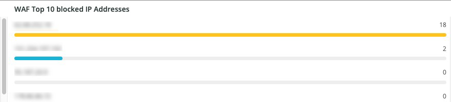

# 다음 [!DNL WAF] 탭

다음 **[!DNL WAF]** 탭에는 에 의해 전달되고 차단되는 트래픽이 표시됩니다 [!DNL firewall].

## [!DNL WAF traffic summary]

다음 **[!DNL WAF traffic summary]** 프레임은 [!DNL firewall].

## [!DNL WAF Top 10 blocked IP Addresses]

다음 **[!DNL WAF Top 10 blocked IP Addresses]** 프레임은 [!DNL firewall].

## [!DNL WAF Top 10 countries for blocked requests]

다음 **[!DNL WAF Top 10 countries for blocked requests]** 프레임은 상위 10개 국가 내에서 [!DNL firewall].

## [!DNL WAF Top 10 logged IP Addresses]

다음 **[!DNL WAF Top 10 logged IP Addresses]** 프레임은 로그인한 상위 10개 IP 주소의 IP 주소를 [!DNL firewall].

## [!DNL Top 10 WAF Rules Executed and Logged by IP address]

다음 **[!DNL Top 10 WAF Rules Executed and Logged by IP address]** 프레임은 가장 자주 일치하는 상위 10개 IP 주소를 표시합니다 [!DNL firewall] 규칙.

## [!DNL WAF Logged Details]

다음 **[!DNL WAF Logged Details]** 프레임은 [!DNL firewall]에는 타임스탬프, 도시, 지역 및 데이터 센터와 같은 세부 사항이 포함됩니다.

## [!DNL WAF Blocked Details]

다음 **[!DNL WAF Blocked Details]** 프레임은 [!DNL firewall]에는 타임스탬프, 도시, 지역 및 데이터 센터와 같은 세부 사항이 포함됩니다.
