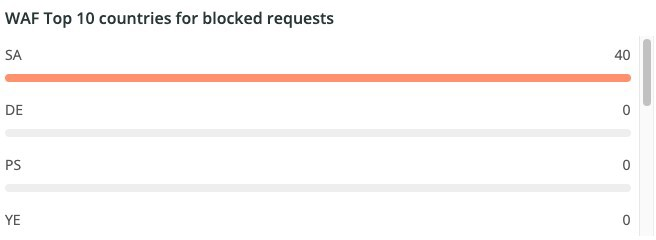

# 다음 [!UICONTROL WAF] 탭

다음 **[!UICONTROL WAF]** 탭에는 방화벽에 의해 전달되고 차단되는 트래픽이 표시됩니다.

## [!UICONTROL WAF traffic summary]

다음 **[!UICONTROL WAF traffic summary]** 프레임은 방화벽에 의해 통과, 로그, 차단 및 실패한 트래픽 수를 보여 줍니다.

## [!UICONTROL WAF Top 10 blocked IP Addresses]

다음 **[!UICONTROL WAF Top 10 blocked IP Addresses]** 프레임은 방화벽에 의해 가장 차단된 IP 주소 10개를 표시합니다.

## [!UICONTROL WAF Top 10 countries for blocked requests]

다음 **[!UICONTROL WAF Top 10 countries for blocked requests]** 프레임은 방화벽에 의해 차단된 요청에 대해 상위 10개 이내의 국가에 대한 차단된 요청 수를 보여줍니다.

## [!UICONTROL WAF Top 10 logged IP Addresses]

다음 **[!UICONTROL WAF Top 10 logged IP Addresses]** 프레임은 방화벽에 의해 기록된 상위 10개 IP 주소의 IP 주소를 표시합니다.

## [!UICONTROL Top 10 WAF Rules Executed and Logged by IP address]

다음 **[!UICONTROL Top 10 WAF Rules Executed and Logged by IP address]** 프레임은 가장 자주 일치하는 방화벽 규칙을 10개 이상 포함하는 IP 주소를 표시합니다.

## [!UICONTROL WAF Logged Details]

다음 **[!UICONTROL WAF Logged Details]** 프레임은 타임스탬프, 도시, 지역 및 데이터 센터와 같은 세부 사항을 포함하여 방화벽에 의해 기록된 요청을 표시합니다.

## [!UICONTROL WAF Blocked Details]

다음 **[!UICONTROL WAF Blocked Details]** 프레임은 타임스탬프, 도시, 지역 및 데이터 센터와 같은 세부 사항을 포함하여 방화벽에 의해 차단된 요청을 표시합니다.
