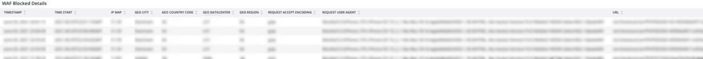

# [!DNL WAF] 탭

**[!DNL WAF]** 탭에는 [!DNL firewall]에 의해 전달 및 차단된 트래픽이 표시됩니다.

## [!DNL WAF traffic summary]

**[!DNL WAF traffic summary]** 프레임에는 [!DNL firewall]에 의해 전달, 로그, 차단 및 실패한 트래픽 수가 표시됩니다.

## [!DNL WAF Top 10 blocked IP Addresses]

**[!DNL WAF Top 10 blocked IP Addresses]** 프레임에는 [!DNL firewall]에서 가장 많이 차단된 상위 10개의 IP 주소가 표시됩니다.

## [!DNL WAF Top 10 countries for blocked requests]

**[!DNL WAF Top 10 countries for blocked requests]** 프레임에는 [!DNL firewall]의 차단된 요청에 대해 상위 10개 국가에서 차단된 요청의 수가 표시됩니다.

## [!DNL WAF Top 10 logged IP Addresses]

**[!DNL WAF Top 10 logged IP Addresses]** 프레임에는 [!DNL firewall]이(가) 기록한 상위 10개 IP 주소의 IP 주소가 표시됩니다.

## [!DNL Top 10 WAF Rules Executed and Logged by IP address]

**[!DNL Top 10 WAF Rules Executed and Logged by IP address]** 프레임에는 [!DNL firewall] 규칙과 가장 일치하는 상위 10개 IP 주소가 표시됩니다.

## [!DNL WAF Logged Details]

**[!DNL WAF Logged Details]** 프레임에는 타임스탬프, 도시, 지역 및 데이터 센터와 같은 세부 정보를 포함하여 [!DNL firewall]이(가) 기록한 요청이 표시됩니다.

## [!DNL WAF Blocked Details]

**[!DNL WAF Blocked Details]** 프레임에는 타임스탬프, 도시, 지역 및 데이터 센터와 같은 세부 정보를 포함하여 [!DNL firewall]에 의해 차단된 요청이 표시됩니다.
