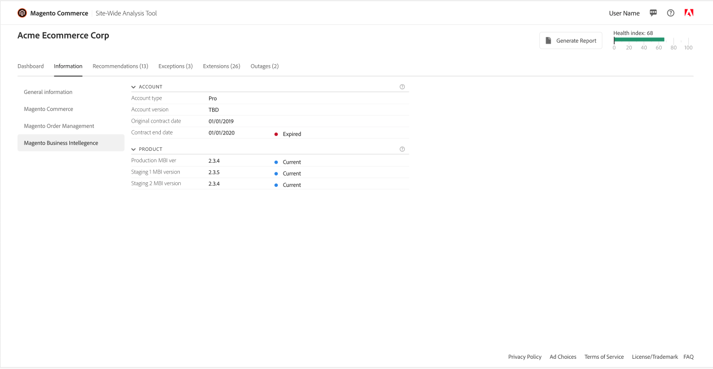

# [!DNL Site-Wide Analysis Tool]에 액세스하는 방법

[!DNL Site-Wide Analysis Tool Dashboard]에 액세스하는 방법에는 두 가지가 있습니다.

[[!DNL Site-Wide Analysis Tool] 웹 사이트](https://supportinsights.adobe.com/commerce)에서 [!DNL dashboard]에 직접 **(클라우드 인프라의 Adobe Commerce 전용)**&#x200B;에 액세스하여 Adobe ID으로 로그인하거나 스토어의 [!DNL Admin Panel]에서 [!DNL dashboard]을(를) 통해 액세스할 수 있습니다.

[!DNL Site-Wide Analysis Tool] 서비스는 [역할 리소스](https://docs.magento.com/user-guide/system/permissions-user-roles.html)에 액세스할 수 있는 권한이 있는 [!DNL Admin] 사용자에 대해 [프로덕션 모드](https://docs.magento.com/user-guide/magento/installation-modes.html)에서 사용할 수 있습니다.

>[!NOTE]
>
>2024년 4월 23일부터 [!DNL Site-Wide Analysis Tool]이(가) 서비스 해제되어 Adobe Commerce 온-프레미스 고객이 더 이상 사용할 수 없습니다.

*[!DNL Site-Wide Analysis Tool]대시보드*

## 옵션 1: [!DNL Site-Wide Analysis Tool] 도메인에서 직접 [!DNL Site-Wide Analysis Tool Dashboard]에 로그인(클라우드 인프라의 Adobe Commerce 전용)

[!DNL Commerce] 계정에 액세스하려면 **[!DNL Adobe ID]이(가) 필요합니다**.
이미 [!DNL Commerce] 계정이 있지만 [!DNL Adobe ID]이(가) 없는 경우 로그인 프로세스 중에 계정을 만들 수 있습니다.

1. [https://supportinsights.adobe.com/commerce](https://supportinsights.adobe.com/commerce)(으)로 이동합니다.

1. **[!UICONTROL Sign in with Adobe ID]** 단추를 클릭하고 나타나는 메시지를 따릅니다.

   
   *[!DNL Adobe ID]로그인 화면*

1. 약관에 동의합니다.

1. **<u>참고</u>:** [!DNL Site-Wide Analysis Tool Dashboard]에 액세스하려면 귀하의 계정에 **[!DNL Support Permissions]** 권한이 있어야 합니다.
자세한 내용은 사용 안내서의 [계정 공유 [!DNL Commerce] 에서 확인하세요](https://experienceleague.adobe.com/docs/commerce-admin/start/commerce-account/commerce-account-share.html).

## 옵션 2: 스토어의 [!DNL Admin Panel]에서 [!DNL Site-Wide Analysis Tool Dashboard]에 로그인

### 1단계: 권한 확인

[!DNL Admin] 사용자 계정에 [할당된 사용자 역할](https://docs.magento.com/user-guide/system/permissions-user-roles.html)을(를) 통해 [!DNL Site-Wide Analysis Tool]에 액세스할 수 있는 권한이 있는지 확인하십시오.

>[!IMPORTANT]
>
>[!DNL Site-Wide Analysis Tool] 역할 리소스(권한)가 **자동 할당되지 않음**. [!UICONTROL Admin]의 각 사용자 계정에 개별적으로 할당된 사용자 역할 및 역할에 대해 활성화해야 합니다.

[!DNL Site-Wide Analysis Tool] 액세스 권한이 필요한 사용자 지정 역할에 대해 다음을 수행하십시오.

1. **[!UICONTROL Reports]** > *[!UICONTROL System Insights]* > **[!UICONTROL Site-Wide Analysis Tool]** 역할 리소스를 선택합니다.

   
   *역할에 대해*[!DNL Site-Wide Analysis Tool] 권한이 선택됨

1. **[!UICONTROL Save Role]**&#x200B;을(를) 클릭합니다.

1. 해당 역할이 할당된 사용자에게 [!DNL Admin]에서 로그아웃하도록 알리고 다시 로그인하세요.

>[!NOTE]
>
>사용자 계정에 [!DNL Site-Wide Analysis Tool]에 액세스할 수 있는 권한이 있고 사용자가 [!DNL Admin]에서 도구에 액세스하려고 할 때 403 오류가 발생하는 경우 클라우드 인프라의 Adobe Commerce 인스턴스에서 HTTP 액세스 제어를 사용하도록 설정할 수 있습니다. HTTP 인증을 사용하도록 설정한 경우 [!DNL Site-Wide Analysis Tool] 대시보드가 지원되지 않습니다. 이 문제를 해결하는 방법에 대한 자세한 내용은 [지원 문서](https://support.magento.com/hc/en-us/articles/360057400172-403-errors-when-accessing-Site-Wide-Analysis-Tool-on-Magento?_ga=2.168901729.117144580.1649172612-1623400270.1640858671)를 참조하세요.

### 2단계: [!DNL Site-Wide Analysis Tool]에 액세스

1. *[!UICONTROL Admin]* 사이드바에서 **[!UICONTROL Reports]** > *[!UICONTROL System Insights]* > **[!UICONTROL Site-Wide Analysis Tool]**(으)로 이동합니다.

   
   Adobe Commerce에서 [!DNL Admin Panel]의 *[!DNL Site-Wide Analysis Tool]위치*

1. [!DNL Site-Wide Analysis Tool]의 *사용 약관*&#x200B;을 읽고 계속하려면 **[!UICONTROL Accept]**&#x200B;을(를) 클릭하십시오.

   각 사용자는 세션에 대한 사용 약관에 동의해야 합니다. 이 단계는 로그인한 각 세션에 대해 반복됩니다.

1. 대시보드 맨 위에서 보려는 탭을 클릭합니다.

   
   *[!DNL Site-Wide Analysis Tool]정보*

## [!DNL Site-Wide Analysis Tool Dashboard]에서 보고서 생성

1. 대시보드의 오른쪽 위 모서리에서 **[!UICONTROL Generate Report]**&#x200B;을(를) 클릭합니다.

1. 보고서에 포함할 각 **[!UICONTROL Type]** 및 **[!UICONTROL Priority]** 설정에 대한 확인란을 선택하십시오.

1. **[!UICONTROL Generate Report]**&#x200B;을(를) 클릭합니다.

   
   *보고서 설정*

| 탭 | 설명 |
| --- | --- |
| 대시보드 | 우선 순위별 현재 알림 및 권장 사항과 함께 시스템 상태를 표시합니다. |
| 정보 | 설치된 각 Adobe Commerce 제품에 대한 자세한 정보와 함께 고객 연락처 정보 및 현재 티켓의 요약을 제공합니다. |
| Recommendations | 사이트에서 감지된 문제를 해결하기 위한 모범 사례를 기반으로 권장 사항을 나열합니다. |
| 예외 | 오류 처리기 없이 비정상 조건으로 인해 응용 프로그램에서 발생하는 오류를 나열합니다. |
| 확장 | 모든 타사 확장 및 타사 라이브러리를 나열합니다. |

>[!NOTE]
>
>권장 사항을 적용한 후 [!DNL Site-Wide Analysis Tool Dashboard] 또는 생성된 보고서에서 업데이트되는 데 며칠이 걸릴 수 있습니다.
