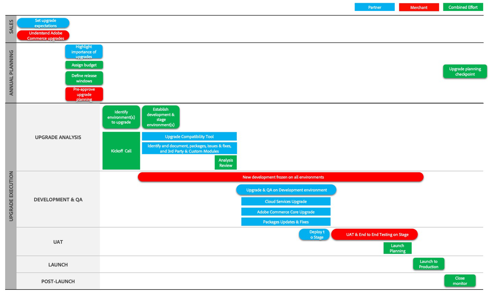

# 업그레이드 여정 단계

업그레이드는 세심한 주의, 계획 및 관리가 필요합니다. Adobe Commerce의 업그레이드 여정을 이해하는 데 도움이 되도록 다음 세 가지 주요 단계로 프로세스를 설명합니다.

- [프로젝트 시작](project-launch.md)
- [연간 계획](annual-planning.md)
- [구현](implementation.md)

