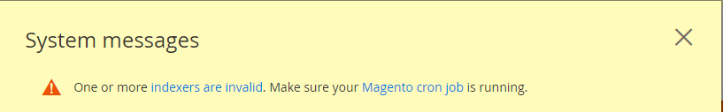

# 업그레이드 사전 요구 사항 완료

Adobe Commerce을 실행하는 데 필요한 사항을 이해하는 것이 중요합니다. 먼저 업그레이드하려는 버전에 대한 [시스템 요구 사항](../../installation/system-requirements.md)을 검토해야 합니다.

시스템 요구 사항을 검토한 후 시스템을 업그레이드하기 전에 다음 사전 요구 사항을 완료해야 합니다.

* 모든 소프트웨어 업데이트
* 지원되는 검색 엔진이 설치되었는지 확인
* 데이터베이스 테이블 형식 변환
* 열린 파일 제한 설정
* cron 작업이 실행 중인지 확인
* `DATA_CONVERTER_BATCH_SIZE` 설정
* 파일 시스템 권한 확인
* `pub/` 디렉터리 루트 설정
* Composer 업데이트 플러그인 설치

## 모든 소프트웨어 업데이트

[시스템 요구 사항](../../installation/system-requirements.md)에서는 Adobe Commerce 릴리스에서 테스트한 타사 소프트웨어 버전을 정확하게 설명합니다.

사용자 환경에서 모든 시스템 요구 사항 및 종속성을 업데이트했는지 확인합니다. PHP [7.4](https://www.php.net/manual/en/migration74.php), PHP [8.0](https://www.php.net/manual/en/migration80.php), PHP [8.1](https://www.php.net/manual/en/migration81.php) 및 [필수 PHP 설정](../../installation/prerequisites/php-settings.md#php-settings)을 참조하십시오.

>[!NOTE]
>
>Adobe Commerce on cloud infrastructure Pro 프로젝트의 경우 스테이징 및 프로덕션 환경에서 서비스를 설치하거나 업데이트하려면 [지원](https://experienceleague.adobe.com/docs/commerce-knowledge-base/kb/help-center-guide/magento-help-center-user-guide.html?lang=ko#submit-ticket) 티켓을 만들어야 합니다. 필요한 서비스 변경 사항을 표시하고 업데이트된 `.magento.app.yaml` 및 `services.yaml` 파일과 PHP 버전을 티켓에 포함하십시오. 클라우드 인프라 팀이 프로젝트를 업데이트하는 데 최대 48시간이 걸릴 수 있습니다. [지원되는 소프트웨어 및 서비스](https://experienceleague.adobe.com/docs/commerce-cloud-service/user-guide/architecture/cloud-architecture.html?lang=ko#supported-software-and-services)를 참조하십시오.

## 지원되는 검색 엔진이 설치되었는지 확인

Adobe Commerce에서 소프트웨어를 사용하려면 Elasticsearch 또는 OpenSearch를 설치해야 합니다.

**2.3.x에서 2.4**(으)로 업그레이드하는 경우 2.3.x 인스턴스에서 MySQL, Elasticsearch 또는 타사 확장을 카탈로그 검색 엔진으로 사용하고 있는지 확인해야 합니다. 그 결과에 따라 2.4로 업그레이드하기 전에 _수행해야 하는 작업이 결정됩니다_.

**2.3.x 또는 2.4.x 릴리스 라인에서 패치 릴리스를 업그레이드하는 경우** Elasticsearch 7.x가 이미 설치되어 있는 경우 선택적으로 [OpenSearch로 마이그레이션](opensearch-migration.md)할 수 있습니다.

명령줄 또는 관리자를 사용하여 카탈로그 검색 엔진을 결정할 수 있습니다.

* `bin/magento config:show catalog/search/engine` 명령을 입력합니다. 명령은 `mysql`, `elasticsearch`(Elasticsearch 2가 구성되었음을 나타냄), `elasticsearch5`, `elasticsearch6`, `elasticsearch7` 또는 서드파티 검색 엔진을 설치했음을 나타내는 사용자 지정 값을 반환합니다. 2.4.6 이전 버전의 경우 Elasticsearch 7 또는 OpenSearch 엔진에 대해 `elasticsearch7` 값을 사용하십시오. 버전 2.4.6 이상에서는 OpenSearch 엔진에 `opensearch` 값을 사용합니다.

* 관리자에서 **[!UICONTROL Stores]** > [!UICONTROL Settings] > **[!UICONTROL Configuration]** > **[!UICONTROL Catalog]** > **[!UICONTROL Catalog]** > **[!UICONTROL Catalog Search]** > **[!UICONTROL Search Engine]** 필드의 값을 확인합니다.

다음 섹션에서는 2.4.0으로 업그레이드하기 전에 수행해야 하는 작업을 설명합니다.

### MySQL

2.4부터 MySQL은 더 이상 지원되는 카탈로그 검색 엔진이 아닙니다. 업그레이드하기 전에 Elasticsearch 또는 OpenSearch를 설치하고 구성해야 합니다. 다음 리소스를 사용하여 이 프로세스를 안내합니다.

* [Elasticsearch 설치 및 구성](../../configuration/search/overview-search.md)
* [Elasticsearch 설치](https://www.elastic.co/guide/en/elasticsearch/reference/current/install-elasticsearch.html)
* 검색 엔진에서 작동하도록 [nginx](../../installation/prerequisites/search-engine/configure-nginx.md) 또는 [Apache](../../installation/prerequisites/search-engine/configure-apache.md) 구성
* [Elasticsearch을 사용하도록 Commerce 구성](../../configuration/search/configure-search-engine.md) 및 색인 재지정

일부 타사 카탈로그 검색 엔진은 Adobe Commerce 검색 엔진 위에서 실행됩니다. 확장을 업데이트해야 하는지 여부를 확인하려면 공급업체에 문의하십시오.

### MySQL 8.4 변경 사항

Adobe은 2.4.8 릴리스에서 MySQL 8.4에 대한 지원을 추가했습니다.
이 섹션에서는 개발자가 알아야 하는 MySQL 8.4의 주요 변경 사항에 대해 설명합니다.

#### 더 이상 사용되지 않는 비표준 키

고유하지 않은 키 또는 부분 키를 외래 키로 사용하는 것은 비표준이며 MySQL 8.4에서는 더 이상 사용되지 않습니다. MySQL 8.4.0부터 [`restrict_fk_on_non_standard_key`](https://dev.mysql.com/doc/refman/8.4/en/server-system-variables.html#sysvar_restrict_fk_on_non_standard_key)을(를) `OFF`(으)로 설정하거나 `--skip-restrict-fk-on-non-standard-key` 옵션으로 서버를 시작하여 해당 키를 명시적으로 사용하도록 설정해야 합니다.

#### MySQL 8.0( 또는 이전 버전 )에서 MySQL 8.4로 업그레이드

MySQL을 버전 8.0에서 버전 8.4로 올바르게 업그레이드하려면 다음 단계를 순서대로 수행해야 합니다.

1. 유지 관리 모드 활성화:

   ```bash
   bin/magento maintenance:enable
   ```

1. 데이터베이스 백업 만들기:

   ```bash
   bin/magento setup:backup --db
   ```

1. MySQL을 버전 8.4로 업그레이드하십시오.
1. `restrict_fk_on_non_standard_key` 파일의 `OFF`에서 `[mysqld]`을(를) `my.cnf`(으)로 설정합니다.

   ```bash
   [mysqld]
   restrict_fk_on_non_standard_key = OFF 
   ```

   >[!WARNING]
   >
   >`restrict_fk_on_non_standard_key`의 값을 `OFF`(으)로 변경하지 않으면 가져오는 동안 다음 오류가 발생합니다.
   >
   >```sql
   > ERROR 6125 (HY000) at line 2164: Failed to add the foreign key constraint. Missing unique key for constraint 'CAT_PRD_FRONTEND_ACTION_PRD_ID_CAT_PRD_ENTT_ENTT_ID' in the referenced table 'catalog_product_entity'
   >```
1. MySQL 서버를 다시 시작합니다.
1. 백업된 데이터를 MySQL로 가져옵니다.
1. 캐시를 정리합니다.

   ```bash
   bin/magento cache:clean
   ```

1. 유지 관리 모드 비활성화:

   ```bash
   bin/magento maintenance:disable
   ```

#### 마리아DB

{{$include /help/_includes/maria-db-config.md}}

### 검색 엔진

2.4.0으로 업그레이드하기 전에 Elasticsearch 7.6 이상 또는 OpenSearch 1.2를 설치하고 구성해야 합니다. Adobe은 더 이상 Elasticsearch 2.x, 5.x 및 6.x를 지원하지 않습니다. [구성 가이드](../../configuration/search/configure-search-engine.md)의 _검색 엔진 구성_&#x200B;에서는 Elasticsearch을 지원되는 버전으로 업그레이드한 후 수행해야 하는 작업에 대해 설명합니다.

프로덕션에 배포하기 전에 데이터 백업, 잠재적인 마이그레이션 문제 감지 및 업그레이드 테스트에 대한 전체 지침은 [Elasticsearch 업그레이드](https://www.elastic.co/guide/en/elasticsearch/reference/current/setup-upgrade.html)를 참조하십시오. 현재 버전의 Elasticsearch에 따라 전체 클러스터를 다시 시작해야 할 수도 있고 필요하지 않을 수도 있습니다.

Elasticsearch을 사용하려면 JDK(Java Development Kit) 1.8 이상이 필요합니다. 설치된 JDK 버전을 확인하려면 [JDK(Java Software Development Kit) 설치](../../installation/prerequisites/search-engine/overview.md#install-the-java-software-development-kit-jdk)를 참조하십시오.

#### OpenSearch

OpenSearch는 Elasticsearch의 라이선스 변경에 따른 Elasticsearch 7.10.2의 오픈 소스 포크입니다. 다음 Adobe Commerce 릴리스에서는 OpenSearch에 대한 지원이 도입되었습니다.

* 2.4.6 (OpenSearch에는 별도의 모듈과 설정이 있음)
* 2.4.5
* 2.4.4
* 2.4.3-p2
* 2.3.7-p3

위에 나열된(또는 이상) Adobe Commerce 버전으로 업그레이드하는 경우에만 [Elasticsearch에서 OpenSearch로 마이그레이션](opensearch-migration.md)할 수 있습니다.

OpenSearch를 사용하려면 JDK 1.8 이상이 필요합니다. 설치된 JDK 버전을 확인하려면 [JDK(Java Software Development Kit) 설치](../../installation/prerequisites/search-engine/overview.md#install-the-java-software-development-kit-jdk)를 참조하십시오.

[검색 엔진 구성](../../configuration/search/configure-search-engine.md)은(는) 검색 엔진을 변경한 후 수행해야 하는 작업을 설명합니다.

#### Elasticsearch 업그레이드

Elasticsearch 8.x에 대한 지원은 Adobe Commerce 2.4.6에 도입되었습니다. 다음 지침은 Elasticsearch을 7.x에서 8.x로 업그레이드하는 예를 보여줍니다.

>[!NOTE]
>
>향후 2.4.8 릴리스에서는 Elasticsearch 8 모듈이 기본적으로 포함되어 있으므로 별도로 설치할 필요가 없으므로 이러한 단계가 필요하지 않습니다.

1. Elasticsearch 7.x 서버를 8.x로 업그레이드하고 가 실행 중인지 확인합니다. [Elasticsearch 설명서](https://www.elastic.co/guide/en/elasticsearch/reference/current/install-elasticsearch.html)를 참조하세요.

1. `id_field_data` 파일에 다음 구성을 추가하고 Elasticsearch 8.x 서비스를 다시 시작하여 `elasticsearch.yml` 필드를 사용하도록 설정합니다.

   ```yaml
   indices:
     id_field_data:
       enabled: true
   ```

   >[!INFO]
   >
   >Elasticsearch 8.x를 지원하기 위해 Adobe Commerce 2.4.6에서는 기본적으로 `indices.id_field_data` 속성을 허용하지 않으며 `_id` 속성의 `docvalue_fields` 필드를 사용합니다.

1. Adobe Commerce 프로젝트의 루트 디렉터리에서 작성기 종속성을 업데이트하여 `Magento_Elasticsearch7` 모듈을 제거하고 `Magento_Elasticsearch8` 모듈을 설치합니다.

   ```bash
   composer require magento/module-elasticsearch-8 --update-with-all-dependencies
   ```

   `psr/http-message`에 대한 종속성 오류가 발생하면 다음 문제 해결 섹션을 확장하려면 클릭하십시오.

   +++문제 해결

   Elasticsearch 8, 특히 `psr/http-message`을(를) 설치하는 동안 종속성 충돌이 발생하면 다음 단계를 수행하여 해결할 수 있습니다.

   1. 먼저 다른 종속성을 업데이트하지 않고 Elasticsearch 8 모듈이 필요합니다.

      ```bash
      composer require magento/module-elasticsearch-8 --no-update
      ```

   1. 그런 다음 Elasticsearch 8 모듈 및 `aws/aws-sdk-php` 패키지를 업데이트합니다.

      ```bash
      composer update magento/module-elasticsearch-8 aws/aws-sdk-php -W
      ```

   이 접근 방식은 PHP 8.3과 함께 2.4.7-p4에서 작동합니다. `aws/aws-sdk-php`에 `psr/http-message >= 2.0`이(가) 필요하기 때문에 문제가 발생하여 충돌이 발생할 수 있습니다. 위의 단계는 이러한 종속성 문제를 해결하는 데 도움이 됩니다.

   +++

1. 프로젝트 구성 요소를 업데이트합니다.

   ```bash
   bin/magento setup:upgrade
   ```

1. [에서 ](../../configuration/search/configure-search-engine.md#configure-your-search-engine-from-the-admin)Elasticsearch 구성[!DNL Admin].

1. 카탈로그 색인을 다시 색인화합니다.

   ```bash
   bin/magento indexer:reindex catalogsearch_fulltext
   ```

1. 활성화된 캐시 유형에서 모든 항목을 삭제합니다.

   ```bash
   bin/magento cache:clean
   ```

#### Elasticsearch 다운그레이드

실수로 서버에서 Elasticsearch 버전을 업그레이드하거나 다른 이유로 다운그레이드해야 한다고 판단되는 경우 Adobe Commerce 프로젝트 종속성도 업데이트해야 합니다. 예를 들어 Elasticsearch 8.x에서 7.x로 다운그레이드하려면 다음을 수행합니다

1. Elasticsearch 8.x 서버를 7.x로 다운그레이드하고 가 실행 중인지 확인합니다. [Elasticsearch 설명서](https://www.elastic.co/guide/en/elasticsearch/reference/current/install-elasticsearch.html)를 참조하세요.

1. Adobe Commerce 프로젝트의 루트 디렉터리에서 작성기 종속성을 업데이트하여 `Magento_Elasticsearch8` 모듈과 해당 작성기 종속성을 제거하고 `Magento_Elasticsearch7` 모듈을 설치합니다.

   ```bash
   composer remove magento/module-elasticsearch-8
   ```

1. 프로젝트 구성 요소를 업데이트합니다.

   ```bash
   bin/magento setup:upgrade
   ```

1. [에서 ](../../configuration/search/configure-search-engine.md#configure-your-search-engine-from-the-admin)Elasticsearch 구성[!DNL Admin].

1. 카탈로그 색인을 다시 색인화합니다.

   ```bash
   bin/magento indexer:reindex catalogsearch_fulltext
   ```

1. 활성화된 캐시 유형에서 모든 항목을 삭제합니다.

   ```bash
   bin/magento cache:clean
   ```

### 타사 확장

확장이 Adobe Commerce 릴리스와 완전히 호환되는지 확인하려면 검색 엔진 공급업체에 문의하는 것이 좋습니다.

## 데이터베이스 테이블 형식 변환

모든 데이터베이스 테이블의 형식을 `COMPACT`에서 `DYNAMIC`(으)로 변환해야 합니다. 또한 저장소 엔진 형식을 `MyISAM`에서 `InnoDB`(으)로 변환해야 합니다. [모범 사례](../../implementation-playbook/best-practices/maintenance/mariadb-upgrade.md)를 참조하세요.

## 열린 파일 제한 설정

열린 파일 제한(ulimit)을 설정하면 긴 쿼리 문자열의 재귀적 호출이 여러 번 실패하거나 `bin/magento setup:rollback` 명령을 사용하는 데 문제가 발생하는 것을 방지할 수 있습니다. 이 명령은 UNIX 셸마다 다릅니다. `ulimit` 명령에 대한 자세한 내용은 개별 환경을 참조하십시오.

Adobe에서는 열린 파일 [ulimit](https://ss64.com/bash/ulimit.html)을(를) `65536` 이상의 값으로 설정하는 것이 좋지만 필요한 경우 더 큰 값을 사용할 수 있습니다. 명령줄에 대한 ulimit을 설정하거나 사용자의 셸에 대한 영구 설정으로 지정할 수 있습니다.

명령줄에서 제한(ulimit)을 설정하려면 다음을 수행합니다.

1. [파일 시스템 소유자](../../installation/prerequisites/file-system/overview.md)(으)로 전환합니다.
1. ulimit를 `65536`(으)로 설정합니다.

   ```bash
   ulimit -n 65536
   ```

Bash 셸에서 값을 설정하려면 다음을 수행합니다.

1. [파일 시스템 소유자](../../installation/prerequisites/file-system/overview.md)(으)로 전환합니다.
1. 텍스트 편집기에서 `/home/<username>/.bashrc` 열기
1. 다음 줄을 추가합니다.

   ```bash
   ulimit -n 65536
   ```

1. `.bashrc` 파일에 변경 내용을 저장하고 텍스트 편집기를 종료합니다.

>[!IMPORTANT]
>
>`pcre.recursion_limit` 파일에서 `php.ini` 속성의 값을 설정하지 않는 것이 좋습니다. 이로 인해 실패 알림 없이 롤백이 불완전할 수 있기 때문입니다.

## cron 작업이 실행 중인지 확인

UNIX 작업 스케줄러 `cron`은(는) 일상적인 Adobe Commerce 작업에 중요합니다. 리인덱싱, 뉴스레터, 이메일, 사이트 맵 등의 일정을 수립합니다. 몇 가지 기능을 사용하려면 파일 시스템 소유자로서 cron 작업을 하나 이상 실행해야 합니다.

cron 작업이 제대로 설정되었는지 확인하려면 다음 명령을 파일 시스템 소유자로 입력하여 crontab을 확인합니다.

>[!NOTE]
>
>crontab은 cron 작업 실행을 담당하는 구성 파일입니다.

```bash
crontab -l
```

다음과 유사한 결과가 표시됩니다.

```cron
#~ MAGENTO START c5f9e5ed71cceaabc4d4fd9b3e827a2b
* * * * * /usr/bin/php /var/www/html/magento2/bin/magento cron:run 2>&1 | grep -v "Ran jobs by schedule" >> /var/www/html/magento2/var/log/magento.cron.log
#~ MAGENTO END c5f9e5ed71cceaabc4d4fd9b3e827a2b
```

cron 이 실행되지 않는 또 다른 증상은 관리자의 다음 오류입니다.



오류를 확인하려면 다음과 같이 창 상단의 **시스템 메시지**&#x200B;를 클릭합니다.


자세한 내용은 [cron 구성 및 실행](../../configuration/cli/configure-cron-jobs.md)을 참조하십시오.

## Data_CONVERTER_BATCH_SIZE 설정

Adobe Commerce 2.4에는 일부 데이터를 직렬화에서 JSON으로 변환해야 하는 보안 개선 사항이 포함되어 있습니다. 이 변환은 업그레이드 중에 발생하며 데이터베이스에 있는 데이터의 양에 따라 시간이 오래 걸릴 수 있습니다.

가장 큰 영향을 받는 테이블은 다음과 같습니다.

* `catalogrule`
* `core_config_data`
* `magento_reward_history`
* `quote_payment`
* `quote`
* `sales_order_payment`
* `sales_order`
* `salesrule`
* `url_rewrite`

데이터 양이 많은 경우 환경 변수 `DATA_CONVERTER_BATCH_SIZE`의 값을 설정하여 성능을 향상시킬 수 있습니다. 기본적으로 값은 `50,000`(으)로 설정됩니다.

환경 변수를 설정하려면 다음을 수행합니다.

1. [파일 시스템 소유자](../../installation/prerequisites/file-system/overview.md)(으)로 전환합니다.
1. 변수를 설정합니다.

   ```bash
   export DATA_CONVERTER_BATCH_SIZE=100000
   ```

   >[!NOTE]
   >
   > `DATA_CONVERTER_BATCH_SIZE`에 메모리가 필요합니다. 먼저 테스트하지 않고 큰 값(약 1GB)으로 설정하지 마십시오.

1. 업그레이드가 완료되면 변수를 설정 해제할 수 있습니다.

   ```bash
   unset DATA_CONVERTER_BATCH_SIZE
   ```

## 파일 시스템 권한 확인

보안상의 이유로 Adobe Commerce에는 파일 시스템에 대한 특정 권한이 필요합니다. 사용 권한이 _[소유권](../../upgrade/prepare/prerequisites.md#verify-file-system-permissions)_&#x200B;과(와) 다릅니다. 소유권은 파일 시스템에서 작업을 수행할 수 있는 사용자를 결정하고, 권한은 사용자가 수행할 수 있는 작업을 결정합니다.

파일 시스템의 디렉터리는 [파일 시스템 소유자의](../../installation/prerequisites/file-system/overview.md) 그룹에서 쓸 수 있어야 합니다.

파일 시스템 권한이 제대로 설정되어 있는지 확인하려면 응용 프로그램 서버에 로그인하거나 호스팅 공급자의 파일 관리자 응용 프로그램을 사용하십시오.

예를들어 응용 프로그램이 `/var/www/html/magento2`에 설치되어 있는 경우 다음 명령을 입력합니다.

```bash
ls -l /var/www/html/magento2
```

샘플 출력:

```console
total 1028
drwxrwx---. 12 magento_user apache   4096 Jun  7 07:55 .
drwxr-xr-x.  3 root         root     4096 May 11 14:29 ..
drwxrwx---.  4 magento_user apache   4096 Jun  7 07:53 app
drwxrwx---.  2 magento_user apache   4096 Jun  7 07:53 bin
-rw-rw----.  1 magento_user apache 439792 Apr 27 21:23 CHANGELOG.md
-rw-rw----.  1 magento_user apache   3422 Apr 27 21:23 composer.json
-rw-rw----.  1 magento_user apache 425214 Apr 27 21:27 composer.lock
-rw-rw----.  1 magento_user apache   3425 Apr 27 21:23 CONTRIBUTING.md
-rw-rw----.  1 magento_user apache  10011 Apr 27 21:23 CONTRIBUTOR_LICENSE_AGREEMENT.html
-rw-rw----.  1 magento_user apache    631 Apr 27 21:23 COPYING.txt
drwxrwx---.  4 magento_user apache   4096 Jun  7 07:53 dev
-rw-rw----.  1 magento_user apache   2926 Apr 27 21:23 Gruntfile.js
-rw-rw----.  1 magento_user apache   7592 Apr 27 21:23 .htaccess
-rw-rw----.  1 magento_user apache   6419 Apr 27 21:23 .htaccess.sample
drwxrwx---.  4 magento_user apache   4096 Jun  7 07:53 lib
-rw-rw----.  1 magento_user apache  10376 Apr 27 21:23 LICENSE_AFL.txt
-rw-rw----.  1 magento_user apache  30634 Apr 27 21:23 LICENSE_EE.txt
-rw-rw----.  1 magento_user apache  10364 Apr 27 21:23 LICENSE.txt
-rw-rw----.  1 magento_user apache   4108 Apr 27 21:23 nginx.conf.sample
-rw-rw----.  1 magento_user apache   1427 Apr 27 21:23 package.json
-rw-rw----.  1 magento_user apache   1659 Apr 27 21:23 .php_cs
-rw-rw----.  1 magento_user apache    804 Apr 27 21:23 php.ini.sample
drwxrwx---.  2 magento_user apache   4096 Jun  7 07:53 phpserver
drwxrwx---.  6 magento_user apache   4096 Jun  7 07:53 pub
-rw-rw----.  1 magento_user apache   2207 Apr 27 21:23 README_EE.md
drwxrwx---.  7 magento_user apache   4096 Jun  7 07:53 setup
-rw-rw----.  1 magento_user apache   3731 Apr 27 21:23 .travis.yml
drwxrwx---.  7 magento_user apache   4096 Jun  7 07:53 update
drwxrws---. 11 magento_user apache   4096 Jun 13 16:05 var
drwxrws---. 29 magento_user apache   4096 Jun  7 07:53 vendor
```

샘플 출력에 대한 설명은 다음을 참조하십시오.

* 대부분의 파일은 `-rw-rw----`이며, `660`입니다.
* `drwxrwx---` = `770`
* `-rw-rw-rw-` = `666`
* 파일 시스템 소유자는 `magento_user`입니다.

자세한 정보를 보려면 다음 명령을 입력할 수 있습니다.

```bash
ls -la /var/www/html/magento2/pub
```

Adobe Commerce은 정적 파일 자산을 `pub`의 하위 디렉터리에 배포하므로 해당 디렉터리에서 권한과 소유권을 확인하는 것도 좋습니다.

자세한 내용은 [파일 시스템 권한 및 소유권](../../installation/prerequisites/file-system/overview.md)을 참조하십시오.

## `pub/` 디렉터리 루트 설정

자세한 내용은 [보안을 향상하도록 docroot 수정](../../installation/tutorials/docroot.md)을 참조하십시오.

## Composer 업데이트 플러그인 설치

[`magento/composer-root-update-plugin`](https://github.com/magento/composer-root-update-plugin) 작성기 플러그인은 새 제품 요구 사항으로 업데이트하기 전에 루트 프로젝트 `composer.json` 파일에 적용해야 하는 변경 사항을 해결합니다.

플러그인은 종속성 충돌을 수동으로 식별하고 수정해야 하는 대신 식별하고 해결하는 데 도움을 주어 수동 업그레이드를 부분적으로 자동화합니다.

플러그인을 설치하려면:

1. 패키지를 `composer.json` 파일에 추가합니다.

   ```bash
   composer require magento/composer-root-update-plugin ~2.0 --no-update
   ```

1. 종속성 업데이트:

   ```bash
   composer update
   ```

<!-- Last updated from includes: 2024-02-12 09:51:27 -->
