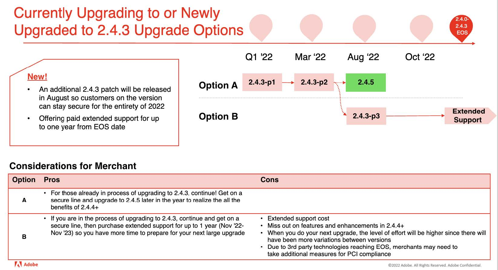

# 2022년 권장 업그레이드 경로

eCommerce 구현은 진화에 불과합니다. 아직 완성되지 않았습니다. 고객은 계속해서 최신 기능과 기능을 도입하여 트렌드를 따라갈 수 있어야 합니다. Adobe Commerce 2.4.4 이상으로 업그레이드하면 동급 최강의 혁신 기능을 갖추고 향후 비즈니스를 보장할 수 있습니다.

- SaaS 서비스로 제공되는 혁신적인 기능에 대한 빠른 액세스
- 간편하고 비용 효율적인 유지 관리 및 업그레이드
- 고유한 비즈니스 요구 사항을 충족하는 지속적인 유연성 및 사용자 지정
- 성능 및 확장성 대폭 향상
- 더 나은 개발자 경험 및 도구
- 다른 Adobe Experience Cloud 애플리케이션과 보다 긴밀하게 통합 가능

Adobe는 2.4.4 이상으로 업그레이드를 계획할 때 판매자에게 더 많은 유연성을 제공하기 위해 최근 Adobe를 업데이트했습니다 [2022년 릴리스 일정](https://devdocs.magento.com/release/)를 클릭하고 지원 종료(EOS) 날짜를 확장한 다음 소프트웨어 버전을 선택할 수 있는 새로운 확장 지원 옵션을 발표했습니다. 이러한 업데이트에 대한 자세한 내용은 블로그 를 참조하십시오.

다음은 최신 버전 중 하나로 업그레이드하는 동안 사이트의 보안 및 성능을 유지할 수 있도록 Adobe Commerce에서 권장하는 2.4.4 이상으로의 경로입니다.

## 버전 2.3.6 이하에서 업그레이드

## 2.3.7에서 업그레이드

## 2.4.0-2.4.3에서 업그레이드

## 2.4.3에서 업그레이드(또는 새로 업그레이드됨)

